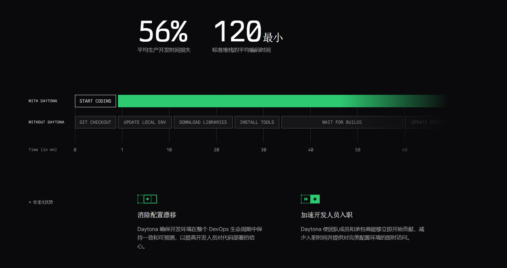
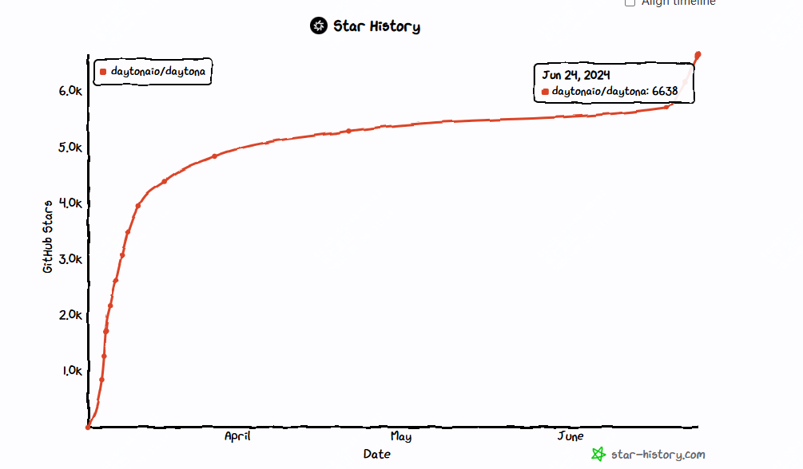

6.6k star,好玩、好用开源工具

一句话介绍：快速打开一个标准、高效的开发环境。


## daytona简介

Daytona是一个开源的开发环境管理器，旨在简化和标准化开发环境的设置过程。以下是关于Daytona项目的介绍文章，包括项目简介、特点以及如何快速部署和开始使用。

Daytona是一个开源项目，致力于为开发者提供一个简单、一致且可在任何基础设施上设置的开发环境¹。它通过单一命令激活一个完全配置的开发环境，支持本地、远程、云基础设施、物理服务器或虚拟机等多种环境，并且兼容x86或ARM架构。


## daytona功能特点
- **单一命令激活**: Daytona允许用户通过一个命令激活完全配置的开发环境。
- **广泛兼容**: 支持在任何机器上启动开发环境，无论是本地还是远程。
- **配置文件支持**: 初始支持dev container文件，未来将扩展到DevFile、Nix和Flox等。
- **预构建系统**: 显著提高环境设置时间。
- **IDE支持**: 无缝支持VS Code和JetBrains IDE，以及内置的Web IDE。
- **Git提供商集成**: 支持连接GitHub、GitLab、Bitbucket、Gitea和Gitness，便于从工作区拉取和提交代码。
- **多项目工作区**: 支持在同一工作区中处理多个项目仓库，适合微服务架构开发。
- **反向代理集成**: 利用反向代理功能，即使在防火墙后面也能无缝访问预览端口和Web IDE。
- **可扩展性**: 支持插件或提供商开发，增强扩展性。
- **安全性**: 自动在客户机和开发环境之间创建VPN连接，确保安全连接。
- **所有端口访问**: VPN连接使得无需通过SSH设置端口转发即可访问开发环境的所有端口。
- **解决“在我机器上能运行”问题**: 开发者再也不会遇到这个问题。


## daytona快速部署
Daytona的快速部署非常简单。对于Mac/Linux用户，可以通过以下命令安装Daytona并运行Daytona服务器：
```bash
curl -sf -L https://download.daytona.io/daytona/install.sh | sudo bash
daytona server -y
daytona create --code
```
Windows用户可以通过PowerShell执行类似的命令来下载、安装Daytona并运行Daytona服务器。

## 开始使用

一旦Daytona环境设置完成，开发者就可以立即开始编码。Daytona提供了一个用户友好的界面，类似于VS Code，包括语法高亮和扩展功能。此外，Daytona还提供了一个类似于Linux的终端，允许开发者根据需要运行命令和拉取包，使得开发过程更加高效。

Daytona的设计理念是为了解决开发环境设置过程中的复杂性和挑战，特别是在远程设置时。它通过提供一个标准化的开发环境，使得开发者和团队能够在不必担心软件安装或配置权限的情况下进行项目工作。Daytona的出现可能很快就会使“设置开发环境”这一耗时且令人沮丧的过程成为过去。


