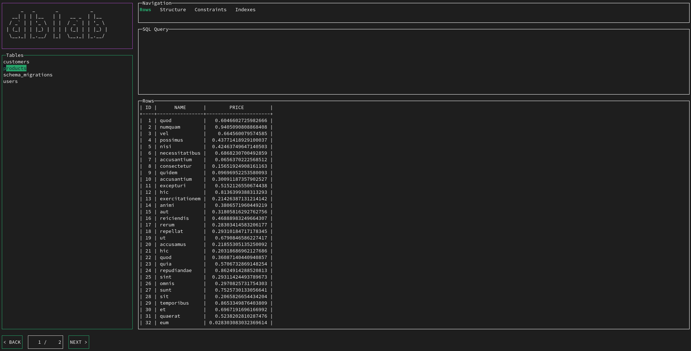
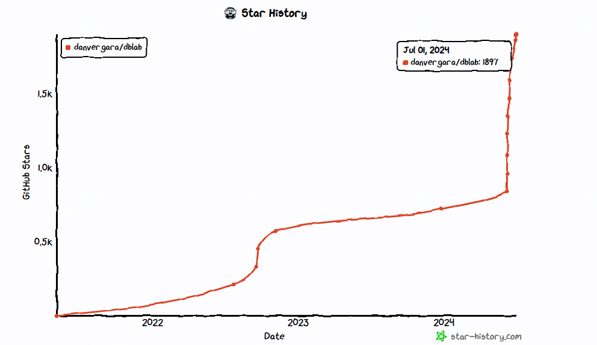

1.9k star，go语言写的一款轻量级开源工具

这是一款go语言的写的数据库终端连接工具，支持mysql、pg、oracle等



## dblab简介

**dblab** 是一个为 PostgreSQL、MySQL、SQLite3 和 Oracle 数据库设计的交互式终端用户界面(UI)应用程序。

它是用 Go 语言编写的，可以在 OSX、Linux 和 Windows 机器上运行。dblab 的主要思想是利用编译器的能力，为多个平台生成零依赖的二进制文件。

dblab 作为一个尝试，旨在构建一个非常简单且便携的应用程序，以便与本地或远程的 PostgreSQL/MySQL/SQLite3/Oracle 数据库工作。


### 功能特点
- **跨平台支持**：OSX/Linux/Windows 32/64位
- **简单安装**：作为单一二进制分发
- **零依赖性**
- **快速导航**：使用 Vim 风格的导航键进行快速移动
- **配置文件支持**：允许用户从配置文件中获取连接数据
- **多数据库支持**：支持 PostgreSQL、MySQL、SQLite3 和 Oracle

### 快速开始使用
1. **安装**：如果需要使用 SQLite3，可以使用下面列出的适当的 bash 脚本安装 CGO 启用的二进制文件。但现在 CGO 不再需要，将会有一个单一的二进制文件能够处理所有支持的客户端。
   - Homebrew 安装：
     ```bash
     brew install danvergara/tools/dblab
     ```
     或者
     ```bash
     brew tap danvergara/tools
     brew install dblab
     ```
   - 手动下载二进制发布版本：您可以从发布页面手动下载二进制发布版本²。

2. **使用**：dblab 是一个基于终端 UI 的交互式数据库客户端。
   - 命令行使用：
     ```bash
     dblab [flags]
     dblab [command]
     ```
   - 可用命令：
     - `help`：关于任何命令的帮助
     - `version`：项目版本

3. **配置**：通过 `--config` 标志从配置文件中获取连接数据，配置文件的默认位置是当前目录、`$HOME/.dblab.yaml` 或 `$XDG_CONFIG_HOME/.dblab.yaml`。

通过以上步骤，用户可以快速开始使用 dblab 来管理和操作他们的数据库。dblab 以其轻量级和跨平台的特性，为数据库管理提供了一个简单而强大的解决方案。无论是数据库开发人员还是喜欢命令行的技术爱好者，都可以通过 dblab 提高他们的工作效率。更多详细信息和文档，可以访问 dblab 的[官方文档](^5^)。


>开源地址：https://github.com/danvergara/dblab
>
>官方网站：https://dblab.danvergara.com/


