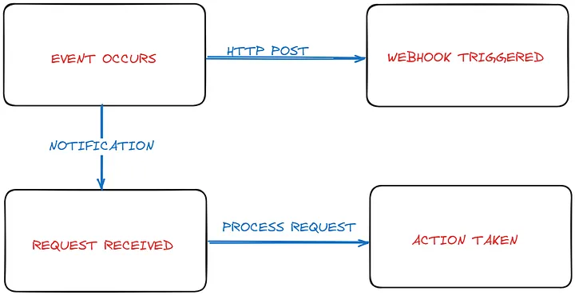

什么是webhooks？

原文译自：
>https://javascript.plainenglish.io/what-are-webhooks-d02e88b77359

在现代技术中，一切都是相互连接的，每个应用程序都通过许多服务的组合和协调来无缝工作。这种协调是通过webhooks实现的。

Webhooks是基于HTTP的回调函数，其中一个服务使用API立即通知另一个服务事件。这是简单的版本。从技术上讲，根据Jeff林赛的说法，webhook是“使用HTTP进行的用户定义回调”，他是第一个将webhook概念化的人之一。

## Webhooks的基础知识

以下是webhook的基本分类：

- 事件驱动聊天：应用程序可以使用webhooks在发生特定事情时相互聊天，而不是不断地检查，比如新客户订单或朋友的生日。
- 推送通知，而不是等待：忘记刷新页面以查看更新。Webhooks就像收到通知一样--当有重要的事情发生时，应用会立即告诉另一个应用。这更快，节省时间。
- 包含详细信息的Web消息：Webhooks使用Web调用来发送消息。这些消息包括一个简短的报告，如新闻更新，关于发生了什么，通常采用JSON格式。
- 实时更新：由于Webhook可以立即提供信息，因此应用程序可以立即相互保持最新状态。
## Webhooks如何工作？


- 事件触发：事件触发webhook进程。这个事件可以是任何事情，从新客户在网站上注册到商店库存水平的变化。
- HTTP POST：一旦事件被触发，HTTP POST请求就会被发送到指定的URL，也就是webhook URL。此URL指向一个Web服务器，该服务器旨在接收和处理这些webhook通知。
- Webhook Triggered：在接收到HTTP POST请求时，Webhook在Web服务器上被触发。
- 通知：webhook服务器然后解析HTTP POST请求中包含的数据。这些数据通常包含有关触发webhook的事件的详细信息。
- 请求接收和处理：webhook服务器然后验证请求的真实性并相应地处理数据。
- 采取的操作：最后，基于从事件接收到的数据，webhook服务器执行特定的操作。此操作可能因具体应用而异，但可能涉及更新数据库、发送电子邮件通知或触发另一个工作流。
- 简单地说，webhook充当应用程序之间的信使。它们向应用程序通知特定事件，并向它们提供相关数据，以便它们可以采取适当的操作。

## 使用GitHub实现Webhooks
现在我们已经看到了基础知识并理解了webhook的工作原理，让我们尝试在最流行的开发应用之一Github中实现它。

### 步骤1：导航到存储库设置

登录到您的GitHub帐户。
转到您要设置webhook的仓库。
点击设置，然后选择Webhooks。

### 步骤2：添加新的Webhook

点击添加webhook按钮。
在Payload URL字段中，输入要接收webhook有效负载的服务器的URL。

### 步骤3：配置负载URL和内容类型

选择内容类型。对于JSON payloads，选择 application/json 。
也可以为安全设置Secret，它将用于验证接收到的有效负载。

###  第4步：选择触发Webhook的事件

决定哪些事件应该触发webhook。您可以选择单个事件或选择接收所有事件。
步骤5：激活Webhook

确保选中Active复选框以立即激活webhook。
单击Add Webhook保存配置。
Node.js中Webhook接收器的示例代码片段：
```
const express = require('express');
const crypto = require('crypto');
const bodyParser = require('body-parser');

const app = express();
const port = 3000;

const secret = 'mySecret'; // Replace with your GitHub webhook secret
app.use(bodyParser.json());

app.post('/webhook', (req, res) => {
  const signature = `sha1=${crypto.createHmac('sha1', secret)
    .update(JSON.stringify(req.body))
    .digest('hex')}`;
  if (req.headers['x-hub-signature'] === signature) {
    console.log('Webhook received:', req.body);
    // Handle the webhook event
    res.status(200).send('Webhook received!');
  } else {
    res.status(401).send('Invalid signature');
  }
});

app.listen(port, () => {
  console.log(`Server is listening at http://localhost:${port}`);
});
```
这段代码创建了一个简单的服务器，它在 /webhook 监听POST请求。它使用您在GitHub中配置的密码验证请求签名。当webhook事件发生时，GitHub会向指定的Payload URL发送一个POST请求，其中包含事件的数据。然后，您的服务器可以相应地处理这些数据。

请记住将 'mySecret' 替换为您在GitHub中设置的实际密码。这可以确保您收到的有效负载确实来自GitHub，而不是冒名顶替者。

## Webhooks的一些实际例子包括：
自动上传到Twitter帐户的Instagram照片。
一个连接的门铃被配置为在它响起时在家里闪烁某些灯光。
将GitHub更新通知作为消息发送到Slack或Discord频道。
创建一个Microsoft Teams频道，当人们购买或出售某些股票时，该频道会传递消息。
## 优势和最佳实践
使用Webhooks的好处：
实时数据传输：Webhooks提供系统之间的即时通信，允许在事件发生时进行即时数据交换。
效率：它们消除了持续轮询的需要，减少了服务器负载并提高了性能。
用户体验：即时更新增强了用户界面，使其更具响应性和动态性。
灵活性：Webhooks可以定制为触发不同事件的特定操作，提供应用程序交互方式的自定义。
## 有效使用Webhooks的最佳实践：
- 安全连接：使用HTTPS确保Webhooks传输的数据是加密和安全的。
- 验证Webhooks：实现验证方法，例如验证数字签名，以确认传入的数据来自可信来源。
- 错误处理：设计你的系统来优雅地处理失败，包括重试和不成功的webhook交付的警报。
- 日志记录：维护webhook活动的详细日志，以便于调试，并为数据流提供审计跟踪。
通过利用webhooks的优势并遵循这些最佳实践，开发人员可以为他们的应用程序创建高效可靠的集成。

## 结论

Webhooks具有实时、事件驱动的功能，是当今数字经济中的变革工具。Webhooks通过允许应用程序之间进行流畅和自动的通信，加快了工作流程，提高了响应能力，并提高了多个领域的效率。无论是用于持续集成、自动通知还是动态数据同步，Webhooks都可以最大限度地减少手动参与的需要，减少错误并加快流程。