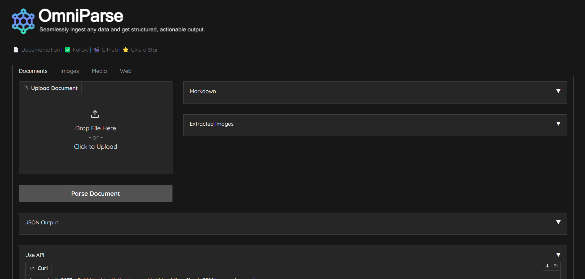
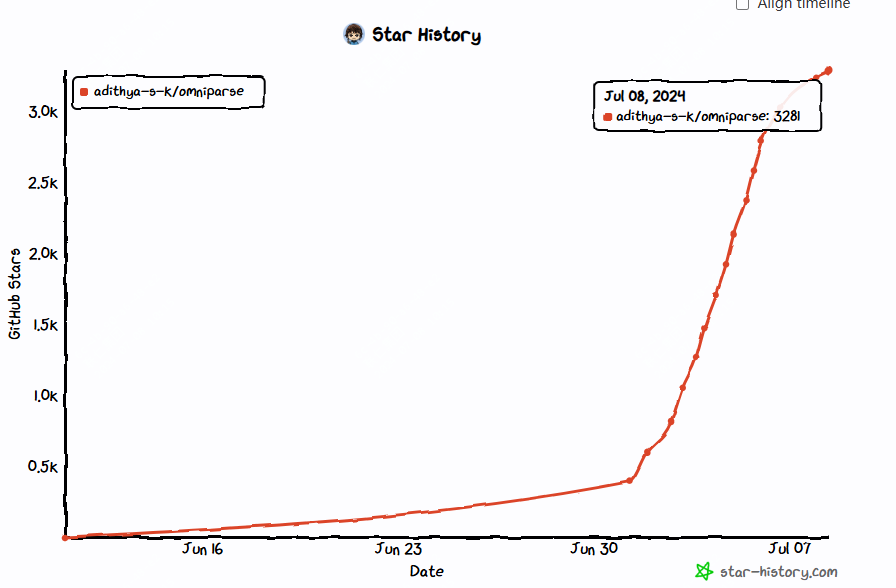

3.3k star,近期发现的一款开源的高级玩意，很强！很好用！
日产工作学习中，我们会接触到很多类型的文档，如文档类（.doc, .docx, .pdf, .ppt, .pptx）图片类(.png, .jpg, .jpeg, .tiff, .bmp, .heic),包括视频、音频、网页等。

那么有没有有一种工具，可以完整、高效的将这些转换为统一的格式呢？如markdown格式。

答案是有的，就是今天将要介绍的这款开源工具。


## omniparse简介

omniparse是一款开源免费，可以开箱即用，并且利用了AI去实现将各类文档或者多媒体文件转换为markdown格式的工具。

omniparse还提供了一个可视化操作平台，使用方便简单。

## omniparse有哪些特点

- 支持本地化部署，可以docker部署。
- 支持多达20中文件类型格式
- 可以cpu环境启动，也可以gpu环境启动，支持T4GPU
- 支持交互ui，采用Gradio实现


## omniparse 简单部署及使用示范

### docker方式部署

镜像比较大，而且受限于网络，所以需要耐心等待一段时间

```
docker pull savatar101/omniparse:0.1
# if you are running on a gpu 
docker run --gpus all -p 8000:8000 savatar101/omniparse:0.1
# else
docker run -p 8000:8000 savatar101/omniparse:0.1
```



如果你想要本地构建docker镜像，那么可以直接执行如下：

```
git clone https://github.com/adithya-s-k/omniparse
cd omniparse
docker pull savatar101/omniparse:0.1
# if you are running on a gpu 
docker run --gpus all -p 8000:8000 savatar101/omniparse:0.1
# else
docker run -p 8000:8000 savatar101/omniparse:0.1
```

## omniparse总结

OmniParse是一个开源项目，专注于将非结构化数据转换为结构化、可操作的格式。

适用于需要处理多种数据类型的生成式AI和大型语言模型应用。

该项目的核心特点包括多模态数据处理能力、数据清洗功能、ETL流式解析，以及与生成式AI框架的兼容性。

OmniParse通过其灵活性和开放性，为数据解析和AI应用提供了强大的支持。

>开源地址：https://github.com/adithya-s-k/omniparse
>
>参考文档：https://docs.cognitivelab.in/

