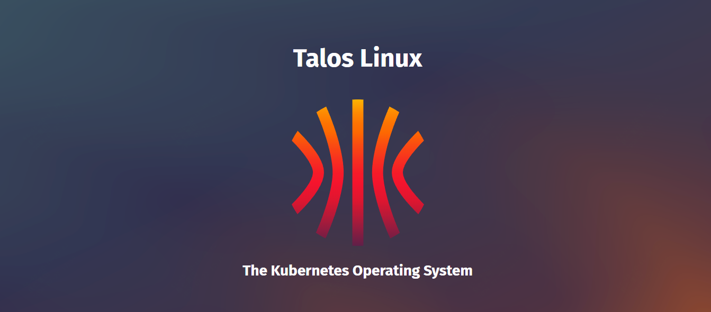
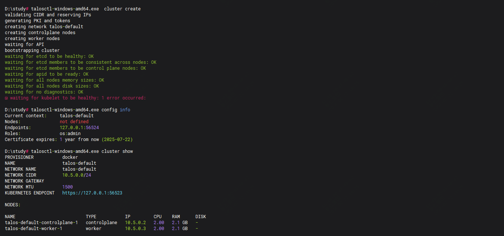

6k star,推荐一个专为kubernetes设计的linux发行版

这是一个最小化的、不可变的、开源的linux发型版本，它叫talos。

在开始之前，我们先来聊下什么是不可变linux发行版

## 不可变linux发行版

顾名思义，不可变及不可发生改变，linux不可变发行版，根文件系统是只读状态，这样可以保证在不同的实例中保持一致。

当然了，如果你必须要要修改某个文件，也是可以做到，但是在默认情况下禁止的。

不可变操作系统，在目前的容器化环境下，测试及研发更加安全和可靠，在以往只用于开发实践的发行版中，目前在一些桌面发行版中也渐有采用。

目前是云原生计算基金会成员。

## talos简介

Talos 是一个容器优化的 Linux 发行版；针对 Kubernetes 等分布式系统对 Linux 的重新构想。

它的设计尽可能简约，同时仍保持实用性。

在目前可选发型版中，Talos 虽简洁，但提供更多。安全、效率、弹性、一致性。

## talos系统有哪些特点？

- 不可变，Talos 通过将根文件系统安装为只读并删除任何主机级别（例如 shell 和 SSH）来进一步提高安全性。
- 基于原子，Talos 仅包含少量二进制文件和共享库：仅足以运行 Containerd 和一小组系统服务。
- 短暂的，Talos 在 SquashFS 的内存中运行，并且不保留任何内容，将主磁盘完全留给 Kubernetes。
- 默认情况在是安全的
- 通过单个声明性配置文件和grpc api管理，所有系统管理都是通过 API 完成的。没有 SSH、shell 或控制台
- 适合生产使用，支持世界上一些最大的 Kubernetes 集群
- 提供最新稳定版本的 Kubernetes 和 Linux。

Talos 可以部署在容器、云、虚拟化和裸机平台上。

## talos快速实践

只需 3 分钟即可在笔记本电脑上的 Docker 内启动 Talos 集群。

- 在releases中下载对应版本的talosctcl

- 创建本地集群

- 查看本机集群状态

