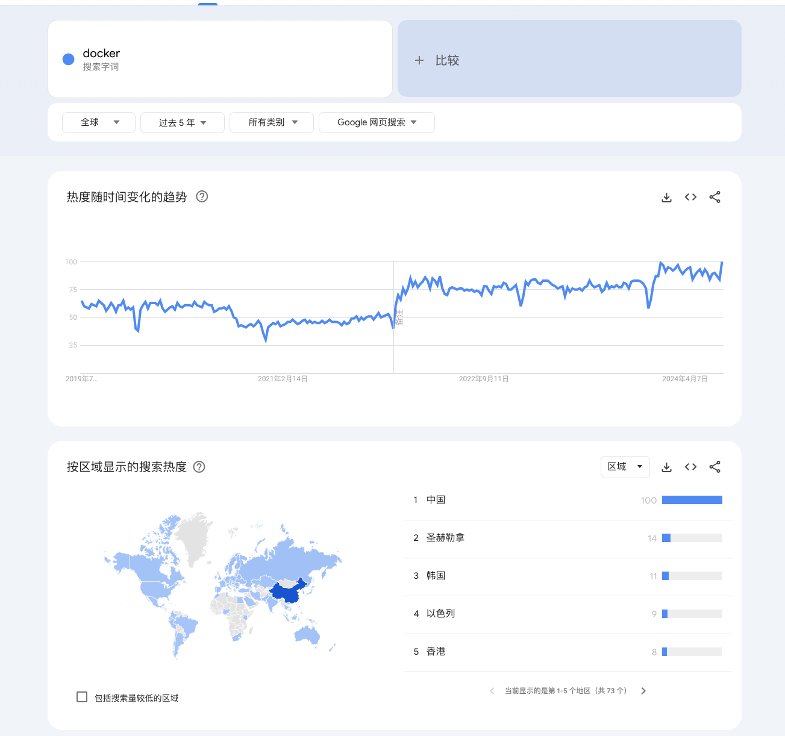
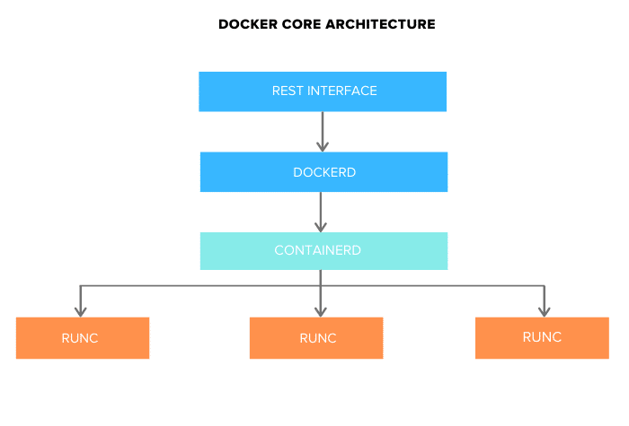
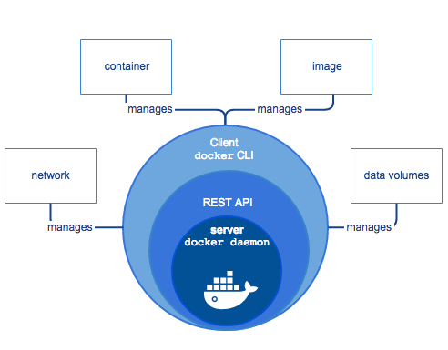
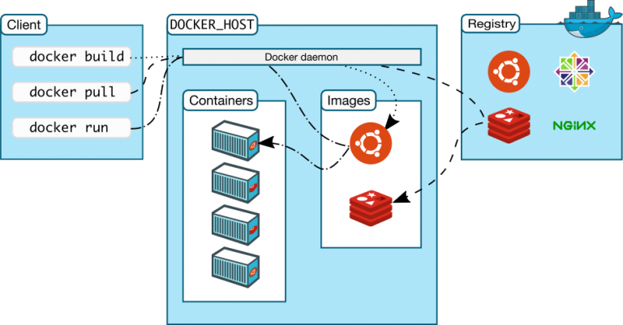
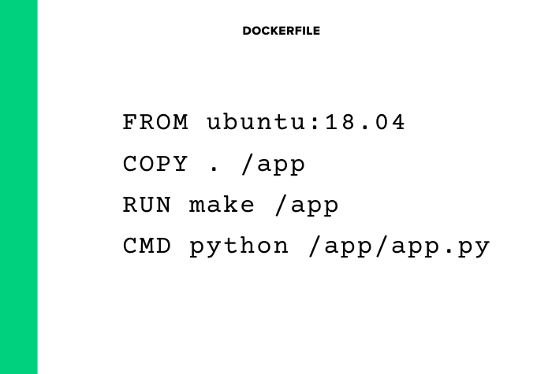
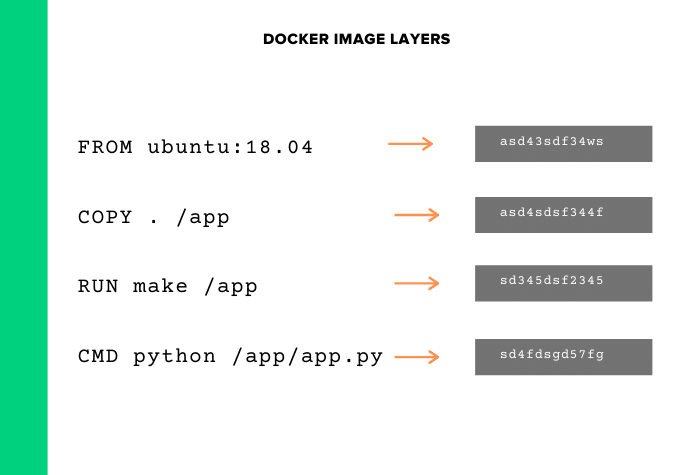
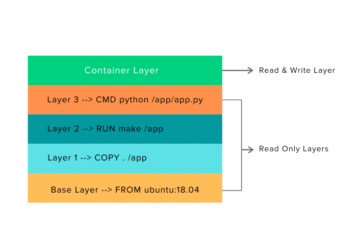
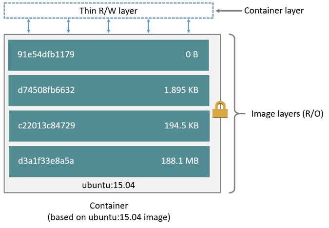

【运维干货分享】什么是docker，它是如何工作的？

这篇文章中，将会介绍什么是docker，它的演变过程，底层核心linux概念以及它的工作原理。

当涉及基于容器的实现时，Docker 已成为事实上的标准。 Docker 是从小规模实施到大规模企业应用程序的基于容器的编排的基础。

Docker 很快在 DevOps 社区中获得了广泛的欢迎和采用，因为它是为可移植性而开发的，并且是为现代微服务架构而设计的。

本文中，你将会了解到：

- 1.什么是 Docker？
- 2.了解 Docker 并了解为什么 Docker 有益且不同于其他容器技术。
- 3.Docker核心架构及其关键组件
- 4.容器的演进和Linux容器的底层概念、
- 5.什么是容器，哪些 Linux 功能使其发挥作用？
- 6.进程、容器和虚拟机之间的区别

## 什么是docker？

Docker 是一个用 Go 编写的流行开源项目，由 Dotcloud（一家 PaaS 公司）开发。

它是一个容器引擎，使用命名空间和控制组等 Linux 内核功能在操作系统之上创建容器。所以你可以称之为操作系统级虚拟化。

Docker 最初构建于Linux 容器 (LXC )之上。后来 Docker 用它的容器运行时 libcontainer （现在是runc的一部分）取代了 LXC。我在文章末尾解释了 LXC 和容器的核心概念。

你可能会问 Docker 与 Linux 容器 (LXC) 有何不同，因为所有概念和实现看起来都很相似？

除了作为一种容器技术之外，Docker 还具有定义明确的包装器组件，可以使打包应用程序变得容易。在 Docker 出现之前，运行容器并不容易。这意味着它通过将所有应用程序系统需求打包到一个容器中来完成将应用程序与基础设施解耦的所有工作。

例如，如果您有一个 Java jar 文件，则可以在任何安装了 java 的服务器上运行它。同样，一旦使用 Docker 将容器与所需的应用程序打包在一起，您就可以在任何其他安装了 Docker 的主机上运行它。

我们将通过执行一些 Docker 命令和参数来启动并运行容器。

## Docker 和 container之间的区别

Docker 是一种为高效管理容器而开发的技术或工具。

那么，我可以在没有 Docker 的情况下运行容器吗？

是的！当然。您可以使用LXC技术在Linux服务器上运行容器。此外， Podman等最新工具提供了与 Docker 类似的工作流程。

### 关于docker你应该了解
  - Docker 不是 LXC
  - Docker 不是虚拟机解决方案。
  - Docker 不是配置管理系统，也不能替代 Chef、Puppet、Ansible 等。
  - Docker 不是一种平台即服务技术。
  - Docker 不是容器。
  

## 为什么docker如此的棒？

Docker 拥有高效的工作流程，可将应用程序从开发人员的笔记本电脑转移到测试环境再到生产环境。当您查看将应用程序打包到 Docker 映像的实际示例时，您会对此有更多了解。

你知道启动 docker 容器只需不到一秒吗？

它的速度非常快，并且可以在任何具有兼容 Linux 内核的主机上运行。 （也支持Windows）

Docker 使用写入时复制联合文件系统来存储映像。因此，当对容器进行更改时，只有更改才会使用写入模型上的副本写入磁盘。

通过copy on write，您将为所有容器优化共享存储层。

## docker采用率统计

这是关于 Docker的趋势数据。你可以看到，在过去的五年里，它一直是一个爆炸性的话题。

## Docker 核心架构

以下部分将介绍 Docker 架构及其相关组件。我们还将了解每个组件如何协同工作以使 Docker 工作。

Docker 架构自诞生以来已经发生了几次变化。当我发布本文的第一个版本时，Docker 是构建在 LXC 之上的

以下是 Docker 发生的一些值得注意的架构变化

- Docker 于 2014 年从 LXC 迁移到 libcontainer
- runc – 用于启动遵循所有 OCI 规范的容器的 CLI。
- Containerd – Docker 在 2016 年将其容器管理组件分离到了 Containerd

OCI：开放容器计划是容器运行时和规范的开放行业标准。

Docker 最初推出时，它具有整体架构。现在它被分为以下三个不同的组成部分。

- Docker 引擎 (dockerd)
- containerd
- runc

Docker 和其他大型组织为标准容器运行时和管理层做出了贡献。因此， containerd和runc现在是云原生基金会的一部分，拥有来自所有组织的贡献者。

现在让我们看一下每个 Docker 组件。

### Docker引擎

Docker 引擎由 docker 守护进程、API 接口和 Docker CLI 组成。 Docker 守护进程 (dockerd) 作为dockerd systemd 服务持续运行。它负责构建 docker 镜像。

为了管理镜像和运行容器， dockerd调用docker-containerd API。

### containerd

containerd是另一个系统守护进程服务，负责下载 docker 镜像并将其作为容器运行。它公开其 API 以接收来自dockerd服务的指令

### docker runc

runc是容器运行时，负责创建容器所需的命名空间和 cgroup。然后它在这些命名空间内运行容器命令。 runc 运行时是根据 OCI 规范实现的。

## Docker 是如何工作的？

我们已经了解了 Docker 的核心构建块。

现在让我们了解使用 Docker 组件的 Docker 工作流程。

### Docker 组件

下面的官方高级 Docker 架构图展示了常见的 Docker 工作流程。

Docker生态系统由以下四个部分组成

- Docker 守护进程 (dockerd)
- Docker客户端
- Docker 镜像
- Docker 注册表
- Docker容器

## 什么是 Docker 守护进程？

Docker 具有客户端-服务器架构。 Docker 守护进程 ( dockerd ) 或服务器负责与容器相关的所有操作。

守护进程通过 CLI 或 REST API 接收来自 Docker 客户端的命令。 Docker 客户端可以与守护进程位于同一主机上，也可以位于任何其他主机上。

默认情况下，docker 守护进程监听docker.sock UNIX 套接字。如果您有任何远程访问 docker API 的用例，则需要通过主机端口公开它。其中一种用例是将 Docker 作为 Jenkins 代理运行。

## 什么是 Docker 镜像？

镜像是 Docker 的基本构建块。它包含操作系统库、依赖项和运行应用程序的工具。

可以使用应用程序依赖项来预构建映像以创建容器。例如，如果您想将 Nginx Web 服务器作为 Ubuntu 容器运行，则需要使用 Nginx 二进制文件以及运行 Nginx 所需的所有操作系统库创建 Docker 映像。

## 什么是 Dockerfile？

Docker 有一个Dockerfile的概念，用于构建镜像。 Dockerfile 是一种文本文件，每行包含一个命令（指令）。

这是 Dockerfile 的示例。

docker 镜像以分层方式组织。 Dockerfile上的每条指令都会在镜像中添加一层。图像的最顶层可写层是容器。

每个镜像都是从基础镜像创建的。

例如，如果您可以使用 Ubuntu 的基本镜像并使用 Nginx 应用程序创建另一个镜像。基础镜像可以是父镜像或者从父镜像构建的镜像。

你可能会问这个基础镜像（父镜像）从哪里来？有 docker 实用程序可以创建初始父基础映像。它获取所需的操作系统库并将它们烘焙到基础映像中。您不必这样做，因为您将获得 Linux 发行版的官方基础映像。

镜像的顶层是可写的并且被运行的容器使用。图像中的其他图层是只读的。

## 什么是 Docker 注册表？

它是 Docker 镜像的存储库（存储）。

注册表可以是公共的或私有的。例如，Docker Inc 提供了名为 Docker Hub 的托管注册表服务。它允许您从中央位置上传和下载图像。

## 什么是 Docker 容器？

Docker 容器是根据现有镜像创建的。它是图像的可写层。

如果您尝试将图像层和容器关联起来，以下是它如何查找基于 ubuntu 的图像。

您可以将应用程序打包到容器中，提交它，并将其设为黄金映像，以便从中构建更多容器。

容器可以启动、停止、提交和终止。如果您终止容器而不提交它，则所有容器更改都将丢失。

理想情况下，容器被视为不可变对象，并且不建议对正在运行的容器进行更改。相反，仅出于测试目的对正在运行的容器进行更改。

两个或多个容器可以链接在一起形成分层应用程序架构。然而，随着kubernetes等容器编排工具的出现，使用 Docker 托管高度可扩展的应用程序变得更加容易。

## Containerd 和 runc 有什么区别？

containerd 负责管理容器，runc 负责使用来自 containerd 的输入来运行容器（在容器内创建命名空间、cgroup 和运行命令）

##  Docker 引擎和 Docker 守护进程有什么区别？

Docker 引擎由 docker 守护进程、rest 接口和 docker CLI 组成。 Docker 守护进程是 systemd dockerd 服务，负责构建 docker 镜像并将 docker 指令发送到 Containerd 运行时。

>翻译自：https://devopscube.com/what-is-docker/