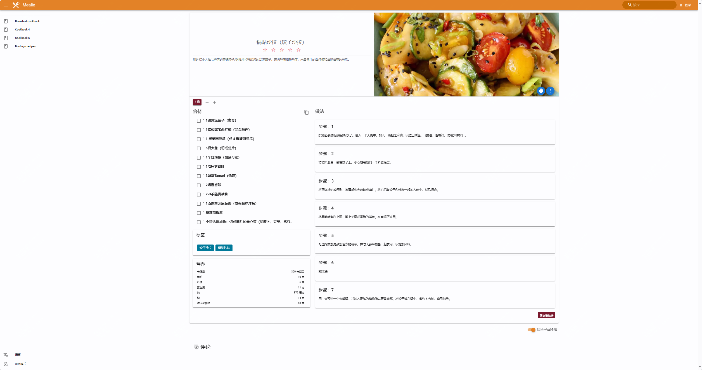

6.1k star,推荐一个好玩、实用的开源项目

如果你喜欢做饭，又想控制自己的体重或者摄入量，还想记录或查看一些食谱，那么这款开源工具，你值得拥有

随便找了一个食谱页面，如下：



### Mealie：自托管的食谱管理和膳食计划工具

#### 工具简介
Mealie 是一个自托管的食谱管理和膳食计划工具，旨在为家庭提供一个便捷的食谱管理平台。它具有 REST API 后端和基于 Vue 的响应式前端应用程序，用户体验友好。

通过 Mealie，用户可以轻松地将食谱添加到数据库中，无论是通过提供 URL 自动导入相关数据，还是使用 UI 编辑器手动添加家庭食谱。

#### 如何快速开始
要快速开始使用 Mealie，可以按照以下步骤操作：

1. **安装 Docker 和 Docker Compose**：Mealie 依赖于 Docker 进行部署，因此首先需要在系统上安装 Docker 和 Docker Compose。
2. **克隆 Mealie 仓库**：在终端中运行以下命令以克隆 Mealie 的 GitHub 仓库：
   ```bash
   git clone https://github.com/mealie-recipes/mealie.git
   ```
3. **配置环境变量**：进入克隆的仓库目录，并根据需要配置 `.env` 文件中的环境变量。
4. **启动 Mealie**：运行以下命令以启动 Mealie：
   ```bash
   docker-compose up -d
   ```
   这将启动 Mealie 的所有必要服务，包括数据库和前端应用程序。
5. **访问 Web 界面**：在浏览器中打开 `http://localhost:9925`，即可访问 Mealie 的 Web 界面，开始添加和管理食谱。

#### 功能特点
Mealie 提供了丰富的功能，满足用户的多种需求：

1. **食谱导入**：用户可以通过提供食谱 URL 自动导入相关数据，或者使用 UI 编辑器手动添加食谱。
2. **膳食计划**：使用膳食计划功能，用户可以规划未来一周的烹饪安排，确保每餐都有详细的计划。
3. **购物清单**：将所需的食材添加到购物清单中，并按超市的不同区域进行分类，方便购物。
4. **食谱书**：用户可以根据自己的标准将食谱分组到不同的食谱书中，便于管理和查找。
5. **Docker 部署**：Mealie 提供了简单的 Docker 部署方式，使得安装和维护变得非常容易。
6. **本地化**：支持 35 种以上的语言翻译，满足全球用户的需求。
7. **API 支持**：Mealie 提供了 REST API，允许第三方应用程序进行交互，扩展了工具的使用场景。

#### 结论
Mealie 是一个功能强大且易于使用的自托管食谱管理和膳食计划工具。无论是家庭用户还是美食爱好者，都可以通过 Mealie 轻松管理和规划自己的膳食。通过简单的 Docker 部署和丰富的功能，Mealie 为用户提供了极大的便利和灵活性。

希望这篇介绍文章能帮助你更好地了解和使用 Mealie。如果有任何问题或需要进一步的帮助，请随时联系我！

 [Mealie GitHub 仓库](https://github.com/mealie-recipes/mealie)
