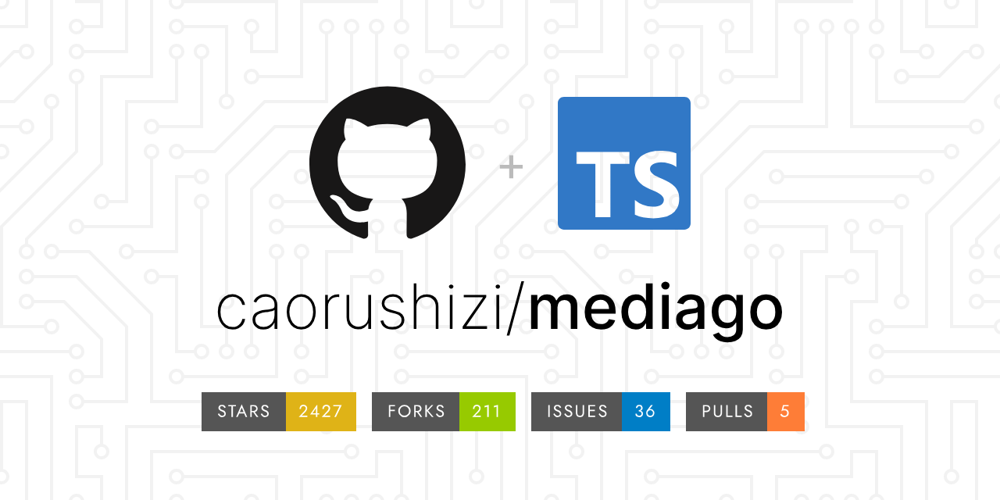
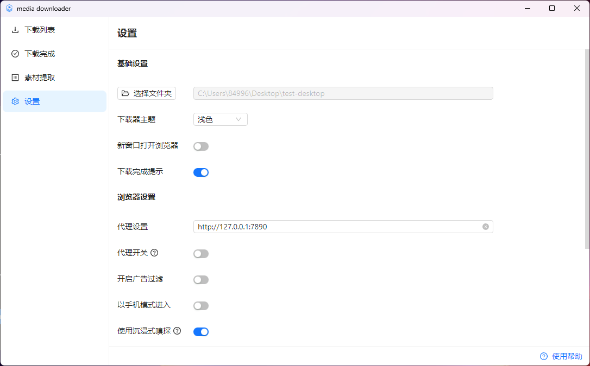
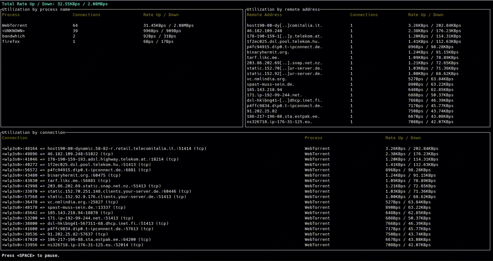
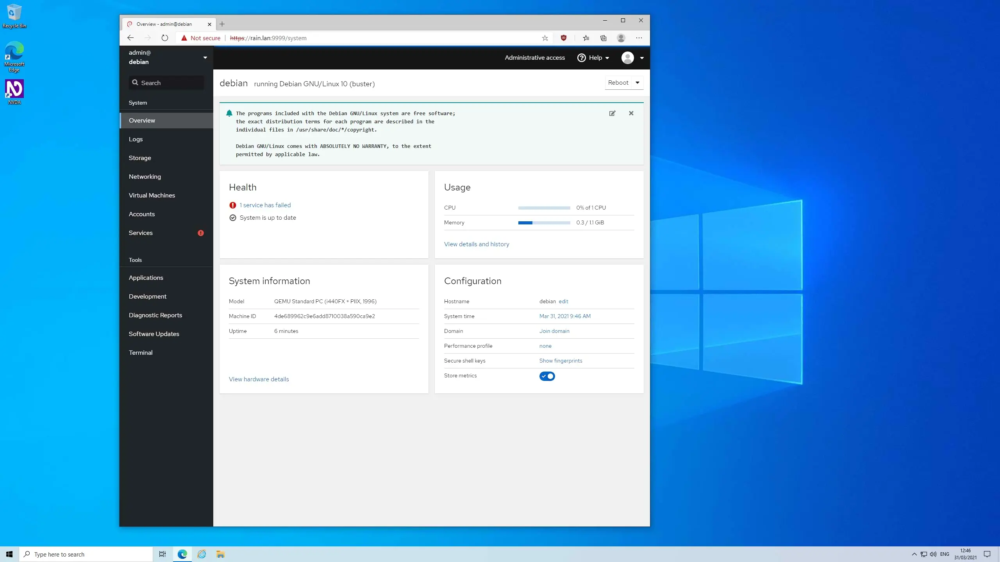
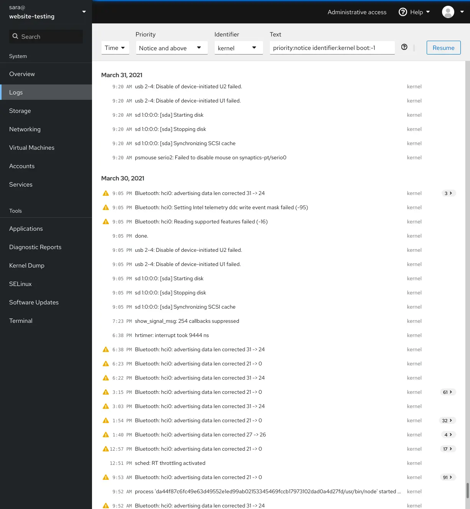
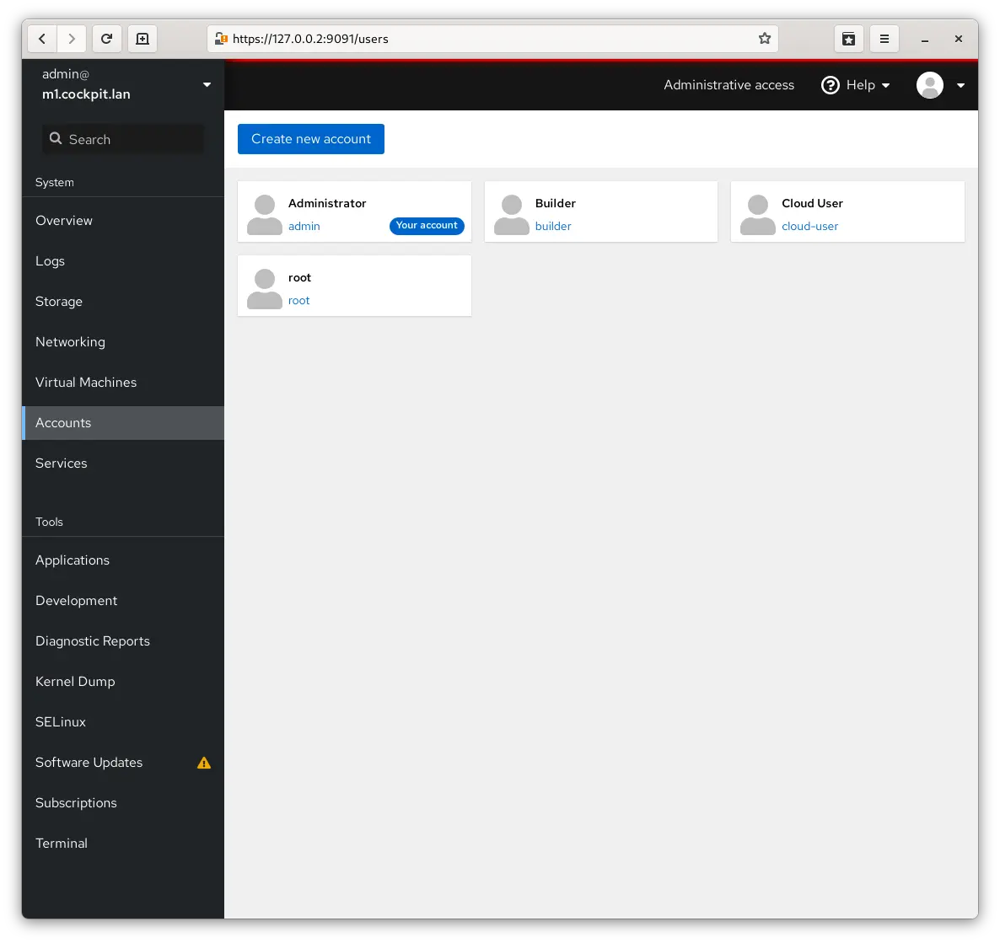
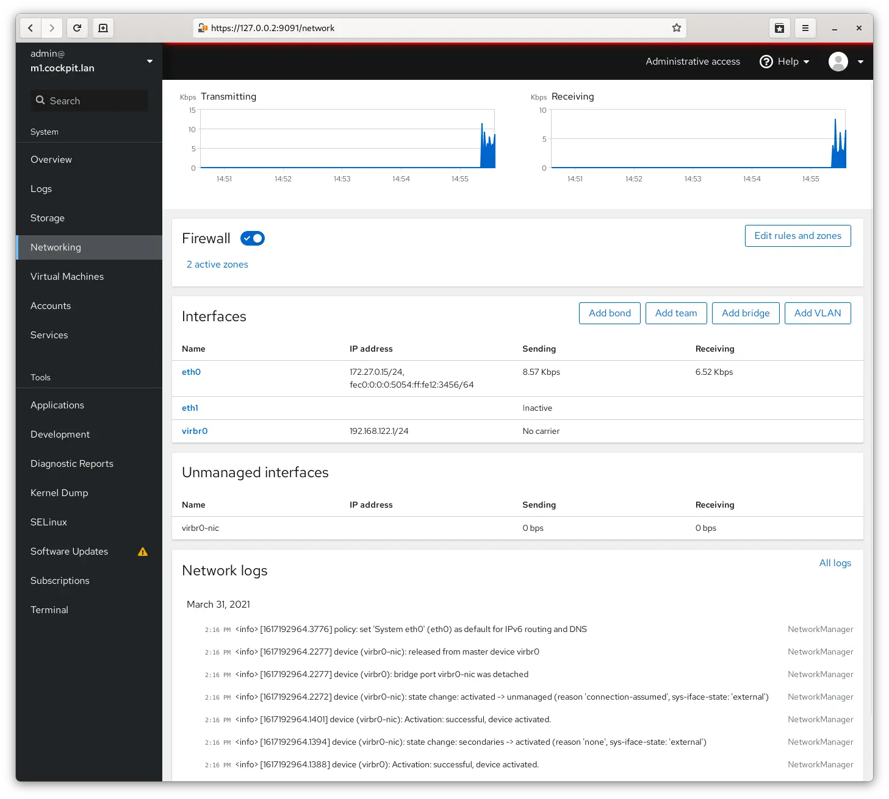

推荐三个飞起的开源项目

## 下载神器，最高速度可达30M/s
**MediaGo**

MediaGo 是一个开源的 m3u8 视频在线提取工具，支持流媒体下载、视频下载和 m3u8 下载。

该工具适用于 Windows、Mac 和 Linux 操作系统，用户无需抓包即可通过软件自带的浏览器轻松嗅探网页中的视频资源，并选择自己想要下载的资源。

MediaGo 还支持批量下载多个视频和直播资源，充分利用高速带宽。

>开源地址：https://github.com/caorushizi/mediago

## 终端带宽使用率
**bandwhich**

bandwhich 是一个开源的命令行工具，用于实时监控网络带宽使用情况。

它可以显示当前网络的使用情况，包括哪些进程创建了哪些连接，以及每个连接的带宽使用情况。

bandwhich 支持多种操作系统，包括 Windows、macOS、Linux 和 Android，适用性非常广泛。

>开源地址：https://github.com/imsnif/bandwhich  

bandwhich 是一个功能强大且灵活的网络带宽监控工具，适合需要详细了解网络使用情况的用户

## web界面管理Linux系统

**Cockpit**

Cockpit 是一个基于 Web 的图形界面，专为服务器管理而设计。

它的目标用户包括新手 Linux 用户、熟悉 Linux 但希望使用图形界面管理服务器的用户，以及主要使用其他工具但希望对单个系统有概览的专家管理员。

Cockpit 直接与操作系统交互，通过浏览器提供实时的 Linux 会话。

>开源地址:https://github.com/cockpit-project/cockpit  

Cockpit 提供了一个直观且功能强大的平台，使系统管理员能够更高效地管理和监控他们的服务器环境。

通过 Cockpit，管理员可以在一个统一的界面中完成大部分日常管理任务，从而提高工作效率和系统可靠性。