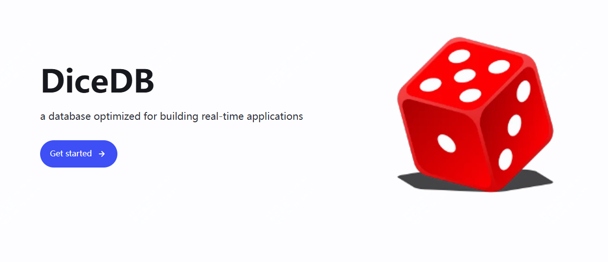

2.8k star,一个最近有点火的开源项目



### DiceDB：SQL驱动的实时反应数据库

#### 工具简介

DiceDB 是一个基于 SQL 的实时反应数据库，旨在作为 Redis 的替代品。它结合了 Redis 的高性能和 SQL 的灵活性，提供了实时数据更新通知功能。DiceDB 采用多线程和共享无架构设计，支持一部分 Redis 命令，并引入了新的 QWATCH 命令，使客户端能够监听 SQL 查询并在数据变化时实时通知。

#### 如何快速开始

要快速开始使用 DiceDB，最简单的方法是通过 Docker 运行。以下是具体步骤：

1. **使用 Docker 启动 DiceDB 服务器**：
    ```sh
    docker run dicedb/dice-server
    ```
    以上命令将在本地端口 7379 上启动 DiceDB 服务器。你可以使用 DiceDB CLI 和 SDK，甚至是 Redis CLI 和 SDK 来连接到 DiceDB。

2. **从源代码设置 DiceDB**：
    如果你希望从源代码运行 DiceDB 以便进行开发或贡献，你需要以下环境：
    - Golang
    - Linux 或 OSX（Darwin）环境，或 Windows 下的 WSL

    具体步骤如下：
    ```sh
    git clone https://github.com/DiceDB/dice
    cd dice
    go run main.go
    ```

3. **设置 CLI**：
    最佳连接 DiceDB 的方式是使用 DiceDB CLI，你可以通过以下命令安装：
    ```sh
    pip install dicedb-cli
    ```

#### 功能特点

1. **SQL 驱动的实时反应**：
    DiceDB 支持 SQL 查询，并引入了 QWATCH 命令，使客户端能够监听 SQL 查询并在数据变化时实时通知。这使得 DiceDB 在处理实时数据更新方面具有独特优势。

2. **多线程和共享无架构**：
    DiceDB 采用多线程和共享无架构设计，能够高效处理并发请求，提升了系统的整体性能和稳定性。

3. **兼容 Redis**：
    作为 Redis 的替代品，DiceDB 支持一部分 Redis 命令，这意味着你可以使用现有的 Redis CLI 和 SDK 来连接和操作 DiceDB。

4. **热重载开发环境**：
    DiceDB 提供了热重载开发环境，允许开发者在本地开发时即时查看代码更改。这一功能由 Air 工具支持，安装和使用方法如下：
    ```sh
    go install github.com/air-verse/air@latest
    air
    ```

5. **开源和社区驱动**：
    DiceDB 是一个开源项目，欢迎开发者参与贡献。你可以通过 GitHub 仓库提交问题和贡献代码，帮助加速项目的发展。

#### 总结

DiceDB 结合了 Redis 的高性能和 SQL 的灵活性，提供了实时数据更新通知功能，适用于需要高并发和实时数据处理的应用场景。通过简单的 Docker 命令或从源代码构建，你可以快速开始使用 DiceDB，并利用其多线程和共享无架构设计提升系统性能。作为一个开源项目，DiceDB 也欢迎社区的参与和贡献，共同推动项目的发展。


(1) GitHub - DiceDB/dice: A drop-in replacement of Redis with SQL-based .... https://github.com/DiceDB/dice.
