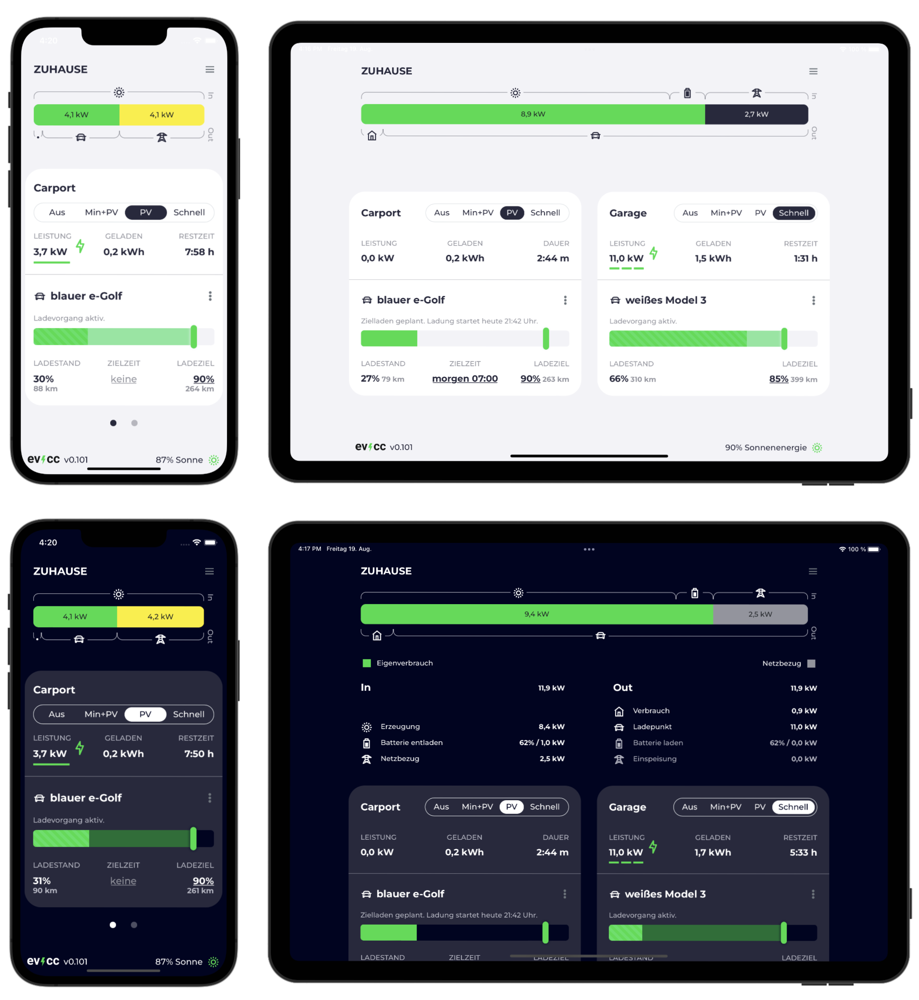

3.1k star,开源！和电动汽车相关



### EVCC：电动汽车充电控制器和家庭能源管理系统

#### 软件简介

EVCC（Electric Vehicle Charge Controller）是一个开源的电动汽车充电控制器和家庭能源管理系统。它旨在为电动汽车车主提供灵活且易于安装的充电解决方案，同时优化家庭能源的使用。EVCC 支持多种充电器和电表，并提供直观的用户界面，使用户能够轻松管理和监控充电过程。

#### 功能特点

1. **广泛的充电器支持**：
   EVCC 支持多种品牌和型号的充电器，包括 ABL eMH1、Alfen Eve、Bender CC612/613、cFos PowerBrain、Daheimladen、Ebee Wallbox、Ensto Chago Wallbox、EVSEWifi、Garo GLB、go-eCharger、HardyBarth eCB1、Heidelberg Energy Control、Innogy eBox、Juice Charger Me、KEBA/BMW、Mennekes Amedio、NRGKick Gen2、openWB、Optec Mobility One、PC Electric、Siemens、TechniSat Technivolt、Tinkerforge Warp Charger、Ubitricity Heinz、Vestel、Wallbe、Webasto Live 等

2. **多种电表支持**：
   EVCC 支持多种电表，用于监控电网、太阳能、电池和充电器的能耗情况。支持的电表包括 ModBus 系列（如 Eastron SDM、MPM3PM、ORNO WE、SBC ALE3 等）、SMA Sunny Home Manager 和 Energy Meter、KOSTAL Smart Energy Meter、Fronius、SMA、SolarEdge、KOSTAL、STECA、E3DC、Discovergy、Tesla PowerWall、LG ESS HOME、OpenEMS 等

3. **车辆集成**：
   EVCC 支持多种电动汽车品牌的集成，包括 Audi、BMW、Citroën、Dacia、Fiat、Ford、Hyundai、Jaguar、Kia、Landrover、Mercedes-Benz、Mini、Nissan、Opel、Peugeot、Porsche、Renault、Seat、Smart、Skoda、Tesla、Volkswagen、Volvo 等用户可以通过 EVCC 监控车辆的充电状态、电池状态和预调节状态。

4. **用户界面**：
   EVCC 提供简洁清晰的用户界面，用户可以通过 Web 平台或移动端应用远程启动、停止和监控充电过程

5. **智能家居集成**：
   EVCC 支持与智能家居设备的集成，如 FritzDECT、Shelly、Tasmota、TP-Link 等¹，使用户能够更好地管理家庭能源使用。

6. **插件支持**：
   EVCC 提供插件机制，用户可以根据需要扩展功能，集成更多的充电器、电表和车辆

#### 如何快速开始

1. **安装 Docker**：
   首先，确保系统上已安装 Docker。可以通过以下命令安装 Docker：
   ```bash
   sudo apt-get update
   sudo apt-get install docker-ce docker-ce-cli containerd.io
   ```

2. **下载 EVCC**：
   从 GitHub 仓库下载 EVCC 源代码：
   ```bash
   git clone https://github.com/evcc-io/evcc.git
   cd evcc
   ```

3. **配置 EVCC**：
   根据需要编辑配置文件 `evcc.dist.yaml`，配置充电器、电表和车辆信息。以下是一个简单的配置示例：
   ```yaml
   chargers:
     - name: mycharger
       type: template
       template: default
   meters:
     - name: mymeter
       type: template
       template: default
   vehicles:
     - name: mycar
       type: template
       template: default
   ```

4. **启动 EVCC**：
   使用 Docker 启动 EVCC：
   ```bash
   docker-compose up -d
   ```

5. **访问用户界面**：
   启动后，可以通过浏览器访问 EVCC 用户界面，默认地址为 `http://localhost:7070`。在界面中，用户可以查看充电状态、能耗数据，并进行相关设置。

6. **移动端应用**：
   用户还可以下载 EVCC 的移动端应用，通过手机远程管理充电过程。应用支持 iOS 和 Android 平台。

#### 结论

EVCC 是一个功能强大且灵活的电动汽车充电控制器和家庭能源管理系统。它支持多种充电器和电表，提供简洁的用户界面和丰富的功能，使用户能够轻松管理和优化家庭能源使用。

通过本文的介绍，希望您对 EVCC 有了更直观的了解，并能够快速开始使用这一优秀的开源工具。

