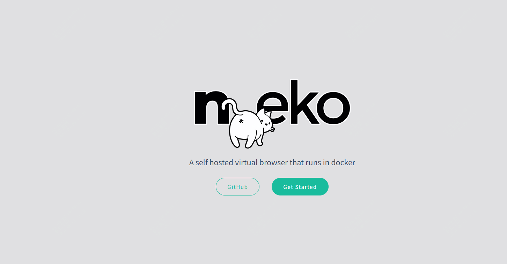

6.6k star ,一款开源好用的共享虚拟浏览器


Neko 是一款自托管的虚拟浏览器，运行在 Docker 容器中，并使用 WebRTC 技术。它为用户提供了一个安全、私密的网络浏览环境，支持多用户共享访问。

无论是开发者测试 web 应用程序，还是隐私保护用户寻求安全的浏览体验，Neko 都是一个理想的解决方案。

#### 软件简介

Neko 是一个开源项目，旨在提供一个功能齐全的虚拟浏览器环境。它允许用户在虚拟环境中运行一个完整的浏览器，从而实现安全、私密的互联网访问。

Neko 的设计初衷是为了替代已经关闭的 rabb.it 服务，提供一个稳定的流媒体观看体验。


#### 功能特点

1. **安全和私密**：Neko 运行在 Docker 容器中，提供了一个隔离的浏览环境，确保用户的浏览数据不会泄露。
2. **多用户支持**：Neko 允许多个用户同时访问同一个虚拟浏览器，非常适合团队协作和共享资源。
3. **实时互动**：用户可以通过 Neko 进行实时互动，适用于在线演示和远程教学。
4. **多种浏览器支持**：Neko 支持多种浏览器标签，如 Vivaldi 和 Opera，用户可以根据需要选择不同的浏览器环境
5. **硬件加速**：Neko 支持 Nvidia GPU 加速，提供更流畅的浏览体验
6. **移动设备支持**：Neko 支持移动设备上的触摸事件，用户可以在手机和平板上使用
7. **文件传输**：Neko 支持双向文件传输，方便用户在虚拟环境中共享文件
8. **屏幕截图**：用户可以通过特定 URL 获取虚拟浏览器的屏幕截图

#### 快速开始

要开始使用 Neko，您需要按照以下步骤进行设置：

1. **安装 Docker**：首先，确保您的系统上已经安装了 Docker。如果没有，请访问 [Docker 官方网站](https://www.docker.com/) 下载并安装 Docker。

2. **克隆 Neko 仓库**：打开终端，运行以下命令克隆 Neko 的 GitHub 仓库：
   ```bash
   git clone https://github.com/m1k1o/neko.git
   cd neko
   ```

3. **配置 Docker Compose**：在 Neko 目录中，您会找到一个 `docker-compose.yaml` 文件。您可以根据需要修改此文件中的配置，例如更改端口号或设置环境变量。

4. **启动 Neko**：运行以下命令启动 Neko：
   ```bash
   docker-compose up -d
   ```

5. **访问 Neko**：在浏览器中打开 `http://localhost:8080`，您将看到 Neko 的登录界面。输入默认的管理员用户名和密码（可以在 `docker-compose.yaml` 文件中找到），即可进入虚拟浏览器环境。

6. **自定义设置**：登录后，您可以根据需要自定义 Neko 的设置，例如添加用户、设置访问权限等。

#### 使用场景

Neko 的多功能特性使其适用于多种使用场景：

- **开发和测试**：开发者可以使用 Neko 测试 web 应用程序，确保其在不同浏览器环境中的兼容性。
- **隐私保护**：隐私保护用户可以通过 Neko 实现安全、私密的浏览体验，避免数据泄露。
- **团队协作**：团队成员可以通过 Neko 共享浏览器，方便协作和资源共享。
- **远程教学**：教师可以使用 Neko 进行远程教学，学生可以通过虚拟浏览器参与互动。
- **在线演示**：用户可以通过 Neko 进行在线演示，方便展示和讲解内容。

#### 结论

Neko 是一款功能强大的自托管虚拟浏览器，提供了安全、私密、多用户支持的浏览环境。

无论是开发者、隐私保护用户，还是需要进行团队协作和远程教学的用户，Neko 都是一个理想的选择。通过简单的安装和配置，您可以快速开始使用 Neko，享受其带来的便利和灵活性。

希望这篇文章能帮助您更好地了解和使用 Neko。

如果您有任何问题或需要进一步的帮助，请访问 github.com/m1k1o/neko)获取更多信息。
