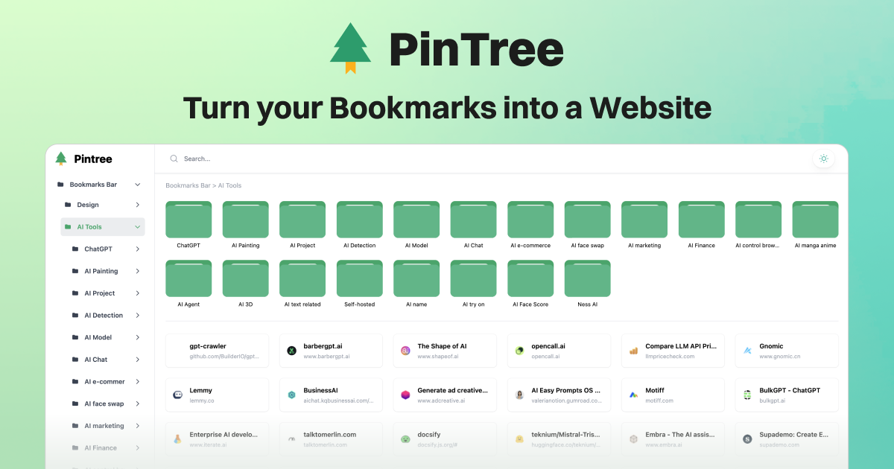

1k star,Chrome 书签变成导航站

Pintree 是一个开源项目，旨在将浏览器书签转换为一个美观且用户友好的导航网站。通过简单的几步操作，用户可以将本地书签导出并生成一个静态导航页面，方便分享和管理。

Pintree 的设计初衷是简化书签管理过程，使用户能够更直观地访问和组织他们的收藏链接。

#### 功能特点

Pintree 提供了一系列强大的功能，使其成为书签管理的理想工具：

1. **书签导出**：支持从浏览器导出书签，并将其保存为 JSON 文件格式。
2. **书签转换**：将导出的书签文件转换为 JSON 格式，便于后续处理。
3. **静态网站生成**：根据书签数据生成一个静态导航网站，用户可以通过 GitHub Pages 等平台进行托管和分享。
4. **多语言支持**：Pintree 提供了多语言支持，包括英文和中文，方便全球用户使用。
5. **开源和可定制**：作为一个开源项目，Pintree 允许用户根据自己的需求进行定制和扩展。

#### 如何快速开始

以下是使用 Pintree 快速开始的步骤：

1. **下载浏览器书签**：
   - 安装 Pintree Bookmarks Exporter 扩展程序。
   - 使用扩展程序导出浏览器书签，并将 JSON 文件保存到本地。

2. **Fork 项目**：
   - 访问 Pintree 的 GitHub 仓库 [Pintree GitHub 仓库](https://github.com/Pintree-io/pintree)。
   - 点击页面右上角的 Fork 按钮，将项目 Fork 到你的 GitHub 账户中。

3. **替换 JSON 文件**：
   - 打开你 GitHub 账户中的 pintree 仓库（即刚刚 Fork 的项目）。
   - 点击仓库中的 json 文件夹。
   - 点击 Upload files 按钮，选择之前下载的 JSON 文件并上传。
   - 确保上传的文件命名为 pintree.json，并选择 Commit changes。

4. **启用 GitHub Pages**：
   - 在你的 pintree 仓库页面，点击 Settings。
   - 找到 Pages 选项。
   - 在 Source 下拉菜单中，选择 gh-pages 分支并点击 Save。
   - 几分钟后，你的静态网站将可通过 [https://yourusername.github.io/pintree](https://yourusername.github.io/pintree) 访问（请将 yourusername 替换为你的 GitHub 用户名）。

#### 技术栈

Pintree 使用了以下技术：
- **HTML/CSS/JavaScript**：用于前端页面的构建和样式设计。
- **JSON 格式处理**：用于书签数据的存储和转换。
- **静态网站托管**：通过 GitHub Pages 等平台进行静态网站托管。

#### 贡献指南

Pintree 欢迎社区贡献，以下是参与项目的步骤：
1. **Fork 仓库**：访问 [Pintree GitHub 仓库](https://github.com/Pintree-io/pintree) 并 Fork 项目。
2. **创建新分支**：在本地仓库中创建新分支 `git checkout -b feature/your-feature`。
3. **提交更改**：进行代码修改并提交 `git commit -am 'Add some feature'`。
4. **推送分支**：将分支推送到远程仓库 `git push origin feature/your-feature`。
5. **提交 Pull Request**：在 GitHub 上提交 Pull Request。

请注意，main 分支是项目的源代码分支，而 gh-pages 分支是打包后的静态网站代码分支。请在 main 分支上进行开发和提交更改，我们将负责将代码打包并发布到 gh-pages 分支。

