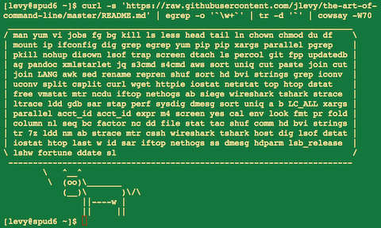

152k star,github 15万星，更艺术的使用命令行

**命令行的艺术（The Art of Command Line）** 是一个由 Joshua Levy 发起并在 GitHub 上维护的开源项目，旨在帮助用户掌握命令行的使用技巧。

该项目汇集了大量实用的命令行技巧和建议，适用于从初学者到高级用户。无论你是开发人员、系统管理员，还是对命令行感兴趣的爱好者，这个项目都能为你提供宝贵的资源。

### 功能特点

1. **基础知识**：项目涵盖了 Bash 的基础知识，包括如何使用基本命令、文件操作、文本处理等。通过这些基础知识，用户可以快速上手并掌握命令行的基本操作。

2. **日常使用**：提供了许多日常使用的命令和技巧，如如何高效地导航文件系统、管理进程、使用别名和快捷键等。这些技巧能显著提高用户的工作效率。

3. **文件及数据处理**：详细介绍了如何使用命令行工具处理文件和数据，包括文本搜索、文件比较、数据转换等。这些工具对于处理大规模数据和自动化任务非常有用。

4. **系统调试**：项目中包含了许多系统调试和故障排除的技巧，如如何查看系统日志、监控系统性能、诊断网络问题等。这些技巧对于系统管理员和开发人员尤为重要。

5. **单行脚本**：提供了一些实用的单行脚本示例，展示了如何使用命令行进行复杂的任务。这些脚本可以帮助用户快速解决实际问题。

6. **跨平台支持**：虽然主要针对 Linux 系统，但项目中也包含了适用于 macOS 和 Windows 系统的部分内容，使得不同平台的用户都能受益。

### 如何快速开始

要快速开始使用命令行的艺术，建议按照以下步骤进行：

1. **访问项目主页**：首先，访问 [The Art of Command Line](https://github.com/jlevy/the-art-of-command-line) 项目主页，浏览 README 文件，了解项目的整体结构和内容。

2. **学习基础知识**：从基础部分开始，学习 Bash 的基本命令和操作。可以通过在命令行中输入 `man bash` 来查看 Bash 的手册，了解更多详细信息。

3. **实践日常使用技巧**：尝试项目中提供的日常使用技巧，如导航文件系统、管理进程等。这些技巧能帮助你更高效地使用命令行。

4. **处理文件和数据**：学习如何使用命令行工具处理文件和数据。可以尝试使用 `grep`、`awk`、`sed` 等工具进行文本搜索和数据处理。

5. **系统调试和故障排除**：了解系统调试和故障排除的技巧，如查看系统日志、监控系统性能等。这些技巧能帮助你更好地维护和管理系统。

6. **编写单行脚本**：尝试编写一些单行脚本，解决实际问题。可以参考项目中的示例，学习如何使用命令行进行复杂任务。

7. **跨平台使用**：如果你使用的是 macOS 或 Windows 系统，可以查看项目中专门针对这些平台的部分内容，了解适用于这些系统的命令和技巧。

### 结论

命令行的艺术（The Art of Command Line）是一个非常有价值的资源，汇集了大量实用的命令行技巧和建议。

通过学习和实践这些技巧，用户可以显著提高自己的工作效率和系统管理能力。无论你是初学者还是高级用户，这个项目都能为你提供宝贵的帮助。访问项目主页，开始你的命令行之旅吧！

