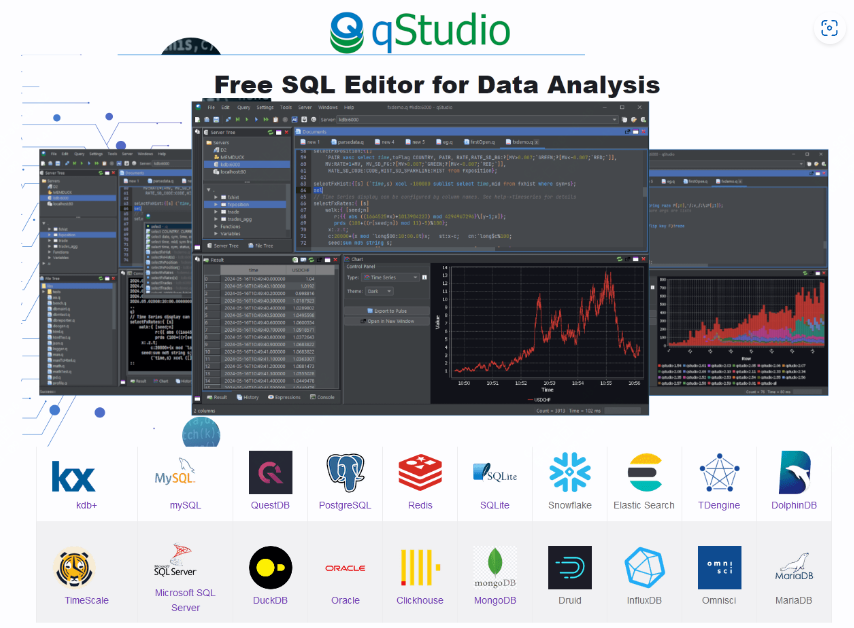

来一个超好用的开源工具

qStudio 是一款免费的 SQL 分析工具，旨在为用户提供一个直观且功能强大的 SQL 图形用户界面（GUI）。

无论您使用的是 MySQL、PostgreSQL、Microsoft SQL Server 还是其他数据库，qStudio 都能帮助您轻松运行 SQL 脚本、浏览表格、绘制图表并导出结果。

该工具支持多种操作系统，适用于各种数据库，包括 kdb+、QuestDB、Redis、TimeScale、Oracle 等。

### 功能特点

qStudio 提供了一系列强大的功能，使其成为数据库管理和分析的理想选择：

1. **服务器浏览器**：qStudio 允许用户以树状结构浏览服务器对象，并通过下拉菜单执行常见任务。这使得管理和导航数据库变得更加直观和高效。

2. **内置图表功能**：用户可以通过简单的查询选择所需的图表类型来绘制图表。这对于数据分析和可视化非常有用，特别是时间序列数据的处理。

3. **语法高亮和代码补全**：qStudio 提供语法高亮和代码补全功能，帮助用户更快地编写和调试 SQL 代码。

4. **数据透视和图表**：用户可以轻松地透视和图表化数据，进一步增强数据分析的能力。

5. **强大的 AI 助手**：qStudio 集成了多种 AI 功能，如 Text2SQL（从自然语言生成查询）、Explain-My-Query（解释查询）和 Explain-My-Error（解释错误），帮助用户更好地理解和优化 SQL 代码。

### 如何快速开始

要快速开始使用 qStudio，您可以按照以下步骤进行：

1. **下载和安装**：首先，访问 [qStudio 的 GitHub 页面](https://github.com/timeseries/qstudio) 下载最新版本的 qStudio。根据您的操作系统选择合适的安装包并进行安装。

2. **配置数据库连接**：安装完成后，启动 qStudio 并配置您的数据库连接。qStudio 支持多种数据库，您只需输入相应的连接信息即可。

3. **运行 SQL 脚本**：连接数据库后，您可以在 qStudio 的编辑器中编写和运行 SQL 脚本。利用语法高亮和代码补全功能，编写 SQL 代码将变得更加轻松。

4. **浏览和管理表格**：使用服务器浏览器功能，您可以轻松浏览和管理数据库中的表格和其他对象。通过右键菜单，您可以执行常见的管理任务，如查看表结构、导出数据等。

5. **数据分析和可视化**：qStudio 提供了强大的数据分析和可视化功能。您可以通过简单的查询生成各种图表，帮助您更好地理解数据。

6. **利用 AI 助手**：如果您在编写 SQL 代码时遇到问题，可以利用 qStudio 的 AI 助手功能。Text2SQL 可以帮助您从自然语言生成查询，Explain-My-Query 可以解释查询的执行过程，而 Explain-My-Error 则可以帮助您找出代码中的错误。

### 总结

qStudio 是一款功能强大且易于使用的 SQL 分析工具，适用于各种数据库和操作系统。其丰富的功能特点，如服务器浏览器、内置图表、语法高亮和代码补全、数据透视和图表以及强大的 AI 助手，使其成为数据库管理和数据分析的理想选择。通过简单的下载和安装步骤，您可以快速开始使用 qStudio，提升您的 SQL 编写和数据分析效率。

>项目地址：https://github.com/timeseries/qstudio
