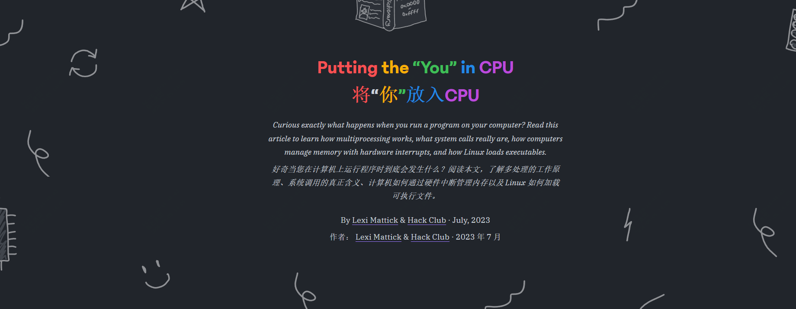

推荐一本开源的适合任何人的书籍，值得收藏！

>访问地址：https://cpu.land/

### 软件简介

CPU.land 是一个深入探讨计算机运行原理的网站，旨在帮助用户理解计算机从启动到程序执行的全过程。

该网站由 Lexi Mattick 和 Hack Club 创建，内容涵盖了多任务处理、系统调用、内存管理、硬件中断以及 Linux 如何加载可执行文件等方面。

### 功能特点

1. **多任务处理**：详细解释了计算机如何同时运行多个程序，包括进程调度和上下文切换的机制。
2. **系统调用**：深入探讨了系统调用的工作原理，如何从用户空间切换到内核空间，以及系统调用在操作系统中的角色。
3. **内存管理**：介绍了计算机如何管理内存，包括分页、内存分配和回收等技术。
4. **硬件中断**：解释了硬件中断的概念及其在计算机系统中的重要性，如何通过中断处理器来管理硬件事件。
5. **Linux 可执行文件加载**：详细描述了 Linux 系统如何加载和执行可执行文件，包括 ELF 文件格式和加载过程。

### 如何快速开始

1. **访问网站**：首先，访问 [CPU.land](https://cpu.land/) 网站，浏览主页上的介绍内容，了解网站的整体结构和主要内容。
2. **阅读章节**：网站内容分为多个章节，每个章节深入探讨一个特定主题。建议从“基础”章节开始，逐步阅读，理解每个概念。
3. **使用示例代码**：网站提供了大量示例代码和实际操作案例，用户可以通过这些示例更直观地理解各个概念。
4. **参与讨论**：网站鼓励用户参与讨论和提问，可以在每个章节的评论区留下自己的问题和见解，与其他用户交流学习心得。
5. **编辑和贡献**：如果你对某个主题有深入的理解或发现内容有改进空间，可以通过 GitHub 提交你的修改建议，参与到网站内容的建设中。

### 结论

CPU.land 是一个非常有价值的资源，特别适合那些对计算机底层原理感兴趣的用户。通过详细的讲解和丰富的示例，用户可以全面了解计算机从启动到程序执行的全过程。无论你是计算机专业的学生，还是对计算机技术有浓厚兴趣的爱好者，都可以从中受益匪浅。

