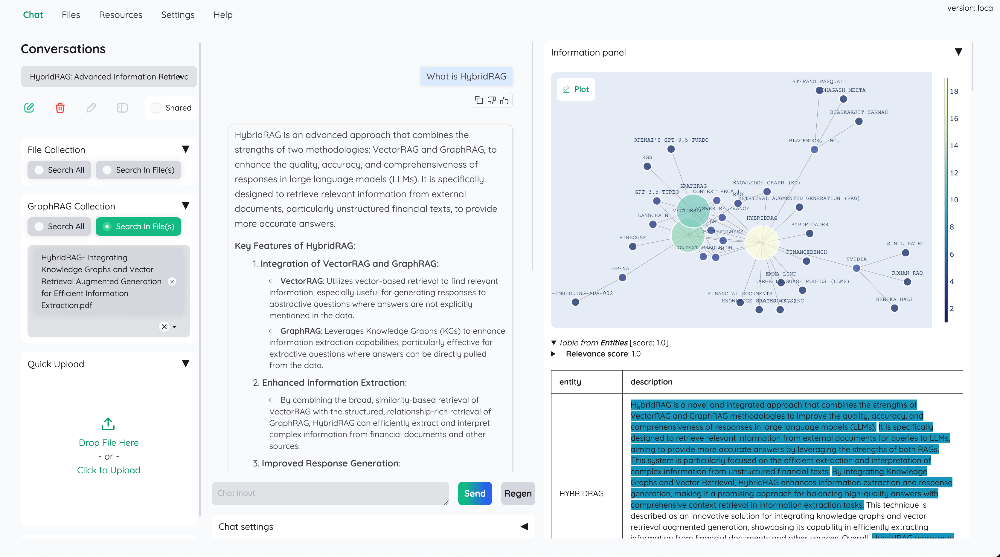

《大侠之运维》第001期

>开源合集推荐，001期合集

## 简介

本合集汇总本月发掘的有趣的开源工具，开源教程，希望可以对你有所帮助。

>本期为第一期，计划每月最后一个周六发布！！

## 好用的工具

**LibreTranslate**是一个完全开源的机器翻译 API，旨在提供自托管和离线翻译能力。与依赖于谷歌或Azure等专有提供商的翻译API不同，LibreTranslate 使用开源的 Argos Translate 库作为其翻译引擎¹。这使得用户可以在不依赖外部服务的情况下，完全控制自己的翻译数据和服务。

详细介绍地址：[开源机器翻译](https://mp.weixin.qq.com/s?__biz=MzU4MjY3Mzc3OQ==&mid=2247493851&idx=1&sn=42a341e6948139a634220ce280442013&chksm=fdb61cc7cac195d10831d8b132128a3a1597abebb4f8ddc906b1a1a9a13dfb71b3fa4cd0db0d&token=1645954397&lang=zh_CN#rd)

开源地址：github.com/LibreTranslate/LibreTranslate

---

**Deskreen** 是由 Pavlo Bu开发的一款基于 Electron.js 的应用程序。它利用 WebRTC 技术，将你的桌面实时流式传输到任何设备的浏览器上。无论是手机、平板还是另一台电脑，只要能运行浏览器，就能成为你的第二屏幕

详细介绍地址：[**Deskreen**](https://mp.weixin.qq.com/s?__biz=MzU4MjY3Mzc3OQ==&mid=2247494199&idx=1&sn=1b42cebeeffda29dd73a5fdf805f1caa&chksm=fdb61e2bcac1973d66f21039c692d2b733c39aeb56358a0d85cb0e2c00e137992425f28ebaac&token=1645954397&lang=zh_CN#rd)

开源地址：github.com/pavlobu/deskreen

---

Cryptomator 是一款开源的客户端加密软件，专为保护云存储中的文件而设计。它通过透明的客户端加密技术，确保用户的文件在上传到云端之前已经被加密，从而避免了云服务提供商或第三方访问用户数据的风险。

Cryptomator 支持多平台，包括 Windows、macOS、Linux、Android 和 iOS，用户可以在这些平台上轻松使用该软件来保护他们的隐私

详细介绍地址：[客户端加密软件](https://mp.weixin.qq.com/s?__biz=MzU4MjY3Mzc3OQ==&mid=2247494604&idx=1&sn=3a166a875913c0b2d8ec34121d573e40&chksm=fdb61fd0cac196c68c8bf20fd4c2afaff9df46368e6839177e27a72f9c5220ef779cda366da4&token=1645954397&lang=zh_CN#rd)

开源地址：

## docker相关

**Docker-OSX** 可以许用户在 Docker 容器中运行 macOS 虚拟机。

这个项目是由Sick.Codes开源及维护，它的想法在于提供接近原生性能的 macOS-KVM 环境

并且支持 X11 转发、CI/CD 安全研究等功能

详细介绍地址：[docker运行macos](https://mp.weixin.qq.com/s?__biz=MzU4MjY3Mzc3OQ==&mid=2247493885&idx=1&sn=498284520786d0a7f034d866dab0f020&chksm=fdb61ce1cac195f7b173ad9766fc906d7c329ad9ce3461cc28da9effe13245c0bd0976a92849&token=1645954397&lang=zh_CN#rd)

开源地址：github.com/sickcodes/Docker-OSX

---

**Dokku **是一个基于 Docker 的开源 PaaS（平台即服务）平台，旨在帮助开发者构建和管理应用程序的生命周期

开源地址：https://dokku.com

## AI相关

**Kotaemon** 是一个开源的文档问答（RAG）工具，旨在为终端用户和开发者提供一个简洁且可定制的用户界面，用于与文档进行交互。

该项目由 Cinnamon 开发，支持多种大型语言模型（LLM）API 提供商，如 OpenAI、AzureOpenAI 和 Cohere，以及本地 LLM。

详细介绍地址：[开源的文档问答（RAG）工具](https://mp.weixin.qq.com/s?__biz=MzU4MjY3Mzc3OQ==&mid=2247493924&idx=1&sn=d05155339f535af217867e8fbd153448&chksm=fdb61d38cac1942e1fbb0489756440728a23b39db6e5a13a87fe845fa4bba23ad119c130184c&token=1645954397&lang=zh_CN#rd)

开源地址：github.com/Cinnamon/kotaemon

---
**Lobe Chat** 是由 LobeHub 开发的一个开源项目，旨在为用户提供一个现代化设计的 AI 聊天框架。

它支持多种 AI 服务商，包括 OpenAI、Claude 3、Gemini、Ollama、Azure 和 DeepSeek 等

用户可以通过一键部署，快速拥有自己的 ChatGPT 或 Claude 应用

详细介绍地址：

开源地址：github.com/lobehub/lobe-chat

---

**Awesome ChatGPT Prompts** 是一个由社区驱动的 GitHub 仓库，旨在收集和分享各种有效的 ChatGPT 提示。

这些提示可以帮助用户更好地与 ChatGPT 互动，提高生产力和创意表达

详细介绍地址：[Awesome ChatGPT Prompts](https://mp.weixin.qq.com/s?__biz=MzU4MjY3Mzc3OQ==&mid=2247493988&idx=1&sn=a842f91f29443d43d9415d9b8d6a5075&chksm=fdb61d78cac1946ee63791f0882ffeda0cd806c37b3c449185e02ca8d29c3658a07cb9e97a8d&token=1645954397&lang=zh_CN#rd)

开源地址：github.com/f/awesome-chatgpt-prompts

---

**Postiz**是一款开源的社交媒体调度工具，提供了全面的功能来帮助用户管理社交媒体帖子、分析效果、与团队成员协作，并利用 AI 提供的各种帮助。无论是个人用户还是企业团队，Postiz 都能满足其需求。

详细介绍地址：[社交媒体调度工具](https://mp.weixin.qq.com/s?__biz=MzU4MjY3Mzc3OQ==&mid=2247494035&idx=1&sn=60c4eb8d9a445f5245c9621da47458a2&chksm=fdb61d8fcac19499595240a872a3e897f2d29cdf2bd4f3204e0159ff4cda48786ab05a1ece81&token=1645954397&lang=zh_CN#rd)

开源地址：github.com/gitroomhq/postiz-app

## 学习文档

AWS DevOps Zero to Hero 是一个由 Abhishek Veeramalla 创建的 GitHub 仓库，旨在帮助 DevOps 工程师在 30 天内掌握 AWS 的核心服务和最佳实践。

该仓库包含项目、演示文稿、面试问题和实时示例，旨在提供全面的学习体验

详细介绍地址：

开源地址：github.com/iam-veeramalla/aws-devops-zero-to-hero

## 数据库相关

**SQLPage**是一个开源的 SQL-only 数据应用构建工具。它允许用户通过编写简单的 SQL 文件来查询、分组、更新、插入和删除数据，并自动生成美观的网页界面。

SQLPage 支持多种数据库，包括 SQLite、PostgreSQL、MySQL 和 Microsoft SQL Server

详细介绍地址：[SQLPage](https://mp.weixin.qq.com/s?__biz=MzU4MjY3Mzc3OQ==&mid=2247494165&idx=1&sn=908a29db40dc4bb3c487f3314eadc5a4&chksm=fdb61e09cac1971ff678a4661f665cb01717d10eec9a8c3e02636c0a82e7e17b209f66a4603f&token=1645954397&lang=zh_CN#rd)

开源地址：github.com/lovasoa/sqlpage

## 浏览器

Neko 是一个开源项目，旨在提供一个功能齐全的虚拟浏览器环境。它允许用户在虚拟环境中运行一个完整的浏览器，从而实现安全、私密的互联网访问。

Neko 的设计初衷是为了替代已经关闭的 rabb.it 服务，提供一个稳定的流媒体观看体验。

详细介绍地址：

开源地址：github.com/m1k1o/neko

## 终端工具

LNAV（Logfile Navigator）是一款功能强大的日志文件查看器，专为终端用户设计。

它能够处理多种日志文件格式，并将它们合并到一个统一的视图中，方便用户进行日志分析和故障排除。

LNAV 的设计初衷是简化日志文件的查看和管理，使用户能够更高效地处理日志数据。

详细介绍地址：[日志文件查看器](https://mp.weixin.qq.com/s?__biz=MzU4MjY3Mzc3OQ==&mid=2247494362&idx=1&sn=bcaab407dd5cdcc3a392326cd4ca371e&chksm=fdb61ec6cac197d0e803a71eacd7c3baded45a2850336a990810513f34ae69ffd2666498775b&token=1645954397&lang=zh_CN#rd)

## 网盘工具

ZFile 是一个开源的在线网盘程序，旨在为用户提供一个统一的文件管理平台。通过 ZFile，用户可以将不同类型的存储源整合到一个网页中进行查看、预览和管理，无需频繁登录各个存储平台。

开源地址：github.com/zfile-dev/zfile

## 下载工具

imFile 是一款功能强大的全能下载工具，基于 Motrix 的 fork 并长期维护更新。

它支持多种下载协议，包括 HTTP、FTP、BitTorrent 和 Magnet 链接，适用于 Windows、macOS 和 Android 平台。imFile 的设计初衷是为用户提供一个顺畅、高速、强大而便捷的下载体验。

详细介绍地址：[全能下载工具](https://mp.weixin.qq.com/s?__biz=MzU4MjY3Mzc3OQ==&mid=2247494734&idx=1&sn=eb8af237b0bb2c317d7b4613f446b382&chksm=fdb61852cac191443335fd8622c6137c66645ba7afb826001edbcd4d640fec55b0d55648704c&token=1645954397&lang=zh_CN#rd)

开源地址：https://imfile.io/
