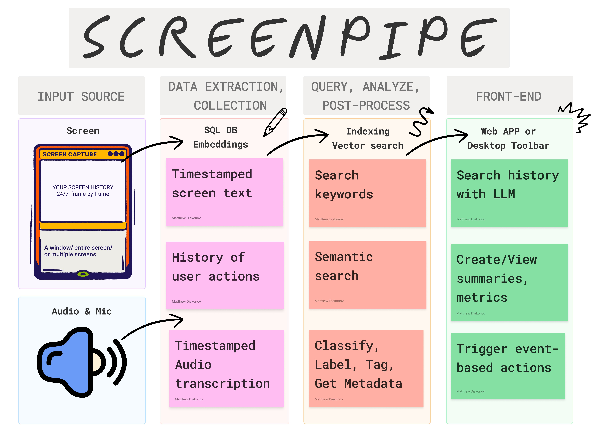
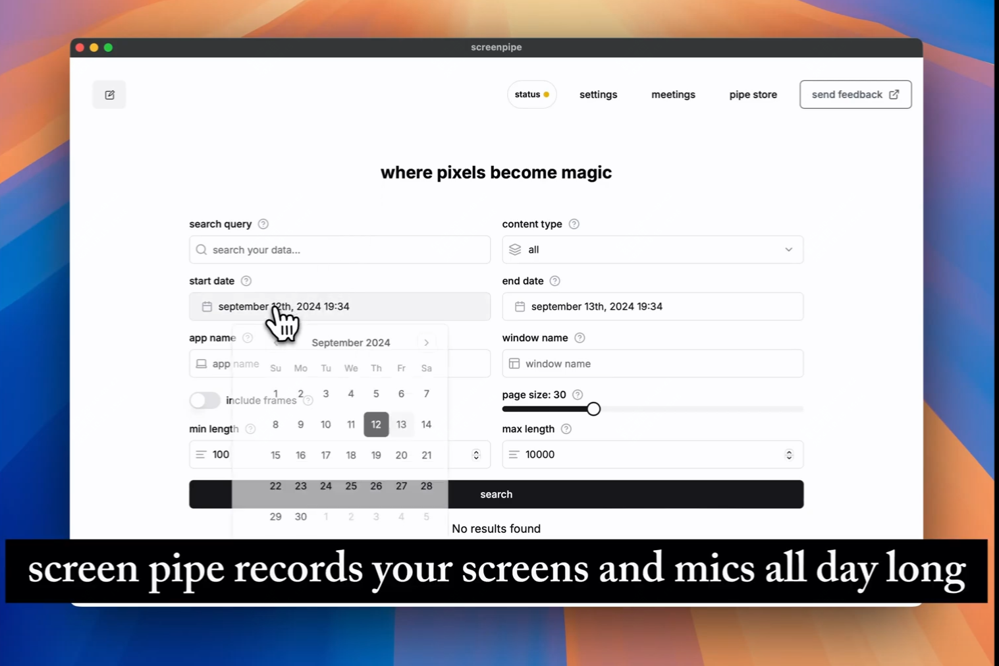

7.7k star,又一款真香开源工具推荐

Screenpipe 是一款开源的全天候本地 AI 屏幕和麦克风录制工具，旨在为用户提供一个安全、私密的数据记录和分析平台。它支持与 Ollama 和 Llama3.2 集成，能够控制计算机，成为 Rewind.ai 和 Zapier 的替代方案。

Screenpipe 采用 Rust 编写，确保高效和安全的数据处理。

**功能特点**

1. **全天候录制**：Screenpipe 能够24/7不间断地录制屏幕和音频，确保用户不会错过任何重要信息。
2. **本地数据存储**：所有录制的数据都存储在本地，用户完全拥有数据的控制权，确保隐私和安全。
3. **多平台支持**：支持 Windows 和 macOS 系统，并且可以通过 CLI 工具进行安装和使用，适合技术用户。
4. **插件系统**：Screenpipe 具有一个名为“pipe”的插件系统，允许用户在 Rust 代码的沙盒环境中运行代码，扩展功能。
5. **OCR 支持**：内置 OCR 功能，支持中文和英文文本识别，方便用户从屏幕截图中提取文字信息。
6. **集成能力**：可以与 Ollama 和 Llama3.2 集成，实现更高级的 AI 控制和自动化操作。

**吸引用户的特点**

1. **数据隐私和安全**：与许多云端服务不同，Screenpipe 将数据存储在本地，用户完全掌控自己的数据，避免隐私泄露的风险。
2. **开源和社区支持**：作为一个开源项目，Screenpipe 拥有活跃的开发者社区，用户可以自由地查看、修改和贡献代码，促进软件的不断改进。
3. **高效的性能**：采用 Rust 编写，Screenpipe 在性能和安全性上具有显著优势，能够高效地处理大量数据。
4. **灵活的插件系统**：通过“pipe”插件系统，用户可以根据自己的需求扩展功能，极大地提高了软件的灵活性和可定制性。
5. **多语言支持**：内置的 OCR 功能支持多种语言，特别是中文和英文，满足不同用户的需求。

**快速使用指南**

1. **安装**：
   - **CLI 工具**：适合技术用户，可以通过命令行安装和使用。
   - **桌面应用**：提供付费和免费版本，付费版本包含一年更新、优先支持和优先功能，免费版本需要用户自行构建。

2. **配置**：
   - 下载并安装 Screenpipe 后，用户可以通过简单的配置文件设置录制参数，如录制频率、存储路径等。
   - 用户可以选择启用或禁用 OCR 功能，根据需要调整识别语言。

3. **使用**：
   - 启动 Screenpipe 后，软件会在后台运行，自动录制屏幕和音频。
   - 用户可以通过插件系统添加自定义功能，例如自动截图、关键字检测等。

4. **数据管理**：
   - 所有录制的数据都会存储在本地数据库中，用户可以随时访问和管理这些数据。
   - 通过内置的搜索和过滤功能，用户可以快速找到需要的录制内容。

Screenpipe 作为一款功能强大且灵活的本地 AI 录制工具，不仅在数据隐私和安全性上具有显著优势，还通过其高效的性能和丰富的功能吸引了大量用户。无论是个人用户还是企业用户，都可以通过 Screenpipe 实现高效的数据记录和分析，提升工作效率。

