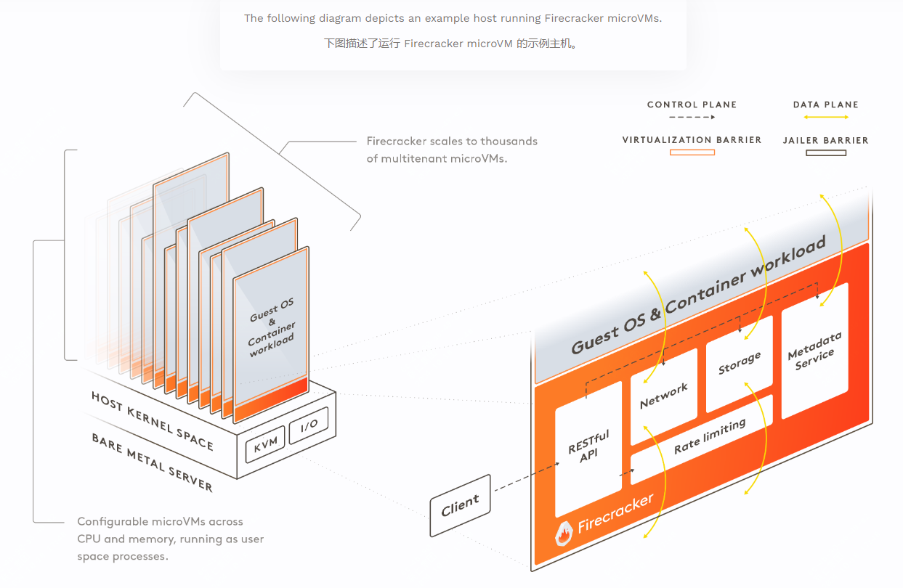

25.7k star,轻如羽翼，快如闪电,亚马逊开源的虚拟技术

Firecracker 是由亚马逊网络服务（AWS）开发的一款开源虚拟机监控程序（VMM），专为高效的多租户容器和无服务器计算环境而设计。它利用 KVM（Kernel-based Virtual Machine）技术，允许用户在裸机环境中运行轻量级的虚拟机（microVMs）。Firecracker 主要服务于 AWS 的无服务器平台 Lambda 和容器服务 Fargate，但它同样适用于其他需要快速、安全、资源高效虚拟化的场景。其核心目标是通过尽可能少的资源占用，实现快速启动、安全隔离以及出色的扩展性。



### 功能简介

Firecracker 的设计核心是支持轻量级的虚拟化环境，尤其适用于无服务器计算、容器化应用和多租户服务。与传统虚拟机不同，Firecracker 的 microVM 尺寸非常小，占用的资源极少，并且启动速度极快，通常在几毫秒内即可启动。它能够运行 Linux 和其他基于 KVM 的系统，但其轻量化设计确保了每个虚拟机只消耗最低限度的系统资源。

Firecracker 通过减少传统虚拟机的开销，如 BIOS、ACPI 表、PCI 总线等，来优化系统性能。它的架构基于 KVM，而 KVM 是 Linux 内核中的虚拟化解决方案，因此 Firecracker 能够直接利用内核的能力来创建虚拟机。Firecracker 提供的 API 驱动允许用户轻松地通过 RESTful API 操作和管理虚拟机，包括创建、配置和启动 microVM。

### 吸引用户的功能特点

1. **启动速度极快**：
   Firecracker 的一个显著优势是其快速的启动时间。传统的虚拟机可能需要数秒或数十秒来完成启动，但 Firecracker 的 microVM 启动时间可以压缩到 125 毫秒左右。这对于无服务器计算环境至关重要，用户可以快速地启动和销毁微服务或容器，而不必等待传统虚拟机的启动延迟。

2. **资源占用极低**：
   Firecracker 的 microVM 被设计为仅使用非常少的内存和 CPU 资源。相比传统的虚拟机或容器，Firecracker 的虚拟机具有更小的开销。它在内存消耗上非常高效，microVM 通常只占用几兆字节的内存，而传统虚拟机可能需要数百兆甚至更多。这使得 Firecracker 成为理想的多租户环境工具，尤其是当需要运行大量虚拟机时。

3. **安全隔离**：
   Firecracker 提供强大的安全隔离机制。每个微虚拟机都运行在独立的内核空间中，确保了应用之间的隔离。它还支持内置的 seccomp（安全计算模式）过滤器，限制系统调用的使用，进一步提升了安全性。这对于无服务器计算和多租户环境来说尤其重要，因为不同用户的工作负载需要完全隔离，以防止潜在的安全威胁。

4. **扩展性强**：
   Firecracker 是为大规模环境设计的，支持同时运行数以千计的微虚拟机。它的资源管理功能可以确保每个虚拟机都能在资源有限的情况下保持高效运行，同时保持整个系统的高效性和稳定性。Firecracker 非常适合需要频繁创建和销毁实例的环境，如 AWS Lambda 等无服务器平台。

5. **与容器集成良好**：
   虽然 Firecracker 是一个虚拟机管理器，但它与容器化技术有很好的兼容性。与传统虚拟机相比，Firecracker 更接近容器化应用的性能，同时提供了更好的安全隔离。通过与 Docker 或 Kubernetes 集成，用户可以在享受虚拟机隔离性的同时，获得与容器类似的灵活性。

### 快速使用指南

Firecracker 官方提供了通过 **Ignite** 这种方式来启动和连接 Firecracker 虚拟机。这使得用户在使用 Firecracker 创建和管理轻量级虚拟机时更加方便。

**Ignite** 是一个开源工具，专为简化使用 Firecracker 启动和管理 microVM 而设计。它将虚拟机管理与容器工作流程结合，用户可以像管理 Docker 容器一样，通过简单的命令行来操作 Firecracker 微虚拟机。Ignite 支持使用 Docker 或 OCI 镜像来作为虚拟机的根文件系统，并通过简单的命令行工具提供 Firecracker 的功能。


### 使用 Ignite 快速启动并连接 Firecracker 虚拟机：

Ignite 大大简化了使用 Firecracker 启动和连接虚拟机的步骤。以下是如何使用 Ignite 启动和连接 Firecracker 虚拟机的简单流程：

1. **安装 Ignite**：
   首先，确保主机环境已经安装了 KVM 和 Docker。然后，你可以通过以下命令安装 Ignite：
   ```bash
   curl -sfLo ignite https://github.com/weaveworks/ignite/releases/download/v0.10.1/ignite-v0.10.1-linux-amd64
   chmod +x ignite
   sudo mv ignite /usr/local/bin
   ```

2. **启动 Firecracker 虚拟机**：
   使用 Ignite 启动一个基于 Docker 镜像的 Firecracker 虚拟机。比如，你可以使用下面的命令启动一个 Ubuntu 虚拟机：
   ```bash
   sudo ignite run ubuntu --cpus 2 --memory 1GB --ssh
   ```
   这个命令将启动一个 Ubuntu 系统的 Firecracker microVM，分配 2 个 CPU 和 1 GB 内存，并启用 SSH 连接。

3. **连接虚拟机**：
   Ignite 会自动为虚拟机设置 SSH 连接。一旦虚拟机启动完成，你可以通过以下命令直接 SSH 进入虚拟机：
   ```bash
   sudo ignite ssh <VM-ID>
   ```
   `VM-ID` 是虚拟机的标识符，你可以通过 `ignite ps` 命令查看当前正在运行的虚拟机及其 ID。

4. **查看虚拟机状态**：
   你可以使用以下命令来查看运行中的虚拟机：
   ```bash
   sudo ignite ps
   ```
   这会显示所有正在运行的虚拟机及其相关信息，包括 IP 地址、状态等。

### 总结

使用 Ignite，可以极大简化 Firecracker 的操作流程，从启动到管理虚拟机的整个过程变得像管理 Docker 容器一样简单。Ignite 提供了便捷的命令行工具，让用户可以轻松启动、停止和连接虚拟机，并且通过 SSH 连接到虚拟机也非常方便。Ignite 还为虚拟机提供了自动的网络配置和管理，这大大提升了 Firecracker 的可用性和开发效率。

通过 Ignite，Firecracker 不仅可以为无服务器计算和容器化应用提供高效、轻量级的虚拟化解决方案，而且让用户以熟悉的容器管理工作流来管理虚拟机

