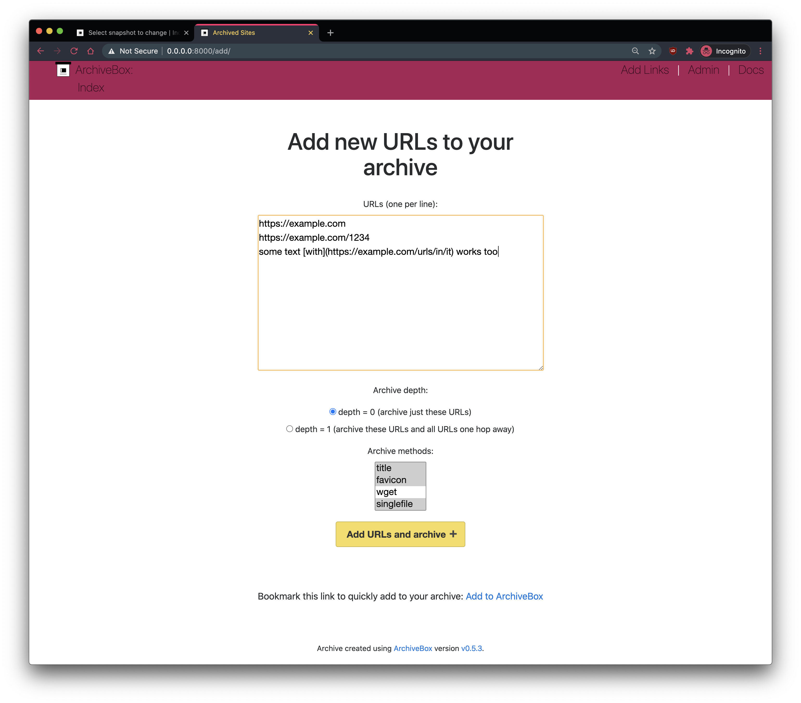
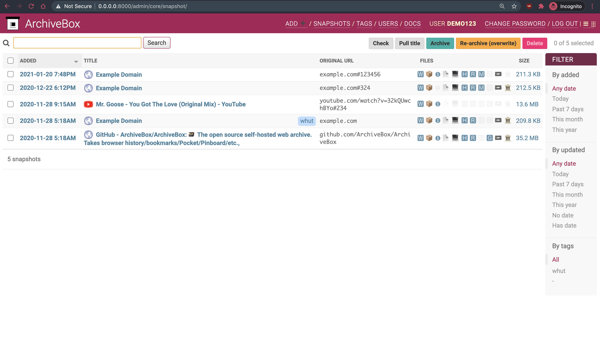

21.7k star,一款用了直呼厉害的工具！

ArchiveBox 是一个开源的自托管网页归档解决方案，用于保存网页的完整快照，防止重要信息丢失。该项目的设计初衷是帮助用户在浏览网络时快速保存感兴趣的网页，并长期备份内容。ArchiveBox 通过多种存储方法记录网页的不同版本，包括 HTML、PDF、截图、DOM 树、文本内容等，确保内容尽可能完整地保留下来。




ArchiveBox 托管在 [GitHub](https://github.com/ArchiveBox/ArchiveBox)，拥有活跃的开发者社区和定期更新的功能。它适用于个人用户、研究人员和需要存档大量网页的组织。其开源的本质和灵活的存储方式，使得 ArchiveBox 成为现代网页归档的理想工具。

## 一、软件简介

ArchiveBox 可以理解为一种离线版本的“时间机器”，用于存档和恢复网页的不同版本。随着互联网内容的动态变化和页面的不断更新，许多重要的资源可能在不经意间被删除或更改，导致信息无法访问。传统的网页存档工具（如浏览器的书签或云存档服务）存在一定的局限性，如只能存储 URL 链接或需要依赖外部服务，而 ArchiveBox 则将存档和管理过程完全掌控在用户自己手中。

该软件通过抓取网页的内容和元数据，并将其存储为不同的格式，如 HTML、PDF、截图、文本等，以便用户在不同情况下进行查阅。ArchiveBox 还支持自动化和批量存档功能，使得用户可以定期备份和更新网页的最新内容。

## 二、功能介绍

ArchiveBox 提供了一系列强大的功能，使得用户可以灵活管理和存储网页内容。以下是一些主要功能：

### 1. 多种存档格式支持

ArchiveBox 支持将网页存储为多种格式，包括：
- **HTML 文件**：完整保存网页的原始代码和结构，方便离线浏览。
- **PDF 格式**：将网页转换为 PDF 文件，保持页面的视觉布局。
- **截图**：为网页生成 PNG 格式的截图，记录页面的外观。
- **DOM 树**：保存网页的 DOM 结构，以便日后进行分析。
- **文本**：提取页面中的纯文本内容，用于全文搜索和数据处理。
- **WARC 格式**：WARC（Web ARChive）是一种标准化的网页存档格式，可以将网页的所有内容和资源打包为一个文件。

通过支持多种格式，ArchiveBox 可以最大程度地保留网页的内容和形式，适应不同的应用场景和需求。

### 2. 自动化归档和定时更新

ArchiveBox 支持自动化归档，用户可以通过脚本将新链接批量导入，并定期更新已存档的网页。这使得用户可以轻松地构建一个全面的网页归档系统，定期抓取和保存重要的网页内容，避免信息丢失。

### 3. 多种导入方式

用户可以通过多种方式将网页链接导入到 ArchiveBox 中进行存档，包括：
- **浏览器书签导入**：从浏览器书签导出文件中批量导入链接。
- **RSS 源**：从 RSS 提要中自动抓取最新的网页链接。
- **文件导入**：从文本文件、CSV 文件等格式中读取 URL 进行存档。
- **命令行输入**：直接在命令行中输入 URL 进行快速存档。

### 4. 全文搜索和标签管理

ArchiveBox 具备全文搜索功能，用户可以对存档的网页内容进行搜索，以便快速找到所需信息。此外，用户可以对存档添加标签进行分类管理，提高检索效率。

### 5. API 支持

ArchiveBox 提供了 RESTful API，允许开发者集成和扩展功能。用户可以通过 API 创建自定义的网页抓取和管理流程，实现更复杂的自动化任务。

## 三、如何快速开始

ArchiveBox 的快速上手过程相对简单，只需几步即可完成安装和使用。

### 1. 环境准备

在使用 ArchiveBox 之前，需要确保以下环境配置：
- **Python 3.7 或更高版本**：用于运行 ArchiveBox。
- **Git**（可选）：用于从 GitHub 克隆项目。
- **Docker**（可选）：如果使用 Docker 进行安装，则需要安装 Docker。

可以通过以下命令检查 Python 是否已安装：
```bash
python --version
```

### 2. 安装 ArchiveBox

有两种安装方式可以选择，分别是使用 `pip` 或 Docker：

#### 方式一：使用 `pip` 安装

可以通过 `pip` 命令直接安装 ArchiveBox：
```bash
pip install archivebox
```

然后，初始化存档目录：
```bash
archivebox init
```

#### 方式二：使用 Docker 安装

首先拉取 Docker 镜像：
```bash
docker pull archivebox/archivebox
```

然后启动 ArchiveBox 容器：
```bash
docker run -v ~/archivebox:/data archivebox/archivebox init
```

### 3. 开始存档

安装完成后，可以开始将网页链接导入 ArchiveBox。以下是几个常见的导入方式：

#### 通过命令行输入 URL
```bash
archivebox add 'https://example.com'
```

#### 从书签文件导入
```bash
archivebox add <path_to_bookmarks_file>
```

#### 从 RSS 源抓取
```bash
archivebox add 'https://example.com/rss_feed.xml'
```

存档完成后，用户可以在 ArchiveBox 的 Web 界面或命令行界面中查看已保存的网页。

### 4. 查看存档

启动 ArchiveBox 的 Web 界面，以便通过浏览器查看和管理存档内容：
```bash
archivebox server
```

默认情况下，服务器会在 `http://localhost:8000` 上运行。用户可以通过浏览器访问该地址，查看存档的网页快照、PDF 文件、截图等内容。

### 5. 自动化存档

通过设置定时任务（如 `cron`），可以自动抓取和更新存档内容。以下是一个简单的 `cron` 示例，每天抓取一次指定的 RSS 源：
```bash
0 0 * * * archivebox add 'https://example.com/rss_feed.xml'
```

## 四、适用场景

ArchiveBox 适用于以下场景：
1. **个人内容管理**：用于保存感兴趣的文章、博客、研究材料等，防止重要内容丢失。
2. **研究和数据分析**：研究人员可以使用 ArchiveBox 归档特定主题的网页，进行长期数据分析。
3. **法律和合规性需求**：一些组织需要保存网页内容作为证据，ArchiveBox 提供的多种存档格式满足这些需求。
4. **企业备份和存档**：企业可以定期抓取和保存自己的网站内容，以防止数据丢失或被篡改。

## 五、结论

ArchiveBox 是一个功能强大且灵活的网页归档工具，通过支持多种存档格式、自动化抓取和多样化的导入方式，帮助用户高效管理和备份网页内容。其开源和自托管的特性，让用户可以完全掌控数据的存储和使用。

通过简单的几步安装和配置，用户即可快速开始使用 ArchiveBox，实现网页内容的持久存档和管理。访问 [ArchiveBox GitHub](https://github.com/ArchiveBox/ArchiveBox) 获取更多详细信息，开始构建属于自己的网页存档系统。