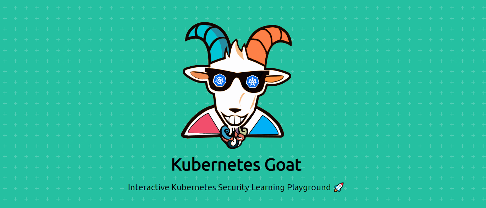

4.3k star,关于K8s,不错的开源工具

Kubernetes Goat 是一个由 Madhu Akula 创建的开源项目，旨在提供一个“故意设计为脆弱”的Kubernetes集群环境，供用户学习和实践Kubernetes安全。



### Kubernetes Goat：探索Kubernetes安全的理想平台


通过这个互动的动手实验平台，用户可以在真实的环境中模拟和体验各种安全漏洞和攻击场景，从而提升对Kubernetes安全的理解和应对能力。

#### 功能特点

1. **多样化的攻击场景**：Kubernetes Goat 提供了超过10种不同的攻击场景，包括容器逃逸、服务端请求伪造（SSRF）、暴露的NodePort服务、RBAC权限配置错误等。这些场景覆盖了Kubernetes环境中常见的安全漏洞，帮助用户全面了解和防范潜在的安全威胁。

2. **互动学习**：平台设计为互动式学习环境，用户可以通过实际操作来理解和解决安全问题。每个场景都配有详细的指导文档，帮助用户逐步完成实验。

3. **开源和可扩展性**：作为一个开源项目，Kubernetes Goat 允许用户根据自己的需求进行定制和扩展。用户可以添加新的攻击场景或修改现有的配置，以适应不同的学习和研究需求。

4. **多平台支持**：Kubernetes Goat 支持在多种Kubernetes环境中运行，包括GKE、EKS、AKS、K3S和KIND等。用户可以根据自己的实际环境选择合适的部署方式。

#### 吸引用户的特点

1. **真实环境模拟**：Kubernetes Goat 提供了一个接近真实生产环境的模拟平台，用户可以在其中体验和解决实际可能遇到的安全问题。这种真实感极大地提升了学习效果和实战能力。

2. **全面的安全覆盖**：通过涵盖多种常见的安全漏洞和攻击手法，Kubernetes Goat 帮助用户建立全面的安全意识和防护能力。这对于从事Kubernetes运维和安全工作的专业人士尤为重要。

3. **社区支持和资源丰富**：作为一个活跃的开源项目，Kubernetes Goat 拥有广泛的社区支持。用户可以通过社区获取最新的安全资讯、学习资源和技术支持，进一步提升自己的技能。

#### 快速使用指南

1. **环境准备**：确保你拥有Kubernetes集群的管理员权限，并已安装kubectl和Helm包管理器。

2. **克隆项目**：
   ```bash
   git clone https://github.com/madhuakula/kubernetes-goat.git
   cd kubernetes-goat
   ```

3. **设置Kubernetes Goat**：
   ```bash
   chmod +x setup-kubernetes-goat.sh
   bash setup-kubernetes-goat.sh
   ```

4. **验证部署**：确保所有Pod都在运行状态：
   ```bash
   kubectl get pods
   ```

5. **访问Kubernetes Goat**：通过端口转发访问本地系统上的资源：
   ```bash
   bash access-kubernetes-goat.sh
   ```
   然后在浏览器中打开 [http://127.0.0.1:1234](http://127.0.0.1:1234) 进行访问。

通过以上步骤，你可以快速搭建并开始使用Kubernetes Goat，体验和学习Kubernetes安全的各种场景和技术。

希望这篇文章能帮助你更好地理解和应用Kubernetes Goat，提升你的Kubernetes安全技能。

