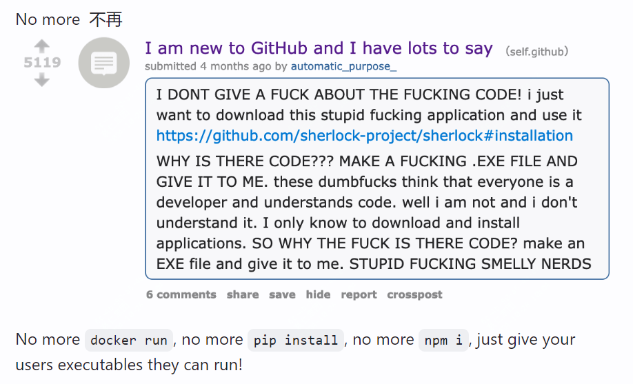

2.9k star,这个开源项目，将docker玩出花了！

Dockerc 是一个创新的工具，旨在将 Docker 镜像编译为独立的便携式二进制文件。



### Dockerc：将Docker镜像编译为独立可执行文件

通过这种方式，用户无需再使用 `docker run` 命令，也无需安装任何依赖项，如 `pip install` 或 `npm i`。

只需提供可执行文件，用户即可直接运行。这种方法极大地简化了应用程序的分发和部署过程，特别适用于需要在不同环境中快速部署的场景。

#### 功能特点

1. **便携性**：Dockerc 将 Docker 镜像转换为独立的可执行文件，使得应用程序可以在没有 Docker 环境的情况下运行。这对于需要在多种操作系统上部署应用程序的开发者来说，极为便利。

2. **跨平台支持**：Dockerc 支持在 MacOS 和 Windows 上运行（通过 QEMU），并且支持 x86_64 和 arm64 架构。这意味着无论是桌面应用还是服务器应用，都可以通过 Dockerc 进行编译和运行。

3. **无根容器**：支持无根容器运行，增强了安全性和灵活性。用户无需以 root 权限运行容器，从而减少了潜在的安全风险。

4. **环境变量和卷支持**：Dockerc 支持通过 `-e` 参数指定环境变量，通过 `-v` 参数指定卷。这与使用 `docker run` 命令时的方式一致，降低了学习成本。

5. **网络服务访问**：容器内运行的网络服务可以直接访问，无需指定 `-p` 参数。这简化了网络配置，使得服务的部署更加直观。

6. **高效的镜像加载**：使用 Skopeo 工具加载镜像，支持从多种镜像源获取镜像，进一步提升了工具的灵活性和适用性。

#### 吸引用户的特点

1. **简化部署流程**：通过将 Docker 镜像编译为独立的二进制文件，Dockerc 消除了对 Docker 环境的依赖，使得应用程序的部署变得更加简单和高效。

2. **增强的安全性**：无根容器的支持使得用户可以在不提升权限的情况下运行应用程序，减少了安全隐患。

3. **广泛的兼容性**：支持多种操作系统和架构，确保应用程序可以在各种环境中无缝运行。

4. **易于使用**：与 Docker 命令的兼容性使得用户可以快速上手，无需学习新的命令或配置方式。

#### 快速使用指南

1. **安装 Dockerc**：从最新的发布版本中安装 Dockerc。

   ```bash
   wget https://github.com/NilsIrl/dockerc/releases/download/v0.3.2/dockerc
   chmod +x dockerc
   ```

2. **编译 Docker 镜像**：使用 Dockerc 将 Docker 镜像编译为二进制文件。

   ```bash
   # 从 Docker Hub 获取镜像并编译
   dockerc --image docker://oven/bun --output bun

   # 从本地 Docker 守护进程存储中获取镜像并编译
   dockerc --image docker-daemon:mysherlock-image:latest --output sherlock_bin

   # 指定目标指令集架构
   dockerc --image docker://hello-world --arch arm64 --output hello
   ```

3. **运行编译后的二进制文件**：编译后的二进制文件可以像普通的可执行文件一样运行。

   ```bash
   ./bun
   ```

通过以上步骤，用户可以轻松地将 Docker 镜像转换为独立的可执行文件，并在各种环境中快速部署和运行应用程序。Dockerc 的出现，为开发者提供了一种高效、便捷的应用程序分发和部署方式，极大地提升了开发和运维的效率。

