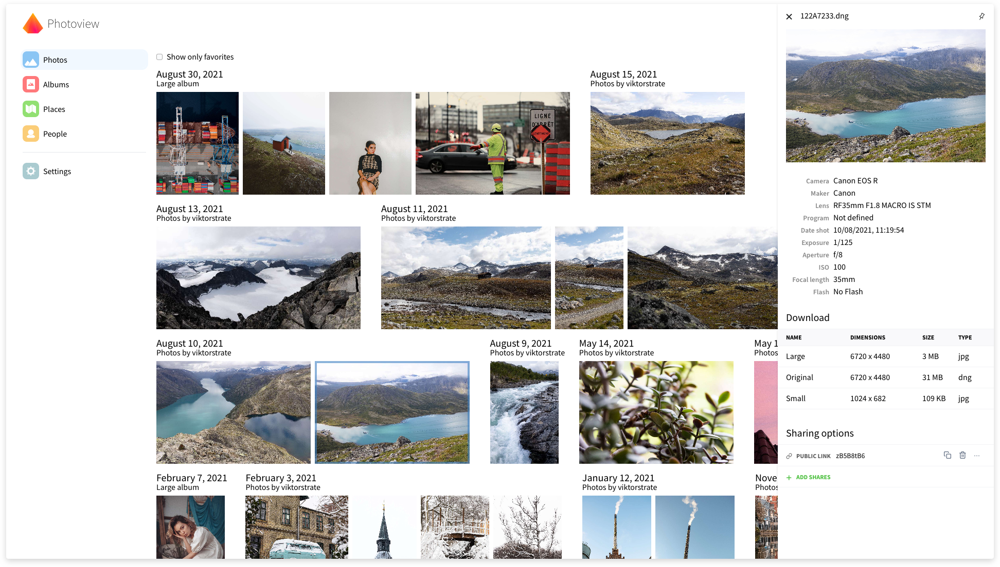

5.1k star,开源，超强照片管理神器

Photoview 是一个开源的、用户友好的照片图库管理软件，专为摄影师设计，旨在提供一种快速、简便的方式来浏览和管理大量高分辨率照片。



### Photoview 简介

用户可以配置 Photoview 来扫描文件系统中的目录，自动生成缩略图，从而加快浏览速度。扫描完成后，照片会按照文件系统中的组织方式显示在网站上。

### 功能特点

1. **文件系统集成**：Photoview 与本地文件系统紧密结合，网站上展示的图片与服务器本地文件系统中的目录相对应，目录即相册。
2. **用户管理**：每个用户创建时会分配一个本地文件系统路径，用户只能访问该路径下的照片。
3. **共享功能**：相册和单个媒体文件可以通过公共链接轻松共享，链接可以选择性地设置密码保护。
4. **摄影师专用**：支持 RAW 文件格式和 EXIF 解析，满足专业摄影师的需求。
5. **视频支持**：支持多种常见视频格式，视频会自动优化以适应网页播放。
6. **人脸识别**：自动检测照片中的人脸，并将同一人的照片归类在一起。
7. **高性能**：自动生成缩略图，照片在屏幕可见时才加载。在全屏模式下，先显示缩略图，直到高分辨率图像完全加载。
8. **安全性**：所有媒体资源都受到 cookie-token 保护，所有密码都经过适当的哈希处理，API 使用严格的 CORS 策略。

### 吸引用户的特点

Photoview 的设计充分考虑了用户体验和性能，以下是一些吸引用户的特点：

1. **易用性**：Photoview 的界面简洁直观，用户无需复杂的操作即可快速上手。
2. **高效管理**：自动扫描和缩略图生成功能使得管理大量照片变得轻松自如。
3. **灵活共享**：用户可以方便地与他人分享照片和相册，且共享链接可以设置密码保护，确保隐私安全。
4. **专业支持**：支持 RAW 文件和 EXIF 解析，满足专业摄影师的需求。
5. **多平台支持**：Photoview 支持 Docker、Arch Linux、Unraid 等多种平台，用户可以根据自己的需求选择合适的部署方式。

### 快速使用指南

1. **安装 Docker**：首先，确保系统上已安装 Docker。可以通过以下命令安装 Docker：
   ```bash
   sudo apt-get update
   sudo apt-get install docker-ce docker-ce-cli containerd.io
   ```

2. **下载 Photoview**：从 GitHub 仓库下载 Photoview 的 Docker 镜像：
   ```bash
   docker pull viktorstrate/photoview
   ```

3. **配置 Photoview**：创建一个 `docker-compose.yml` 文件，配置 Photoview 的服务：
   ```yaml
   version: '3'
   services:
     photoview:
       image: viktorstrate/photoview
       ports:
         - "8000:80"
       volumes:
         - /path/to/photos:/photos
         - /path/to/config:/config
   ```

4. **启动 Photoview**：运行以下命令启动 Photoview：
   ```bash
   docker-compose up -d
   ```

5. **访问 Photoview**：在浏览器中打开 `http://localhost:8000`，即可访问 Photoview 界面，开始管理和浏览照片。

通过以上步骤，用户可以快速部署和使用 Photoview，享受高效便捷的照片管理体验。

