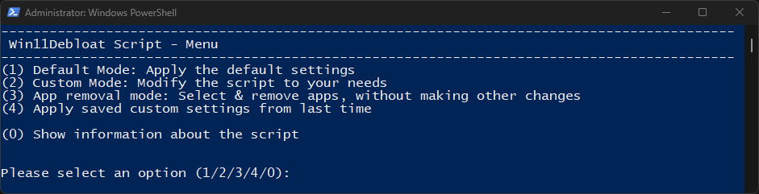

13.8k star,一个脚本优化你的windows

Win11Debloat 是由 GitHub 用户 Raphire 创建的开源项目，可以快速优化 Windows 11 系统。



### Win11Debloat：深入了解 Windows 11 的优化工具

该项目通过移除预装的软件和不必要的服务，提升系统性能和用户体验。Win11Debloat 通过一个精心设计的脚本，针对系统中的臃肿部分进行深度清理，让你的 Windows 11 系统焕然一新。

#### 功能特点
1. **全面的去臃肿功能**：Win11Debloat 能够识别并移除 Windows 11 中的各种预装应用和服务，确保系统运行更顺畅。无论是你从未使用过的应用程序，还是后台默默运行但消耗资源的服务，这个工具都能帮助你清理干净。
2. **模块化设计**：该脚本采用模块化设计，用户可以根据自身需求选择性地移除特定的组件和服务。这样，不仅保证了系统的核心功能不受影响，还能根据个人需求进行个性化优化。
3. **详尽的日志和备份功能**：Win11Debloat 在执行每一步操作时都会记录详细的日志，并提供备份功能，确保用户可以随时恢复系统到之前的状态。这为用户在进行系统清理时提供了更高的安全保障。
4. **持续更新和社区支持**：作为一个活跃的开源项目，Win11Debloat 不断更新，吸纳全球开发者的建议和贡献。用户可以从项目的 GitHub 页面获取最新的脚本和文档，并与社区成员交流经验和问题。

#### 吸引用户的特点
1. **简洁易用**：Win11Debloat 的界面和操作非常简洁，用户只需执行几个简单的命令即可完成系统优化。对于技术小白来说，这无疑是一个福音。
2. **强大的自定义能力**：用户可以根据自身需求，灵活地选择移除哪些应用和服务，避免了一刀切式的清理，保证了系统的稳定性和功能完整性。
3. **透明度和安全性**：详尽的日志记录和备份功能，使得用户在清理系统时可以放心操作，即使发生问题也能轻松恢复，极大地降低了使用风险。
4. **社区支持和资源丰富**：活跃的社区提供了丰富的资源和支持，用户可以随时从社区中获取帮助和建议，使得 Win11Debloat 不仅是一个工具，更是一个共享经验和知识的平台。

#### 快速使用指南
以下是使用 Win11Debloat 的快速指南：

1. **访问项目页面**：首先，打开 [Win11Debloat 的 GitHub 页面](https://github.com/Raphire/Win11Debloat)。
2. **下载脚本**：在项目页面上，可以选择克隆仓库或者直接下载脚本文件。
3. **运行脚本**：下载完成后，打开命令提示符（以管理员身份运行），执行以下命令运行脚本：
   ```sh
   git clone https://github.com/Raphire/Win11Debloat.git
   cd Win11Debloat
   .\Win11Debloat.ps1
   ```
4. **自定义清理选项**：根据提示选择要移除的组件和服务，按照需要进行个性化的清理设置。
5. **检查和恢复**：完成清理后，检查系统运行状态。如有需要，可以使用备份功能恢复到之前的系统状态。

通过以上步骤，你就可以轻松使用 Win11Debloat 优化你的 Windows 11 系统，享受更快速、更清爽的用户体验。