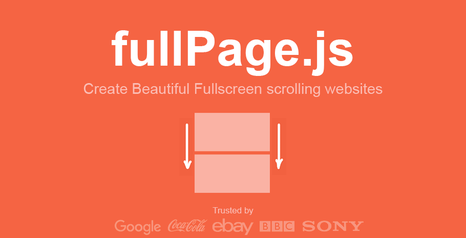

35.3k star,前端工程师看过来了！

`fullPage.js` 是一个轻量级且功能强大的 JavaScript 库，它能够轻松创建全屏滚动网站。该项目的诞生，让开发者无需费力编写复杂的代码，即可打造出流畅、现代且具有交互性的网页体验。无论是个人博客、公司主页还是展示作品，`fullPage.js` 都能够帮助你实现令人惊艳的效果。


### 特点

1. **易于使用**：`fullPage.js` 提供简单明了的 API，即使是新手开发者也能轻松上手。
2. **高性能**：该库经过优化，确保滚动效果流畅，适配各种设备和浏览器。
3. **丰富的自定义选项**：从滚动动画到页面布局，`fullPage.js` 提供多种参数和方法，满足各种定制需求。
4. **兼容性**：支持主流浏览器，并提供对移动设备的良好适配。
5. **插件支持**：提供了一系列插件，增强了其功能扩展性。

### 快速开始

要使用 `fullPage.js`，你只需要几个简单的步骤：

1. **引入库文件**：可以通过 CDN 或下载源码的方式，将 `fullPage.js` 引入项目。

```html
<!DOCTYPE html>
<html lang="en">
<head>
    <meta charset="UTF-8">
    <meta name="viewport" content="width=device-width, initial-scale=1.0">
    <title>fullPage.js Example</title>
    <link rel="stylesheet" href="https://cdnjs.cloudflare.com/ajax/libs/fullPage.js/3.1.2/fullpage.min.css">
</head>
<body>
    <div id="fullpage">
        <div class="section">第一页内容</div>
        <div class="section">第二页内容</div>
        <div class="section">第三页内容</div>
    </div>

    <script src="https://cdnjs.cloudflare.com/ajax/libs/fullPage.js/3.1.2/fullpage.min.js"></script>
    <script>
        new fullpage('#fullpage', {
            autoScrolling: true,
            scrollHorizontally: true
        });
    </script>
</body>
</html>
```

2. **配置参数**：根据需求，在初始化 `fullPage.js` 时配置参数。例如，启用自动滚动、设置滚动速度、添加导航按钮等。

```javascript
new fullpage('#fullpage', {
    autoScrolling: true,
    scrollHorizontally: true,
    navigation: true,
    navigationPosition: 'right',
    scrollingSpeed: 700
});
```

3. **自定义样式**：通过 CSS 修改页面样式，使其符合你的设计需求。

```css
.section {
    text-align: center;
    font-size: 3em;
    background-color: #f2f2f2;
}
```

### 复杂性与突发性

在使用 `fullPage.js` 时，不妨发挥你的创造力，通过组合各种配置选项和自定义样式，打造出独特且引人入胜的滚动效果。无论是简洁的单页面设计，还是多层次的交互体验，`fullPage.js` 都能满足你的需求。你可以在页面间加入动画效果、嵌入视频、展示图片，甚至结合其他 JavaScript 库，进一步提升网站的复杂性和突发性。通过混合长句和短句，以及使用丰富的词汇和句子结构，来创建生动而有趣的网页内容。

总的来说，`fullPage.js` 是一个功能强大且易于使用的工具，它为开发者提供了实现创意的无限可能。希望这篇介绍能够帮助你快速上手，并在实际项目中充分利用该库的优势，打造出令人印象深刻的网站。