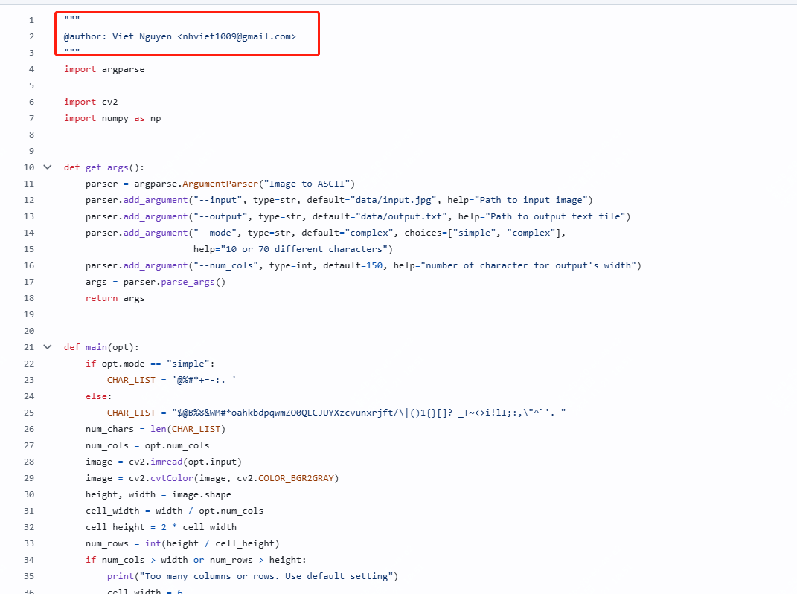

4.1k star,何同学最近使用的开源项目

最近何同学最新发布的视频在网上引起了争议，虽然进行了道歉，但貌似并没有得到网友的原谅。

而在视频中晒出的代码片段明显删除了原作者



**ASCII Generator** 项目结合了技术与艺术的工具，它能够将普通的图像转化为生动的字符画，以一种古典与现代交织的方式重新定义视觉表达。

该项目可以将图片转为ASCII码，也可以转换视频，如下效果：


---

#### 项目简介

**ASCII Generator** 是一个通过 Python 脚本实现的字符画生成器，能够将图像转换为 ASCII 艺术（字符艺术）形式的文本表达。字符艺术最早可以追溯到计算机早期时代，那时显示器分辨率低、存储资源有限，图像以字符方式表达成为一种流行的视觉解决方案。而如今，虽然技术飞速发展，字符艺术却依然具有其独特的复古美感。

这个项目的核心功能是读取输入图像，并通过特定算法将其像素数据映射为预设字符集。生成的 ASCII 艺术既可用于打印，也能直接保存为文本文件。

---

#### 项目特点

ASCII Generator 之所以能够脱颖而出，主要得益于以下几个独特特点：

1. **高效且易用**  
   项目以 Python 编写，代码结构简洁明了，注释详细，即使对图像处理领域不甚了解，也能轻松理解其实现原理。借助标准库与简单依赖，快速完成字符画生成的全过程。

2. **支持多种字符集**  
   默认情况下，ASCII Generator 使用常见的字符集（如 `@`, `#`, `S`, `%`, `?`, `*`, `+`, `;`, `:`, `,`, `.`）来表达不同的像素亮度。你也可以自定义字符集，根据艺术需求调整输出风格。

3. **可调节分辨率与灰度级**  
   用户能够通过修改脚本参数，控制输出 ASCII 图像的字符分辨率（字符尺寸密度）以及灰度级别。这种灵活性确保生成结果既可以展现细节，也可以满足艺术化的抽象表达。

4. **跨平台运行**  
   由于基于 Python 开发，无论是在 Windows、MacOS 还是 Linux 上，只要安装了 Python 环境，都能无缝运行该工具。

5. **轻量级设计**  
   项目仅需少量依赖（如 PIL 或 OpenCV）即可运行，无需复杂的配置过程，使用体验轻松愉快。

---

#### 快速开始指南

想要将一张普通的图像转化为 ASCII 艺术？只需几个简单的步骤，即可立刻上手：

1. **克隆项目代码**  
   打开终端，输入以下命令将代码克隆到本地：
   ```bash
   git clone https://github.com/vietnh1009/ASCII-generator.git
   cd ASCII-generator
   ```

2. **安装依赖**  
   项目依赖 `Pillow` 库来处理图像文件。通过以下命令安装：
   ```bash
   pip install -r requirements.txt
   ```

3. **运行脚本**  
   将待处理的图像文件放入项目目录，然后运行脚本：
   ```bash
   python ascii_generator.py --input <input_image_path> --output <output_text_file>
   ```
   参数说明：  
   - `--input`：指定输入图像文件的路径（支持常见格式如 JPG、PNG 等）。  
   - `--output`：指定生成的 ASCII 文件路径。

4. **自定义选项**  
   可通过脚本的其他参数，调整输出的字符分辨率与字符集。例如：
   ```bash
   python ascii_generator.py --input example.jpg --scale 0.5 --charset "@#$%*+"
   ```
   - `--scale`：设置缩放比例（默认值为 1.0，数值越低图像越小）。  
   - `--charset`：定义用于生成 ASCII 艺术的字符集合。

5. **欣赏你的作品**  
   打开生成的文本文件，一幅独特的字符画就跃然纸上！你还可以通过复制粘贴，将其用于社交媒体展示或保存为个人艺术收藏。

---


#### 结语

ASCII Generator 是一个令人兴奋的小型工具，尽管代码量不大，却体现了技术与艺术的完美结合。从简单的图片到充满艺术感的字符画，其转化过程充满魔力。如果你对字符艺术、图像处理或 Python 编程感兴趣，强烈建议尝试这个项目，体验从数字图像到文字画布的奇妙旅程！