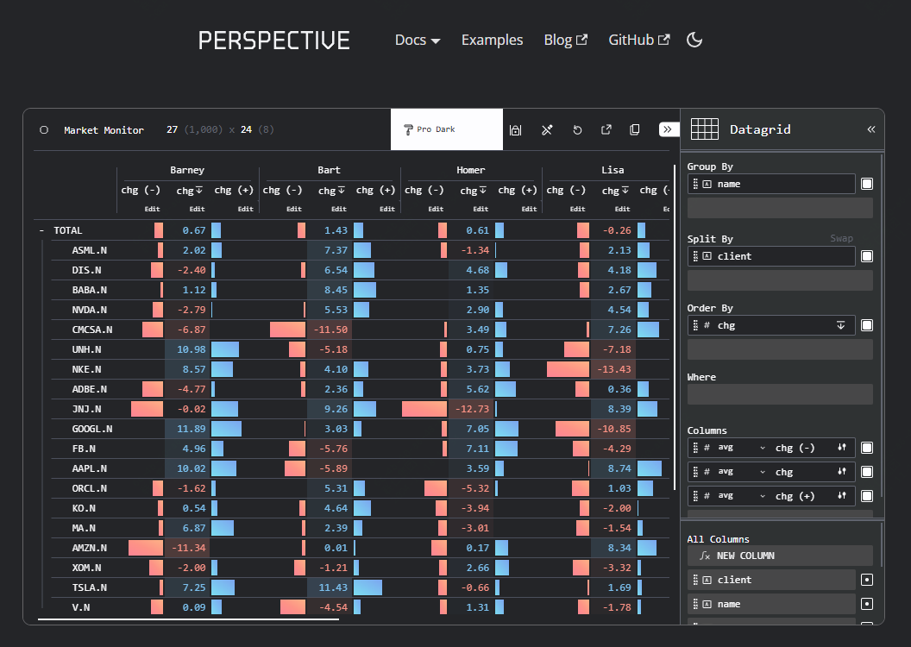
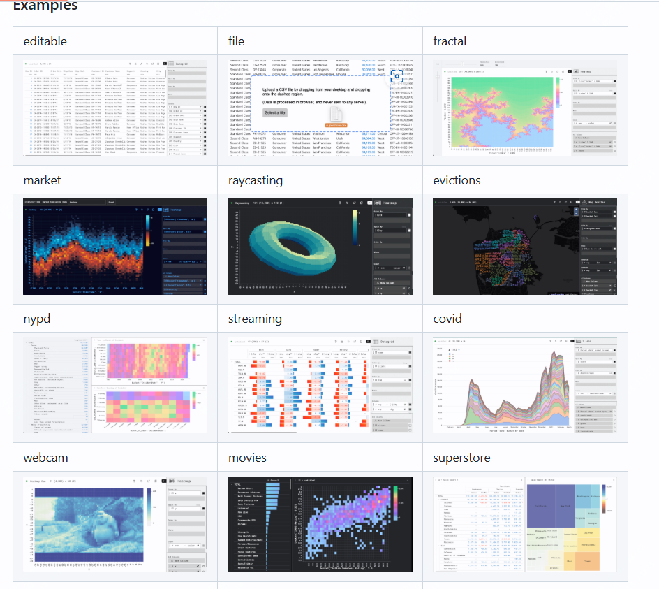

<small>8.5k star,开源！超过亿万数据的分析展示工具</small>







随着数据可视化需求的不断增长，能够实时、高效地处理和展示动态数据的工具越来越受到开发者和数据分析师的青睐。**Perspective** 项目正是在这种背景下应运而生的一款开源库。由 **FINOS** 提供支持，Perspective 是一个强大的交互式数据可视化工具，能够处理海量数据并动态展示，广泛应用于金融分析、业务监控和数据驱动的决策支持系统。  

#### 项目简介

Perspective 是一个基于 Web 的前端与后端结合的可视化工具，专为实时数据和大规模表格数据的分析与展示而设计。其核心是一个高性能的 WebAssembly 数据引擎，能够高效处理动态更新，并支持各种复杂的数据操作，如聚合、分组和筛选。你可以将它嵌入到 Web 应用中，或者用作独立的数据仪表盘工具。它提供了丰富的接口，支持 JavaScript、Python 和 Rust 等主流编程语言，让开发者可以轻松地集成它到不同的技术栈中。

#### 核心特点

1. **高性能与实时性**  
   Perspective 的底层使用 WebAssembly 实现极致的性能优化，能够高效处理大规模数据流。无论是实时市场数据，还是频繁更新的监控指标，它都能保持平滑的交互体验。数据的动态更新通过基于增量的计算模型实现，仅重新计算变更部分，大幅提升了响应速度。

2. **灵活的交互与丰富的可视化组件**  
   提供了多种可视化类型，包括表格、条形图、折线图、树形图和透视表等。你可以通过直观的拖拽操作调整数据视图，改变分组、排序或筛选条件，生成洞察力更强的展示形式。Perspective 支持在一个视图中同时呈现多个维度的数据，让复杂的数据关系一目了然。

3. **多语言支持与跨平台兼容**  
   Perspective 通过提供 Python 和 JavaScript 的 API，支持数据科学家和前端开发者无缝协作。无论是构建一个交互式仪表盘，还是集成到已有的 Python 数据处理脚本中，它都可以胜任。此外，它的设计完全基于 Web 标准，兼容现代浏览器和 Web 平台，无需额外的插件或安装。

4. **模块化与可扩展性**  
   Perspective 是模块化设计的，每个组件独立且高效。开发者可以通过自定义插件扩展其功能，比如新增可视化样式或数据转换逻辑。这种灵活性使得它可以满足各种行业的特定需求。

5. **开源与社区支持**  
   Perspective 是一个活跃的开源项目，得到了 FINOS 社区和全球开发者的持续贡献。它的开发者社区不仅提供详尽的文档和示例，还不断推出新的功能更新和性能改进。

#### 如何快速开始

要使用 Perspective，以下是一个快速入门的指南，让你能够迅速上手并构建一个动态可视化应用。

##### 1. 安装 Perspective

Perspective 提供了多种安装方式，用户可以根据具体需求选择。以 Python 用户为例，通过 pip 安装非常简单：

```bash
pip install perspective-python
```

对于前端开发者，可以通过 npm 安装 JavaScript 版本：

```bash
npm install @finos/perspective
```

##### 2. 加载数据并初始化视图

Perspective 可以直接加载 Pandas DataFrame、JSON 等多种数据格式。例如，在 Python 中，你可以这样初始化一个表：

```python
from perspective import Table

data = [{"name": "Alice", "age": 30, "salary": 100000},
        {"name": "Bob", "age": 25, "salary": 80000}]
table = Table(data)

print(table.view().to_arrow())  # 显示数据表内容
```

在前端开发中，数据加载和渲染也十分便捷：

```javascript
import { Table } from "@finos/perspective";

const data = [
    { name: "Alice", age: 30, salary: 100000 },
    { name: "Bob", age: 25, salary: 80000 },
];

const table = Table(data);
const view = await table.view();
console.log(await view.to_json()); // 显示表数据
```

##### 3. 创建可视化组件

Perspective 提供了可视化组件库，支持以 HTML 元素的形式直接嵌入到网页中。在前端应用中，可以使用 `<perspective-viewer>` 标签：

```html
<perspective-viewer id="viewer"></perspective-viewer>

<script type="module">
    import { Table } from "@finos/perspective";
    import "@finos/perspective-viewer";

    const data = [
        { name: "Alice", age: 30, salary: 100000 },
        { name: "Bob", age: 25, salary: 80000 },
    ];

    const table = Table(data);
    const viewer = document.getElementById("viewer");
    viewer.load(table);
</script>
```

##### 4. 动态更新数据

Perspective 支持动态数据更新，你可以通过 `update` 方法添加新数据或修改现有数据。例如：

```javascript
table.update([{ name: "Alice", age: 31, salary: 105000 }]);
```

##### 5. 探索更多功能

Perspective 的文档中提供了详尽的 API 说明和使用示例，包括复杂的聚合、分组和跨语言调用的实现方式。你可以根据需要深入探索。

#### 结语

Perspective 凭借其高性能的实时数据处理能力和丰富的可视化选项，成为了一个在数据分析领域不可或缺的工具。无论是构建交互式仪表盘，还是集成到已有的数据管道中，它都展现了极大的灵活性和实用性。如果你正在寻找一种能够快速处理海量数据并进行动态展示的工具，不妨尝试 Perspective，它的强大功能和开源社区将为你带来无与伦比的体验。

