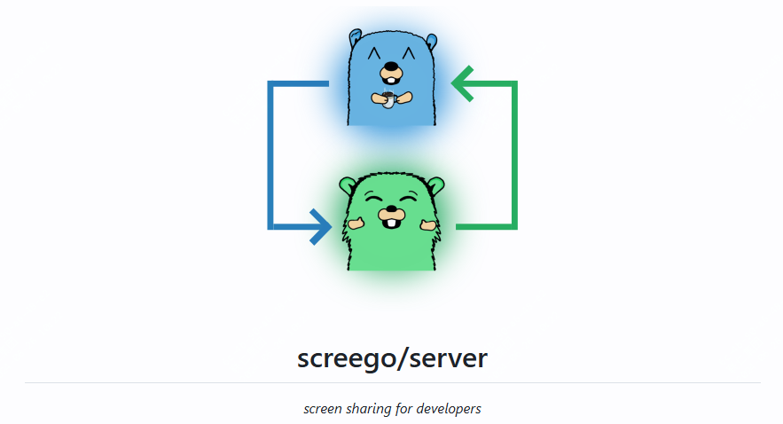

7k star,开源、免费，在线屏幕共享工具

在日常工作中，你使用的屏幕共享软件是哪款？是微信会议或者其他？使用过程中是否遇到过卡顿或者质量有些差。

今天推荐的这个项目，提供了一个新的选项，而且作者的本意也在于提供一个高质量而且低延迟的共享屏幕。

这个项目叫screego，可以选择本地私有化部署，支持docker方式部署，也可以直接使用二进制方式启动，当然项目开发者也提供一个现有的demo可以直接使用。



该工具支持大部分平台包括不限于（linux_amd64 (64bit)
linux_i386 (32bit)
armv7 (32bit used for Raspberry Pi)
armv6
arm64 (ARMv8)
ppc64
ppc64le
windows_i386.exe (32bit)
windows_amd64.exe (64bit)）

## screego是干嘛的

Screego 旨在提供一个简单而有效的屏幕共享解决方案，它不仅可以作为现有软件的补充，还能独立使用。Screego 的设计理念是“做好一件事”，即提供高质量的屏幕共享体验。


## screen功能特点

- 多用户屏幕共享：支持多个用户同时共享屏幕。

- 安全传输：通过 WebRTC 技术实现安全的屏幕数据传输。
- 低延迟/高分辨率：确保共享内容的实时性和清晰度。
- 简单安装：可以通过 Docker 或单个二进制文件轻松安装。
- 集成 TURN 服务器：支持 NAT 穿透，提高连接的可靠性2。

## screego如何部署

docker-compose方式部署

```
version: "3.7"
services:
  screego:
    image: ghcr.io/screego/server:1.10.3
    ports:
      - 5050:5050
      - 3478:3478
      - 50000-50200:50000-50200/udp
    environment:
      SCREEGO_EXTERNAL_IP: "192.168.178.2"
      SCREEGO_TURN_PORT_RANGE: "50000:50200"
```

二进制方式部署

```
#下载包
$ wget https://github.com/screego/server/releases/download/v1.10.3/screego_1.10.3_{PLATFORM}.tar.gz

# 解压
$ tar xvf screego_1.10.3_{PLATFORM}.tar.gz
# 授权
$ chmod +x screego
#启动
$ ./screego
# on windows
$ screego.exe
```

如果是freebsd环境，可以直接使用pkg包管理器下载

```
$ pkg install screego
```

>demo：https://app.screego.net/