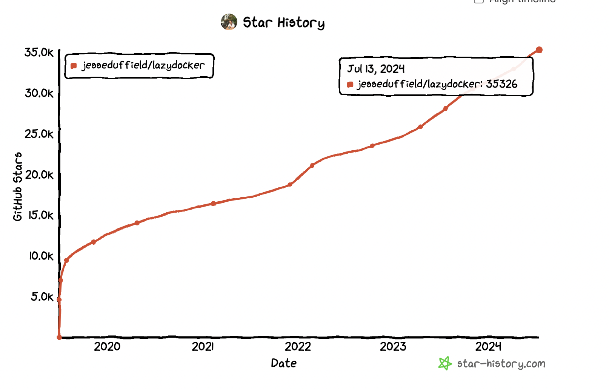

如果你对docker有所了解，那么这个工具你一定要看下。lazydocker是一款用来在终端环境中快速管理你的docker配置的软件，具体可以看如下演示：


>项目地址：https://github.com/jesseduffield/lazydocker

### 项目简介

lazydocker是一个简单的终端UI，可以用于管理docker及docker-compose，是用go语言完成的。

如果你最近正在学习go语言，那么这款开源工具，也可以作为学习模版，主要采用的是gocil这个库。

### 如何安装

可以看到这款工具的下载量是很高的

 

安装的方式的话， 也有多种选择，比如，mac环境可以直接通过brew方式安装，windows环境可以通过scopp方式安装。

因为是go语言写的，所以也可以通过go去安装。

当然了，也可以直接通过curl的方式去下载二进制包

```
curl https://raw.githubusercontent.com/jesseduffield/lazydocker/master/scripts/install_update_linux.sh | bash
```

当然了，也可以通过docker或者compose的方式去启动

```
docker run --rm -it -v \
/var/run/docker.sock:/var/run/docker.sock \
-v /yourpath:/.config/jesseduffield/lazydocker \
lazyteam/lazydocker
```

### 功能特点
这个工具最大的特点在于可以将一些常用的命令，汇总到界面上，对于不是特别熟悉的docker的朋友，可以通过快速点击去完成需求。

比如：查看日志、查看卷、重启、删除等操作。

另外这些按键，还可以通过自定义的方式去配置。


### star增长图

 

 