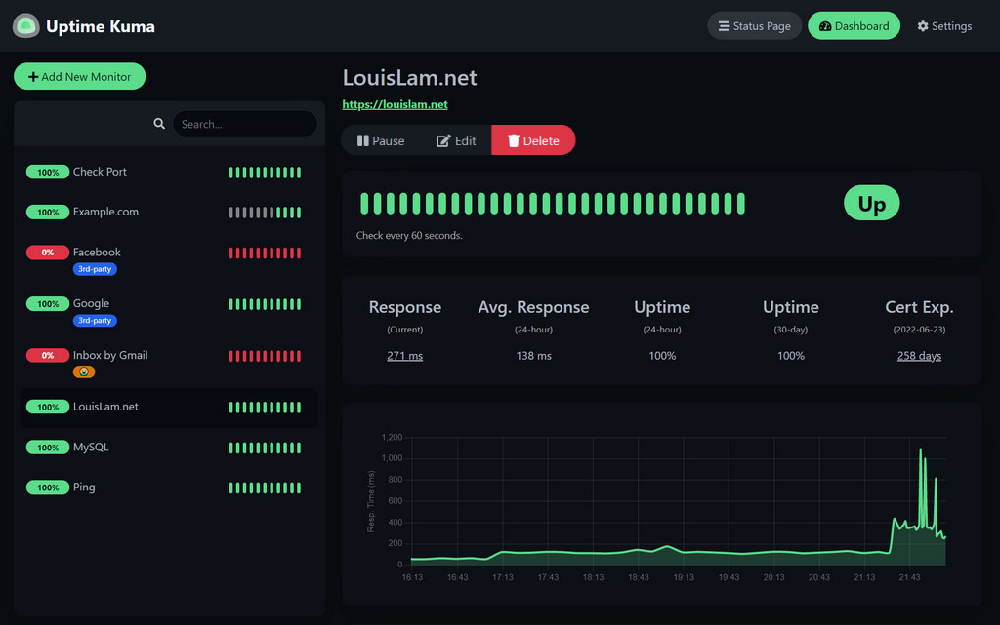
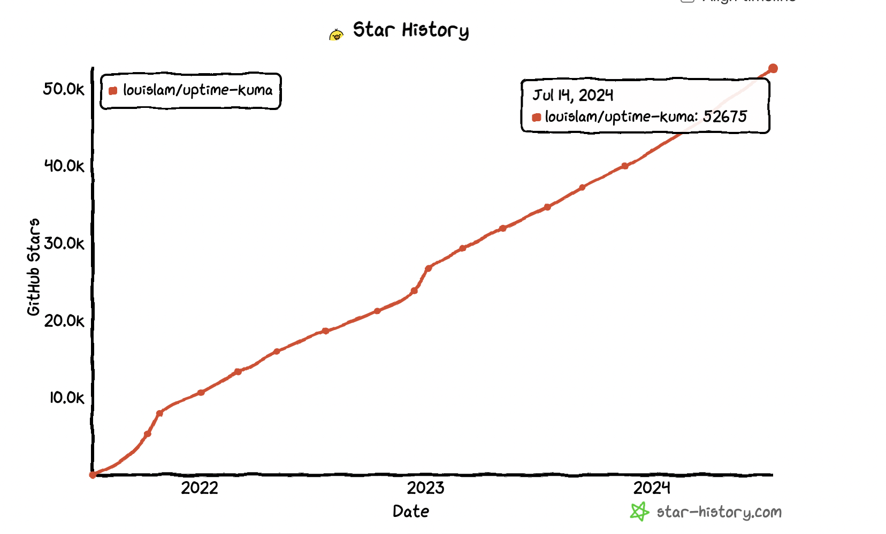

好用的开源监控工具推荐，uptime-kuma

这是一款自己托管的监控管理工具，可以用来监控http状态、DNS状态等，可以通过docker快速部署

感兴趣的可以去体验下demo，或者通过docker快速部署。


>项目地址：https://github.com/louislam/uptime-kuma
>
>demo地址：https://uptime.kuma.pet/

### 项目简介

uptime-kuma是一个很酷炫的易于使用的自托管监控工具


### 如何安装

 

可以看到该工具目前的下载量有433k，如果你感兴趣，可以直接通过docker部署

```
docker run -d --restart=always -p 3001:3001 -v uptime-kuma:/app/data --name uptime-kuma louislam/uptime-kuma:1
```

### 功能特点

- 可以监控HTTP（s）/ TCP / HTTP（s）关键字/ HTTP（s）JSON查询/ Ping / DNS记录/ Push / Steam游戏服务器/ Docker容器
- 支持大部分监控告警途径，如Telegram，Discord，Gotify，Slack，Pushover，电子邮件（SMTP）和90+通知服务
- 可以监控证书状态
- 跨语言支持

### star增长图

 

 

 目前该项目十分火爆，已经有53k。