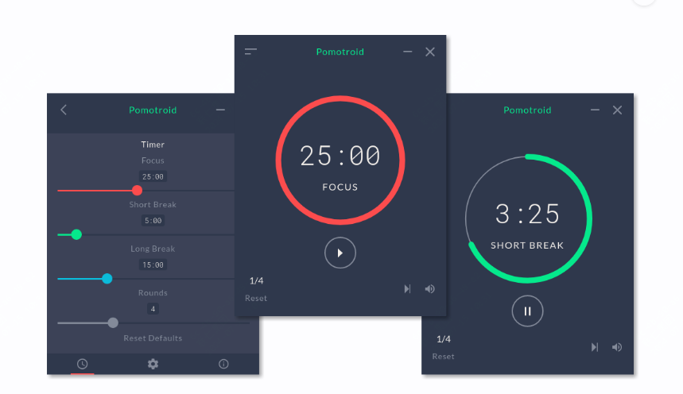
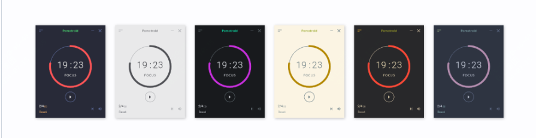
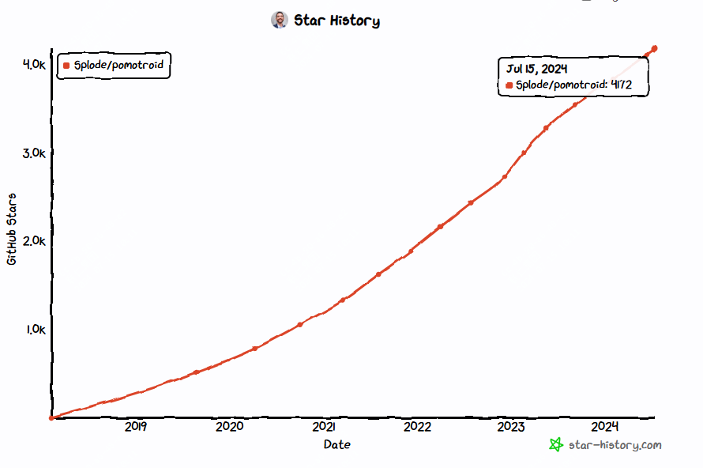

好用的效率工具推荐，pomotroid

如果说你正在用番茄计时法，或者想要在工作学习时，有更高效的工作。

那么你可以尝试下番茄计时法，同时可以看下这款简单、美观、开源、免费的计时器。

>项目地址：https://github.com/Splode/pomotroid

### 项目简介

pomotroi是一个可以通过简单配置就可以上手使用的番茄计时器

它最大的特点在于，让你在枯燥的工作之余，有更加愉悦的使用体验。



### 如何安装

 

这款小工具目前有254k的下载量，应该说是一个比较火的项目了。

它提供了一个demo环境，可以直接体验，你也可以到github的release中去下载最新版本。

这个工具是支持跨平台使用的，可以在mac、windows、linux下安装。

如果你是mac用户，可以直接brew方式安装

```
brew install --cask pomotroid
```

windows下的话，可以通过scoop方式安装

```
scoop install https://raw.githubusercontent.com/Splode/pomotroid/master/pomotroid.json
```
### 功能特点

- 提供了多种主题可选


- 可以根据需要自己去定义次数和回合数
- 带有桌面通知功能，甚至可以配置警报声
- 可以最小化到托盘
- 等等

### star增长图

 

 