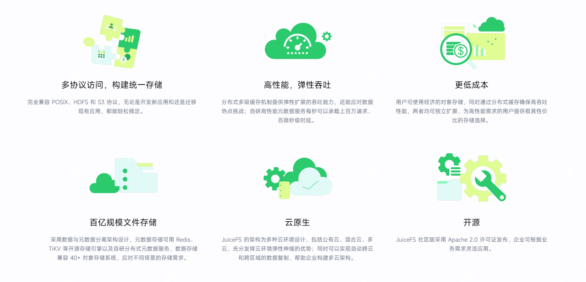
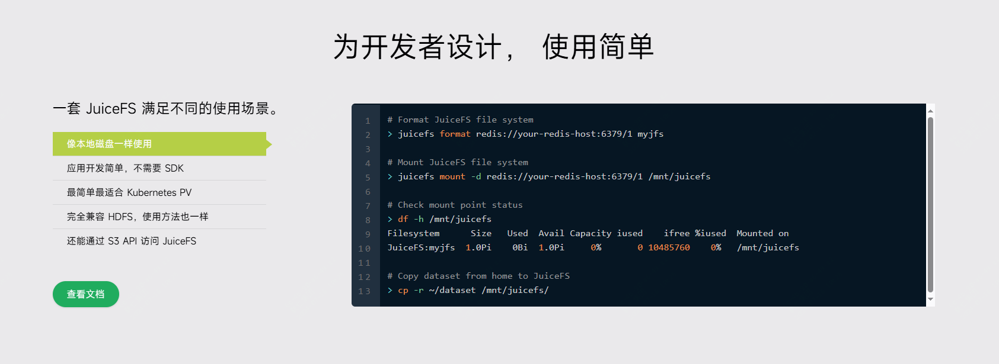
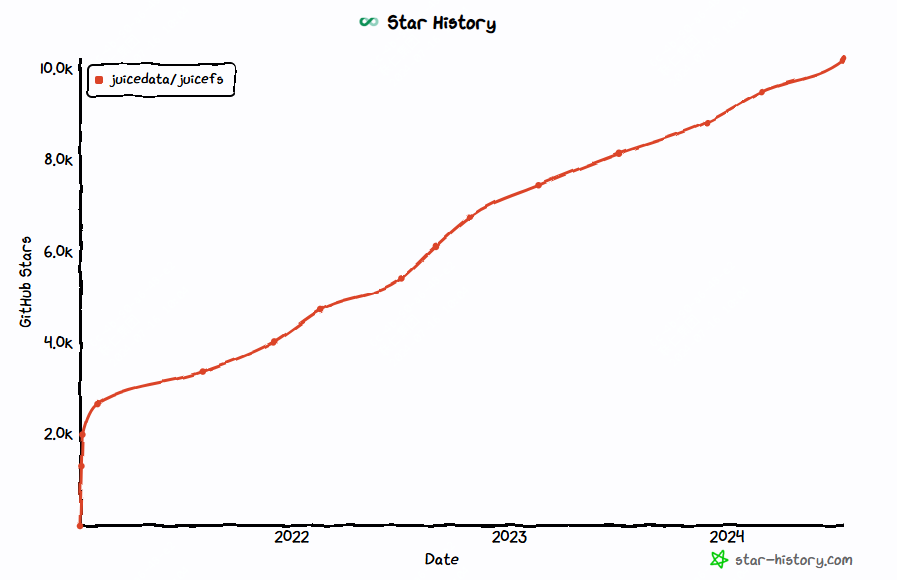

开源!好用的分布式文件系统，juicefs

如果说你最近在做AI相关的学习或者研究，那么对于海量数据你可以尝试下juicefs。
如果说你最近有使用k8s，然后需要配置存储层，那么可以使用juicefs
简单讲，这款开源工具就是可以将你的海量数据，不管是在s3、或者是hadoop中的数据，可以像在本地访问一样简单。


>项目地址：https://github.com/juicedata/juicefs

### juicefs项目简介

juicefs是一个基于Redis和S3的分布式POSIX文件系统。

这是一个高性能的支持云原生环境的分布式文件系统，使用简单，效果很棒，天然支持posix、s3、hdfs协议，方便快速迁移。

### juicefs如何安装

 

下面是一个最简化的安装方式，正式生产需求，建议按照官方文档来操作：

- 安装客户端
```
curl -sSL https://d.juicefs.com/install | sh -
```
- 创建文件系统
```
juicefs format [command options] META-URL NAME
#以下命令创建了一个名为 myjfs 的文件系统
juicefs format sqlite3://myjfs.db myjfs

```
- 挂载文件系统
```
juicefs mount sqlite3://myjfs.db ~/jfs
```

### juicefs功能特点


- 支持多种协议，可以快速迁移转换，无缝接入（兼容posix，可以直接用本地的存储环境，兼容hdfs，可以与现有的hadoop对接，兼容s3，可以实现海量存储）
- 元数据存储在redis中，提供了多级缓存机制，可以提供更高的吞吐能力
- 可以对接对象存储，使得存储成本更低
- 可以无缝接入k8s，为多云设计
- 延迟可以低至几毫秒，吞吐量几乎可以无限扩展（取决于对象存储的大小）


### star增长图

 

 