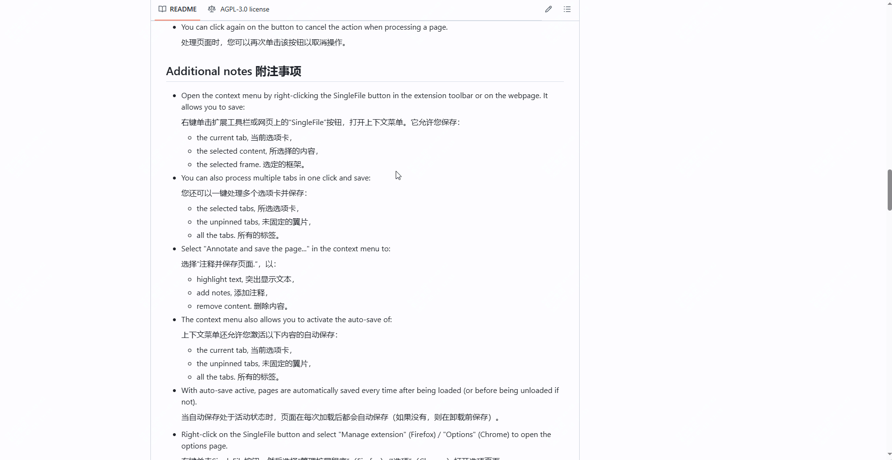
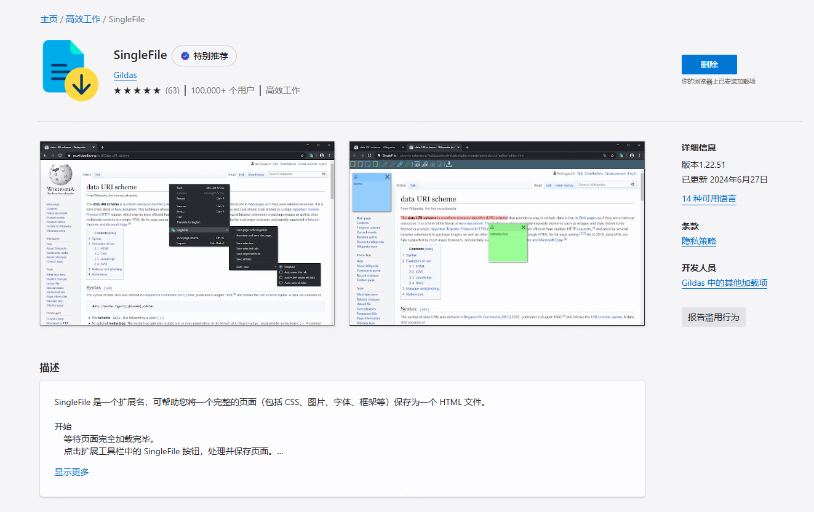

一键保存整个浏览器页面，SingleFile

这是一款适用于大部分浏览器的插件工具，可以快速的将一个网页保存为一个html文件，方便下次快速浏览。

如下：

>项目地址：https://github.com/gildas-lormeau/SingleFile

### SingleFile项目简介

一个用于在浏览器页面中完整保存html元素及内容的浏览器拓展工具

### 如何安装

 

 - 可以在各浏览器的插件页面去查找安装
 - 也可以直接下载zip包导入到扩展中
  

### 功能特点

- 右击鼠标选择"SingleFile”按钮，打开上下文菜单，可以保存当前选项卡
-  还可以一键处理多个选项卡并保存
-  可以对需要下载的页面进行批注。

### star增长图

 

 