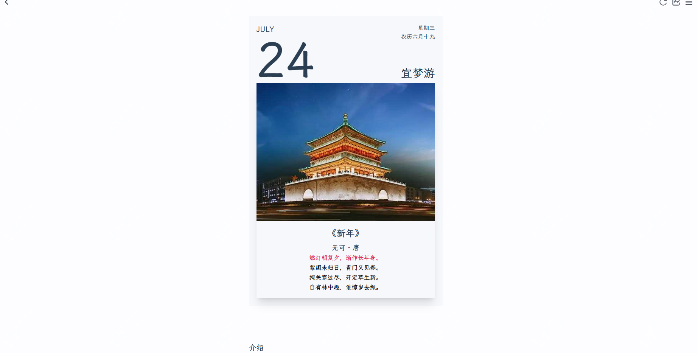
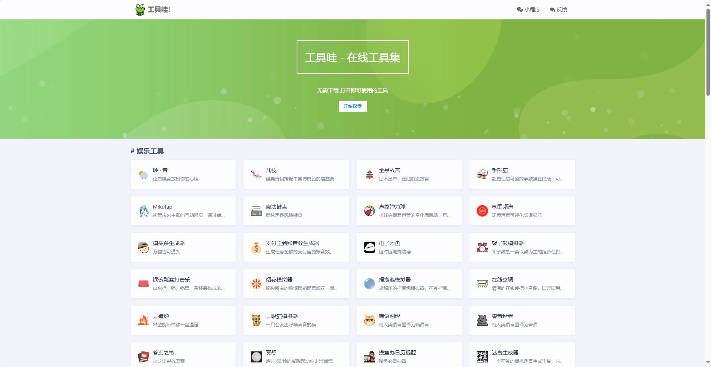
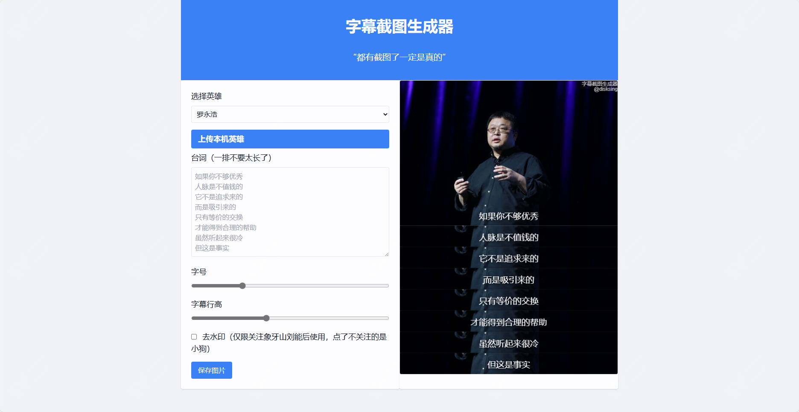

神仙网站，强推！都很好用！

今天推荐三个不错的站点，有工具类，也有AI相关，还有可以用来自己玩的

有用到的，可以收藏保存下。

后面会整理一篇工具合集，可以关注下。

诗境

通过AI为照片匹配诗句，生成卡片

我觉得这个工具最大的用处，其实可以用来带小孩去学习古诗，可以用日常看过的一些风景，或者旅游风景图。

然后生成的卡片可以打印出来，它其实还会有一些解释。

然后就是用来发朋友圈或者小红书了，今天去哪玩了，上传张图片，直接给你一首诗，这不意境就来了。

>传送门：https://photo2poem.top/

工具蛙
这是一个工具合集，相较于其它的一些工具合集的话

这款有更多的娱乐工具，工作累了，可以打开摸摸鱼，还有一些小游戏，可以直接打开玩

当然了工具合集，还是有一些开发工具、站长工具之类的

收藏一下还是值得的，这个工具站其实来源于开源dev tools，感兴趣的也可以自己去搭建一个。

>传送门：https://toolwa.com/#index-main

字幕截图生成器

这个就更好玩了，在刷短视频的时候，可能会看到一些字幕的截图或者视频

这个工具可以用你熟悉或者不熟悉的人物作为主图

然后去配一些你想要的文字，都是可以自定义的，快去尝试一下吧

毕竟都有截图了，那就一定是真的了。

>传送门：https://disksing.com/fake-screenshot/