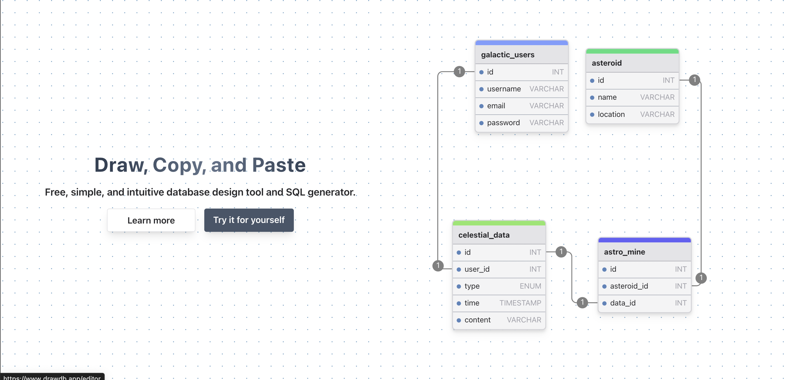

免费、简单、直观的强大开源工具推荐

在IT团队中，日常汇报可能会涉及数据库设计相关的内容

今天推荐的这款开源工具，是一个简单、免费、直观的数据库设计工具和SQl生成器

简单效果如下：


>项目地址：https://github.com/drawdb-io/drawdb

## drawdb项目简介

drawdb是一个在web-ui中的强大且友好的关系型数据库的编辑器

你只需要操作几下就可以构建图表、可以导出SQL脚本，支持自定义编辑器



## drawdb如何安装

如果你想在本地构建，可以如下操作：

```
git clone https://github.com/drawdb-io/drawdb
cd drawdb
npm install
npm run dev
```
你也可以通过docker部署
```
docker build -t drawdb .
docker run -p 3000:80 drawdb
```
## drawdb功能特点

- 导出 DDL 脚本以在数据库上运行，或将图表导出为 JSON 或图像。
- 已经有图表了吗？导入 DDL 脚本或要生成的 JSON 文件或图表。
- 自定义 UI 以适合您的喜好。选择您想要在视图中出现的组件。
- 使用键盘快捷键加快开发速度。
- 从预先构建的模板开始。快速开始或获得设计灵感。
- 撤消、重做、复制、粘贴、复制等。添加表格、主题区域和注释。
- 支持 5 种关系数据库 - MySQL、PostgreSQL、SQLite、MariaDB、SQL Server。


## star增长图

 