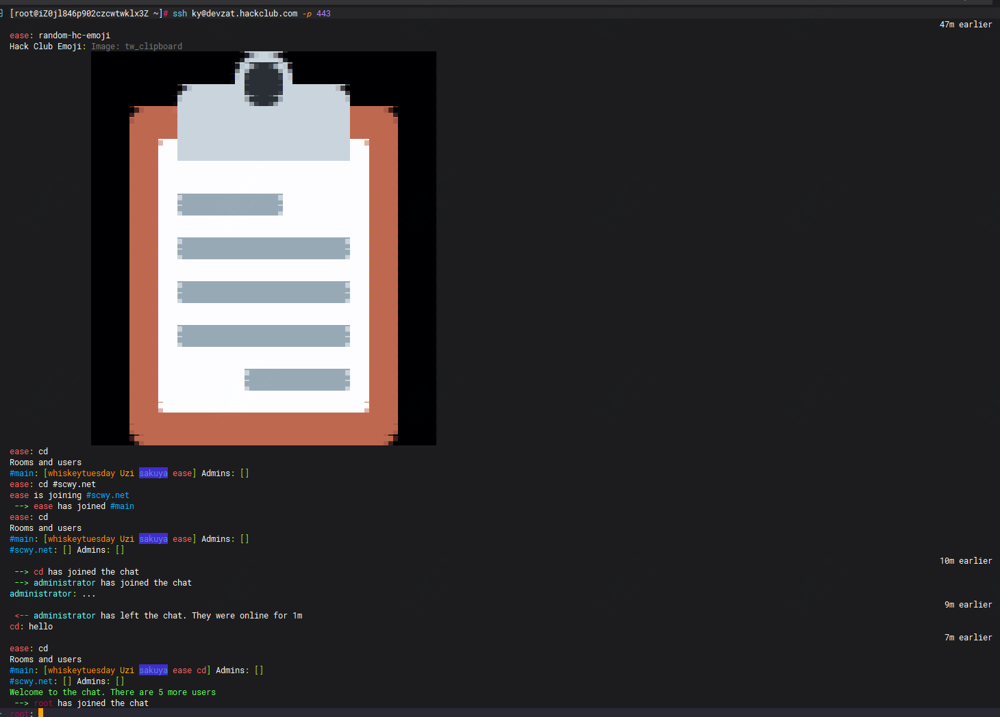
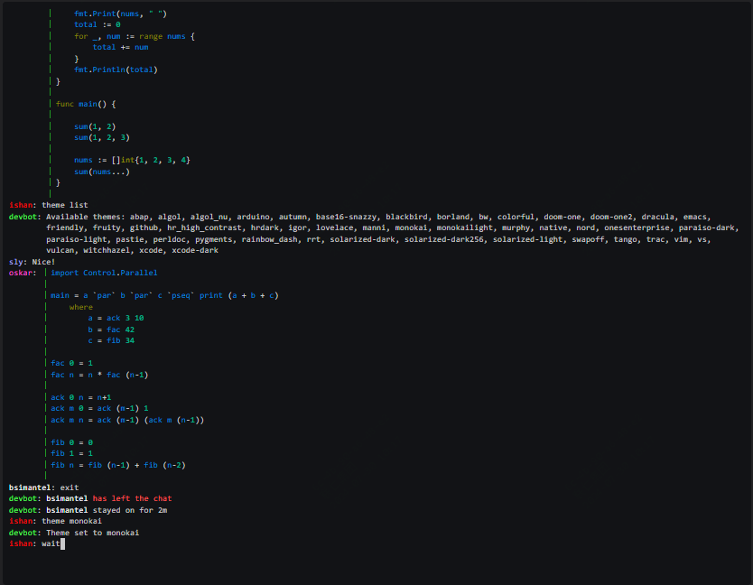

这是全世界最酷炫的聊天室吧，打开方式竟然是....

打开方式是通过ssh，如下其实是进入一个聊天室，是不是和科幻、酷炫



除了可以直接进作者给出的这个聊天室，你还可以直接自己本地化部署，是不是很city？

>项目地址：https://github.com/quackduck/devzat

### devzat项目简介

这是一个让开发人员通过ssh聊天的工具，是用go语言开发，感兴趣的可以去翻下源代码

竟然真的有人在里面讨论代码



### 如何使用或安装

如果想要直接进入的话，可以直接ssh。如下：

```
ssh devzat.hackclub.com
#也可以使用昵称登录
ssh nickname@devzat.hackclub.com
#如果有防火墙问题，可以通过端口进入
ssh devzat.hackclub.com -p 443
```
你也可以配置本地的ssh的config文件，然后直接通过别名进入

```
# cat ~/.ssh/config
Host chat
    HostName devzat.hackclub.com

```
然后执行

```
ssh chat
```

如果想要自己部署的话，可以通过如下方式,这些命令下载、构建、设置和运行在端口 2221（默认端口）上侦听的 Devzat 服务器（通过设置$PORT进行更改）。

```
git clone https://github.com/quackduck/devzat && cd devzat
go install # or build, if you want to keep things pwd
ssh-keygen -qN '' -f devzat-sshkey # new ssh host key for the server
devzat # run! the default config is used & written automatically
```

### 功能特点

- ssh嘛。跨平台都有，所以你可以从几乎任务终端进入
- ssh的安全机制，可以保证你的聊天通信的加密
- 还支持图片发送，这个是我没想到的
- 你可以创建多个聊天室，这样可以讨论不同的议题。

### star增长图

 