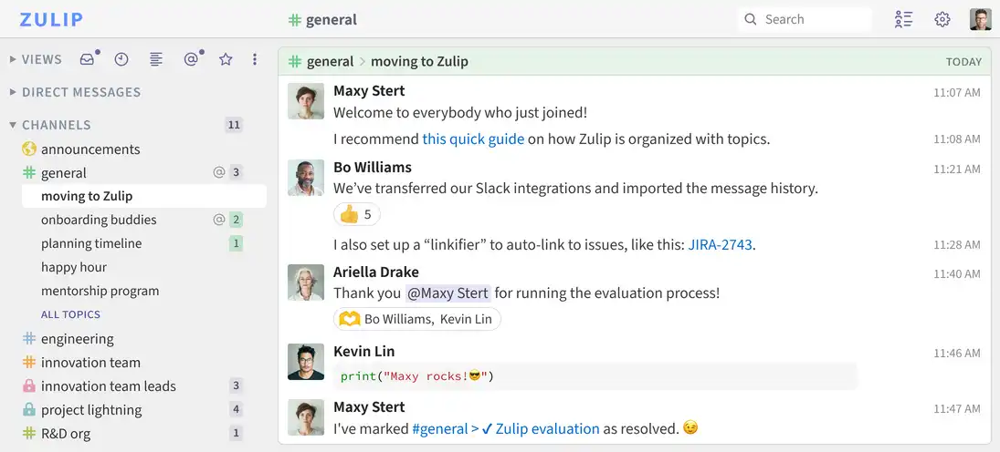
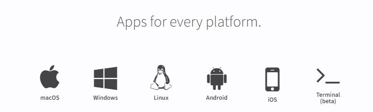

免费、高效、专注的一款开源软件推荐

今天逛github趋势榜，发现一个不错的软件

不知道你们公司用的内部沟通工具是自研的，还是企微、飞书之类的

这个项目提供了一个新的选择，一个开源的团队聊天软件，一方面可以将内部的一些聊天记录私有化，另一方面也节省了自己开发的成本。

>项目地址：https://github.com/zulip/zulip

## zulip项目简介

zulip是一个专业的聊天软件，适合各种大小规模的需求，它最大的特点在于可以根据话题来展开一个会话，这个有点类似于群聊。

在功能上结合了邮件与常规的聊天软件，目的在于更加高效的沟通

而且它的开源版本，提供的功能与正式版本是一致的。

zulip是基于python开发的，采用django框架。

Zulip 是唯一一款专为实时和异步对话而设计的现代团队聊天应用程序，目前有上千个组织在使用中。



## zulip如何安装

 

可以选择docker方式安装，它的组件包含（redis、postgres、rabbitmq、memcached）

你可以通过docker-compose方式快速启动，如果是生产使用，建议根据文档增加配置

```
git clone https://github.com/zulip/docker-zulip.git
cd docker-zulip
# Edit `docker-compose.yml` to configure; see docs below
docker-compose pull
docker-compose up
```

但你看到有如下输出后，证明已经启动成功

```
rabbitmq_1   | =INFO REPORT==== 27-May-2018::23:26:58 ===
rabbitmq_1   | accepting AMQP connection <0.534.0> (172.18.0.3:49504
-> 172.18.0.5:5672)
```

然后你就可以通过localhost在本地访问尝试了。

## zulip功能特点

- 支持任何平台，如下：
  
- 支持聊天记录迁移
- 自行部署保证与云端客户的软件100%一致，关于认证等服务也是免费提供的
- 自行部署的服务，可以保证数据完整的保存在本地
- 支持docker或者k8s环境部署

## zulip的star数

  

 目前该项目有21kstar，而且在今天上了github的趋势榜

 如果你们公司在找一个可以本地私有化部署的开源聊天工具，那么这款工具可以作为选择

 如果有python开发能力，还可以在基础上做一些改进。

 如上，希望有所帮助！