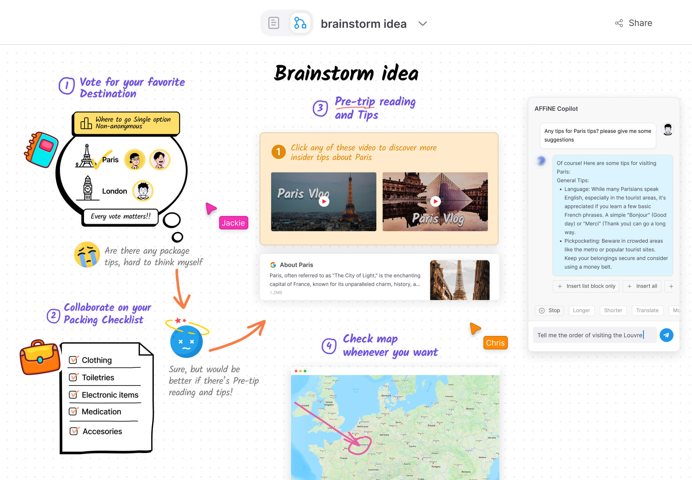
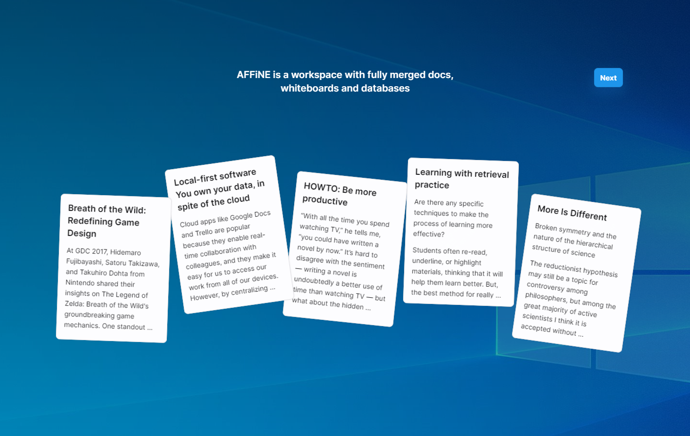
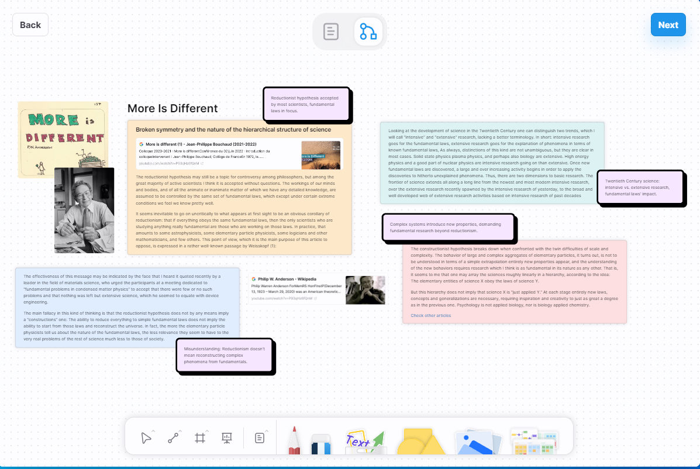
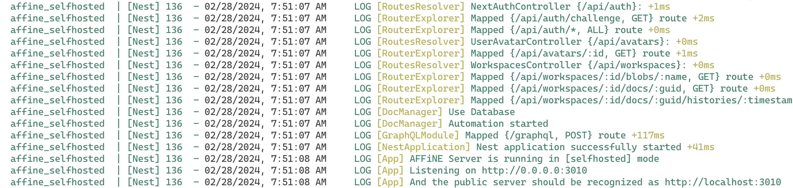
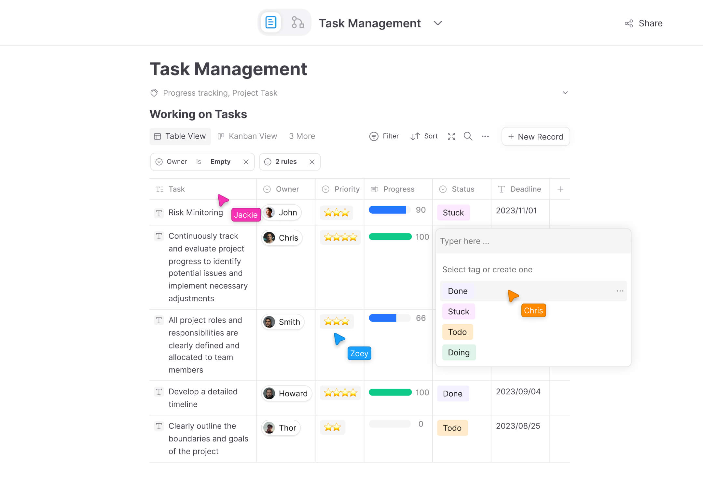

全能、高效、免费，推荐一个开源的知识库工具

如果你用过notion，那么这款工具更加强大，你值得去看下。

如果你没有接触过类似的工具，那么建议你立刻去感受下。

其最吸引我的点在于画布功能，可以随时记录你的灵感，不管是图片、文字、链接等等都可以汇集到一个画布中，如下：



>项目地址：https://github.com/toeverything/AFFiNE

## affine项目简介

affine是一个超级强大，并且功能完善的只是库工具。

它可以将你日常写的内容、画的内容、日常计划关联起来，而且目前还集成了AI功能。

下面是一个简单实用过程，可以了解下：


## affine如何安装

 

目前该工具的下载安装量已经有34万，这里提供两种使用方式

一种是可以直接到官网去下载安装包使用即可，不在详细介绍，安装很简答， 按步骤操作即可:

  

这里着重介绍下另外一种方式，适合喜欢自己动手的朋友。

是使用docker来自己启动，下面是docker启动的步骤

前提需要你已经有docker环境

```
# git拉取
git clone https://github.com/toeverything/AFFiNE.git --branch stable
```
docker启动
```
AFFINE_ADMIN_EMAIL=affine@acme.sh AFFINE_ADMIN_PASSWORD="affine" docker compose -f ./.github/deployment/self-host/compose.yaml up
```
查看日志出现如下内容，可以访问3010端口，需要登录


## Affine功能特点

- 无边界画布，我认为最大的特点之一，允许在画布上放置任何形式的块，包括富文本、便签、嵌入网页、多视图数据库、链接页面、形状和幻灯片。
- 隐私、安全，自托管的部署模式，可以保证数据都在本地
- 自托管带来的另外一个优点就是离线可正常使用
- 还有就是Ai的支持，功能也蛮全的，算是紧跟现在潮流 


常常看到这款与notion的对比，简单聊下吧：

正如前面提到的几个点，affine是开源的，可以离线自托管部署，而notion是闭源的，并且nition最大亮点在于文档的管理。相比而言，affine更像是一个集合，也就是知识库

如果都有使用过的朋友，聊聊你的看法吧！

## star数

 

 目前该项目已经获得了37k star，最开始使用的时候之后20k，也就几个月之前吧

 所以还是比较值得尝试的。