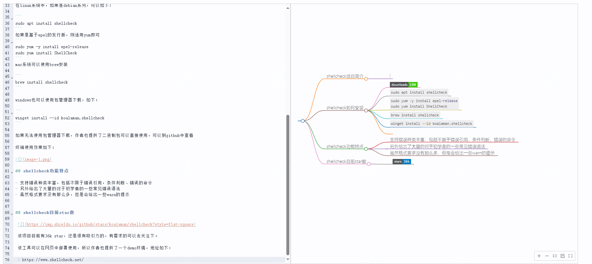
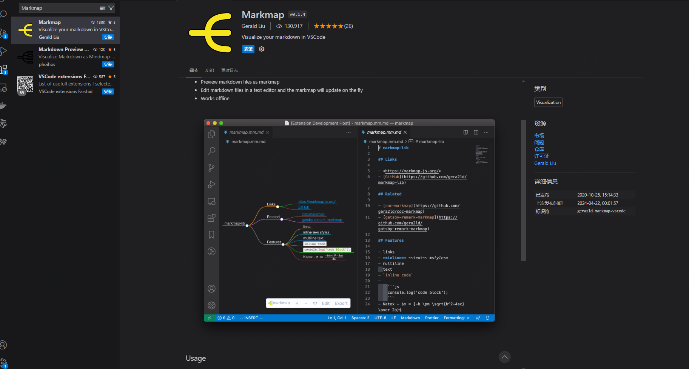

简单、直接、高效，推荐一款免费的开源工具

如果你日常接触的文本或者思维导图比较多，那么今天这个工具你一定不能错过。

如果你日常善于记录一些内容，但想要更好的展示，如图像的方式，那么这款工具或许可以帮助到你。

>项目地址：https://github.com/markmap/markmap 

效果如下，素材来源于昨天的文章：

## markmap项目简介

markmap是一款将markdown内容转化为思维导图的工具，它的灵感来源于另外一款开源工具(github.com/dundalek/markmap)

## markmap如何使用

可以直接使用作者提供的一个demo版本，地址如下：

>https://markmap.js.org/

另外它还提供了vscode的插件，可以直接安装使用，如下：

## markmap功能特点

- 最关键的在于它将markdown可视化，能够更加直观的去理解文章内容
- 支持多种编辑器的集成，包括vscode、vim、emacs，给开发者提供了更多的选择
- 实时更新，在编辑器中更新markdown文件时，对应的思维导图也会实时更新，确保用户可以第一时间更新
- 提供了api接口文档，对于一些业务上的需求提供了支持
- 因为是插件的形式所以可以离线使用，而操作文档中也提供了命令行的使用方式

怎么样？看到这里心动了吗？

## markmap的star数

 

 目前该项目的star数目已经是7.6k，快去尝试下吧！