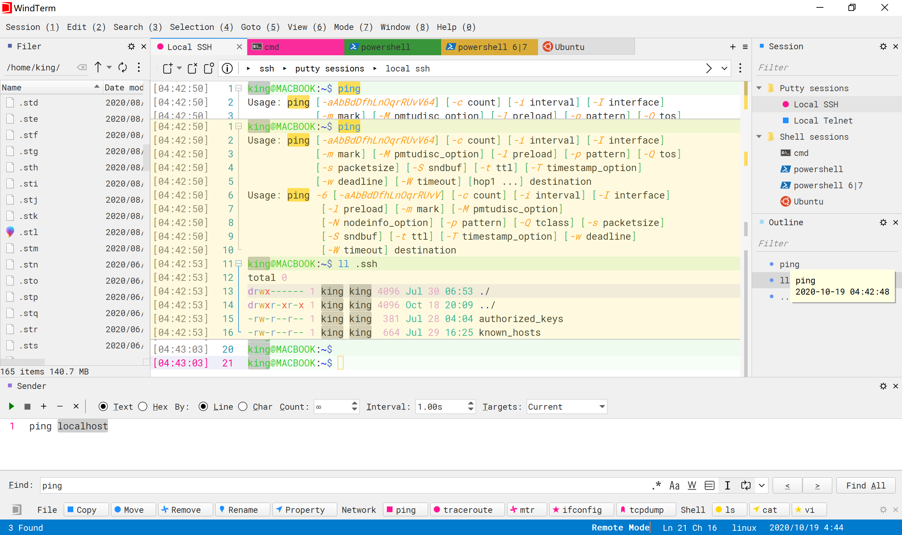
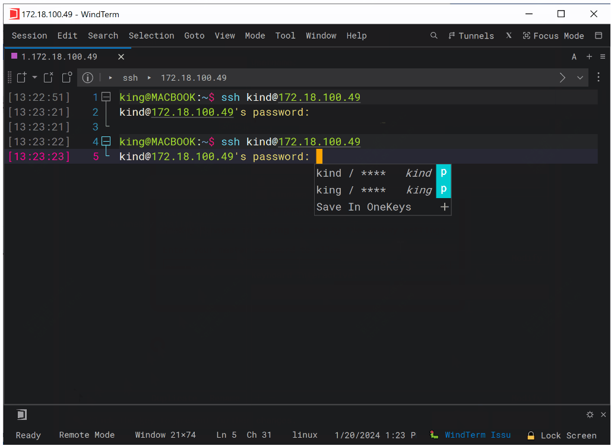
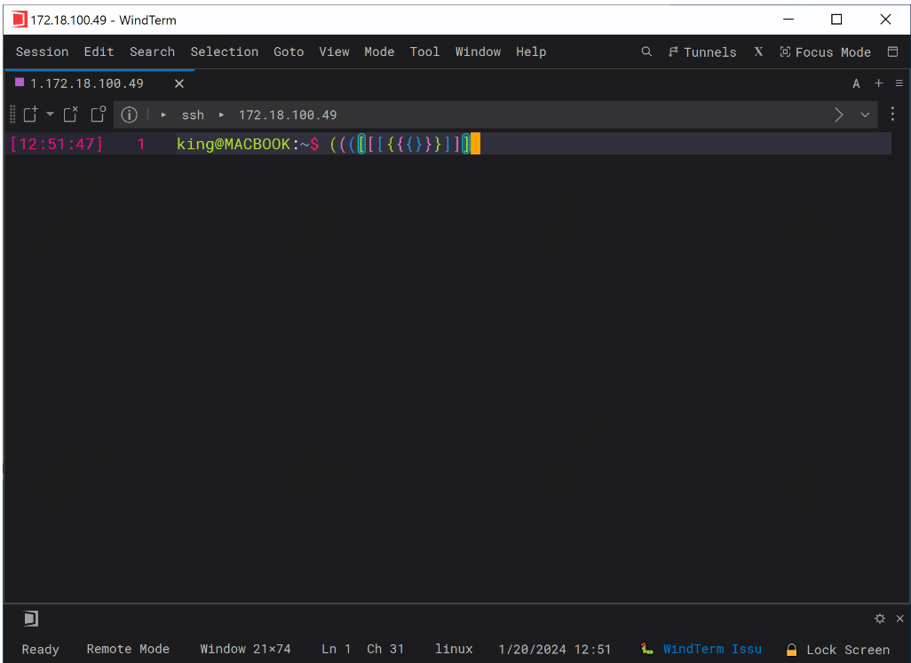
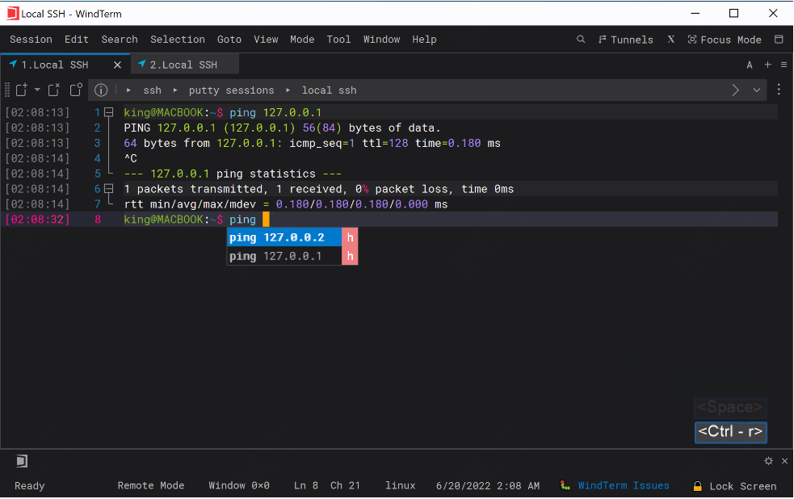
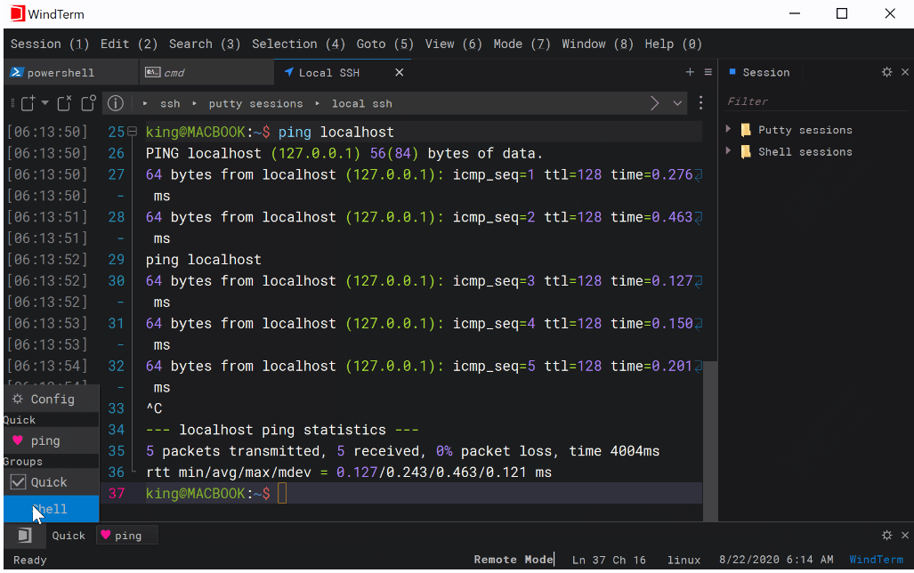
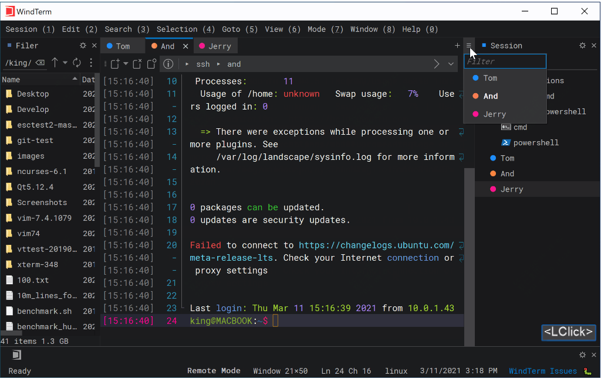

再见了putty、Xshell、FinalShell、Mobaxterm、iTerm2，这款开源的终端工具真香

不管是开发、测试甚至产品，日常工作中都或多或少的会用到终端ssh工具

运维就更不用说了，每天的工作内容，大部分都是在终端工具上完成的。

相信每个人都有自己熟悉的一套工具，但今天推荐的这款，建议都尝试下，你不会后悔的。

因为我推荐过的同事，现在都在使用。

记得上次出差，看到有个交付的小伙伴也在用这款，他看了下我的界面，然后会心一笑，潜台词：是兄弟。

说再多，不如图片来的直观，下面先上图：

如果，有一定的吸引力，那么请继续往下看，为啥它这么突出！

## 最新更新的功能

刚看到2024年1月份发布2个功能更新，一个是账户密码自动填充，一个是彩虹括号

### Onekey自动填充

需要提前把账户密码记录到Onekey中，这样登录的时候，可以直接选择

### 彩虹括号

这个功能的话，是在一些代码中，如何有大量括号的嵌套，可以通过颜色快速分辨

## 其它特色功能介绍

功能很多，实际都是使用其他工具的一些痛点，这里简单介绍几个

### SSH、Telnet、Tcp、Shell、串行

实现了 SSH v2、Telnet、Raw Tcp、Serial、Shell 协议，支持在会话身份验证时 SSH 自动执行

如果你用的是jump server之类的堡垒机，也可以直接配置，支持二次验证

当然也支持代理跳板机登录。

### 自动填充

这个点或许是开发最喜欢的，它可以自动完成历史命令填充

### 常用命令快速触发

这个也是日常用到比较多的，有些工具虽然有这个功能，但是很多有限制

这款就很随意了，可以选择一组服务器，可以配置大量的预制命令

### 搜索

如果你打开了多个终端，可以快速搜索跳转

### 关于性能

性能测试其实作者提供了很多的数据，包括文件的传输、随机数据的生成、延迟、终端性能等，确实很强，尤其是与一些其它常用工具相比。

具体数据，这里不在罗列，更多可以到github上去看。

等等等很多好玩的功能，可以去体验下

## 如何安装使用？

>项目地址：https://github.com/kingToolbox/WindTerm

 

目前下载量已经很高了，在github中提供了mac、linux、windows不同环境的终端包，可以直接去releases中下载

## star数

 