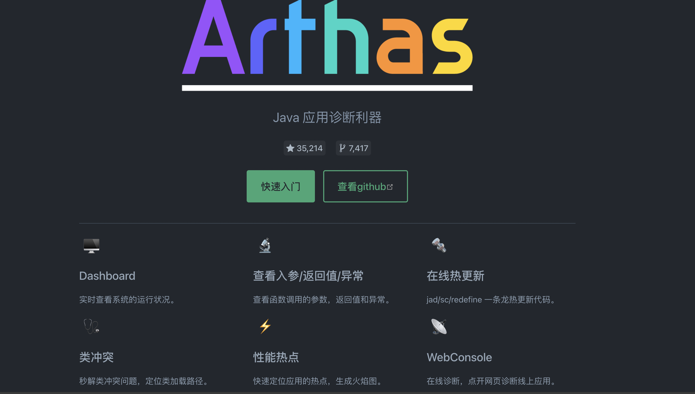
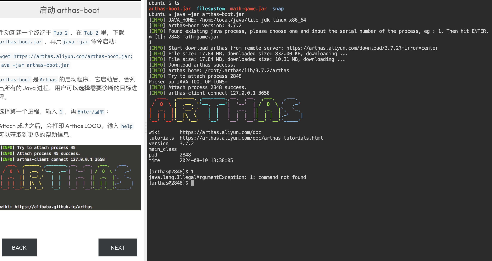
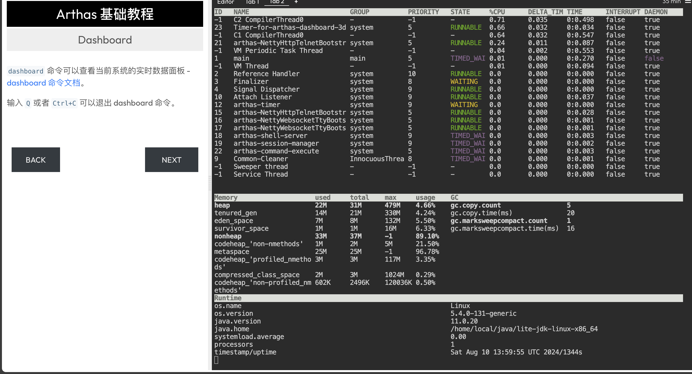
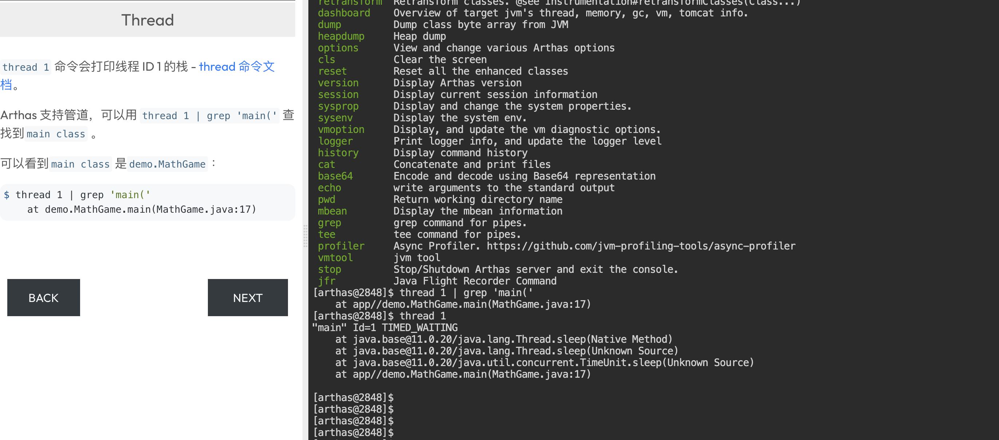
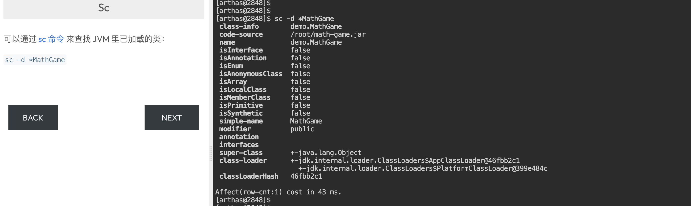
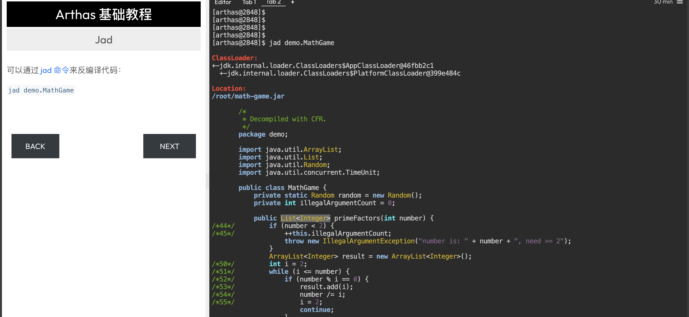

阿里开源，一款释放潜力的神器，推荐！

如何在java进程运行过程中查看异常？

今天推荐一款阿里开源的java诊断工具，它可以在线查看java运行问题

可以实时监控jvm状态，可以动态跟踪java代码，很强大。

不管是开发还是运维，都可以用到，也是目前工作中用到最多的工具之一。

>项目地址：https://github.com/alibaba/arthas

## arthas项目简介

这个工具其实在几年前就已经在使用了，上周排查了一个线上问题，就想着再推荐给大家，希望可以帮助到大家。

arthas是一款java的诊断利器，可以快速解决线上问题。

## 如何安装

该工具目前有318k的star数

 

 如果之前没有使用过的话，可以先去官网体验下在线教程，它可以逐步让你掌握这款工具，如下：

用的是killercoda，如果有了解过的话，这个平台还可以用来学习k8s

## 部分命令演示：

dashboard可以查看整体仪表盘，如下：

thread 可以用来查看线程站栈信息

sc命令可以查看JVM里已经加载的类

jad命令可以用来反编译

## 功能特点

- 支持反编译确认代码运行是否正常
- 查看类加载器统计信息，例如类加载器的数量、每个类加载器加载的类数、类加载器层次结构、可能的类加载器泄漏等。
- 查看方法调用详情，如方法参数、返回对象、抛出异常等。
- 监控方法调用统计信息，如qps、rt、成功率等。
- 监控系统指标、线程状态和 CPU 使用率、gc 统计信息等。
- 等等

## star数

 

目前该项目获得了35k star，建议大家周末可以玩下，在线教程如下：

>https://arthas.aliyun.com/doc/arthas-tutorials.html?language=cn&id=arthas-basics
