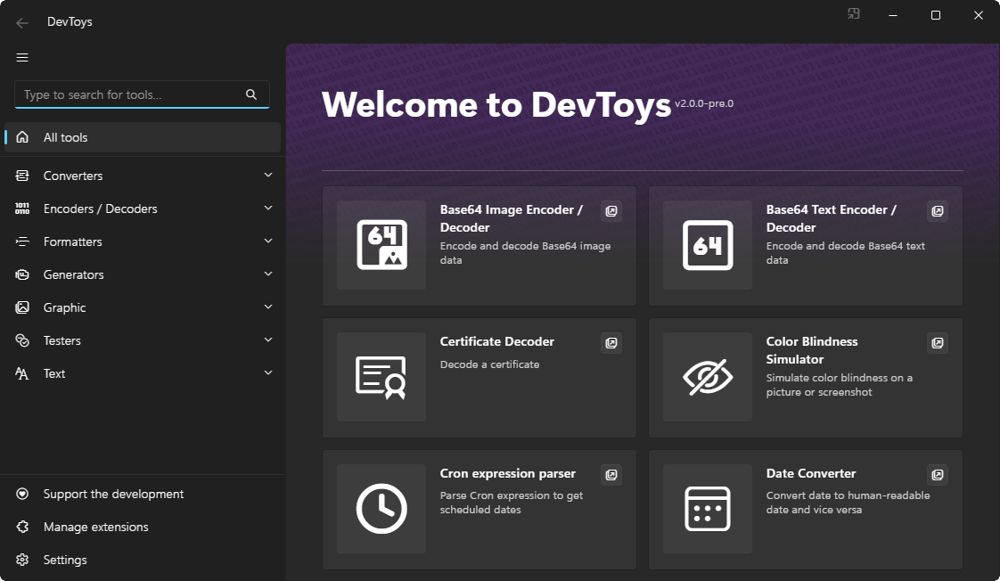
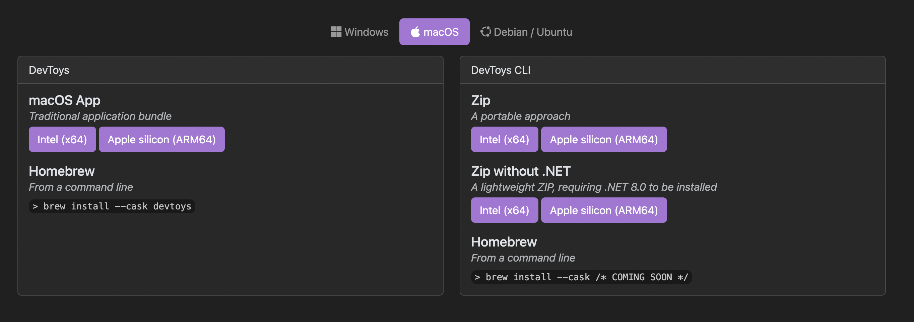
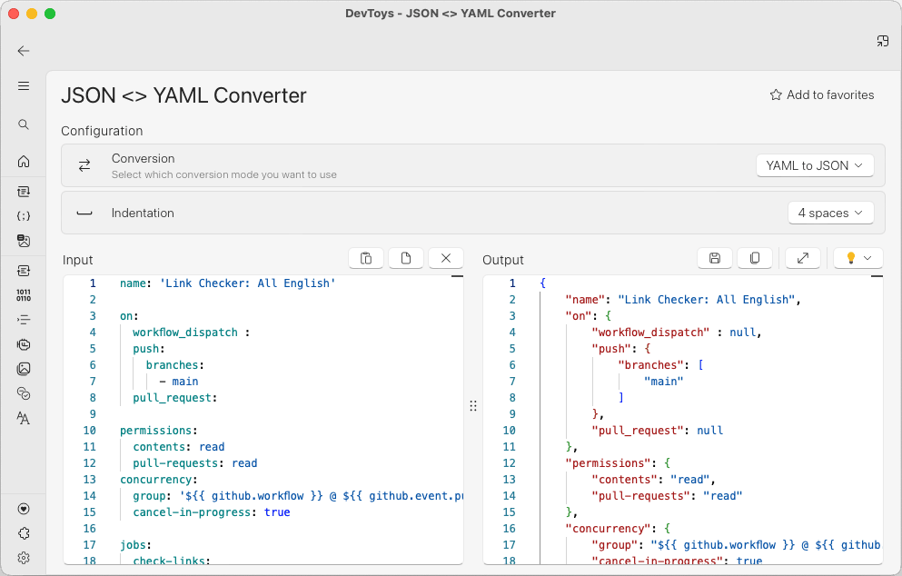

github2.6万星！开发者必备，堪称“瑞士军刀”，免费！

在实际的开发过程中，开发人员经常会用到很多的小工具，如果要是单独去寻找的话，费时费力

今天推荐一款开源免费工具，它是集合了日常用到的工具合集

目前在github上有2.6万star，下载量达到了185k，目前推出了2.0版本，集合了30个工具

>项目地址：https://github.com/DevToys-app/DevToys 

## DevToys项目简介

DevToys是一款为开发人员提供的瑞士军刀。

它提供了一些执行快速、特定微小任务的微型工具来帮助完成日常开发任务

## DevToys如何安装

 

 

该工具可以直接到官网去下载，跨平台支持，可以有mac、linux、windows的版本

也可以自己本地化部署。

## DevToys功能

- 转换器：JSON <> YAML、日期、数字基数......
- 编码器/解码器：HTML、URL、Base64、GZip、JWT、二维码......
- 格式化程序：JSON、SQL、XML...
- 生成器： Hash & Checksum， Lorem Ipsum， Password...
- 图形工具：色盲模拟器、PNG/JPEG 压缩器......
- 测试器：JSONPath、RegEx、XML...
- 文本工具：Markdown 预览、文本比较器、分析器和实用程序......

## DevToys目前的star数

 

 如上为该项目的star数