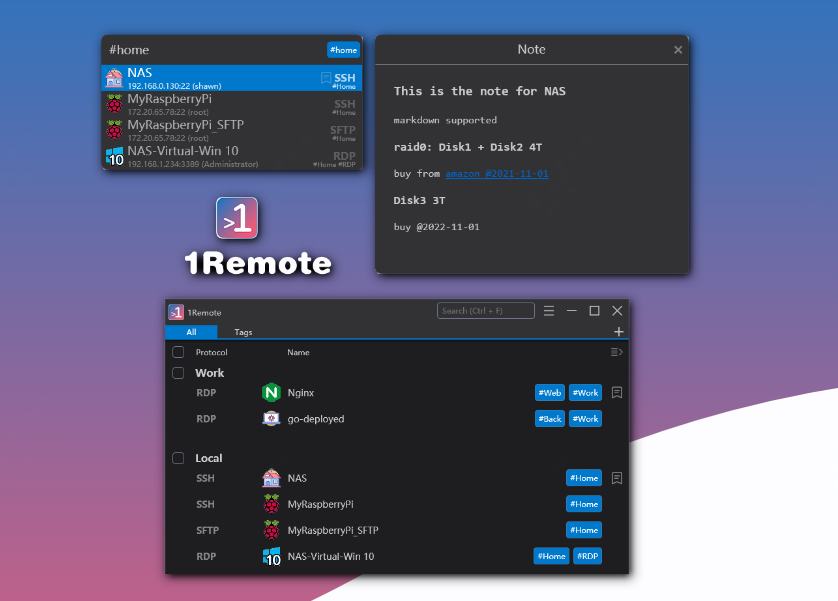
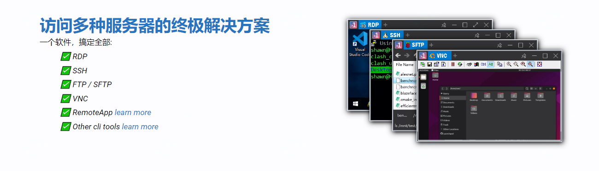

远程桌面不要再用mstsc了，这款开源神器真的牛！

在使用这个工具之前也一直使用mstsc去连接

然后后来有用过mRemoteNG

今天推荐一款更加轻量级，也更加实用的一个小工具1Remote

>项目地址：https://github.com/1Remote/1Remote

## 1remote项目简介

1remote是一个远程管理器，可以替代你之前的一系列工具如winscp、vnc等

主要作用在于从一个入口可以管理多个远程会话！

## 1remote如何安装

 

可以直接到github的releases中去下载，也可以在如下地址去安装,目前该工具已经有51k的下载量！

>https://1remote.org/zh-cn/ 

## 功能特点

- 开源、免费、安装简介，快速上手，支持中文
- 支持多种协议，包括不限于RDP、SSH、VNC、Telent、Sftp、
- 支持多屏幕，而且支持4k高分辨率的使用
- 支持快捷方式，可以一键打开你的远程
- 单个连接地址可以配置多个账户
- 对于团队使用，可以通过配置mysql来共享账号
- 部署很方便，仅需下载后解压就能运行
- 它是基于选项卡的远程桌面界面、支持多语言、而且可以可自定义颜色主题

## star数

 

 目前该项目有3.7k star，另外在微软商城中已经有上万用户使用过。