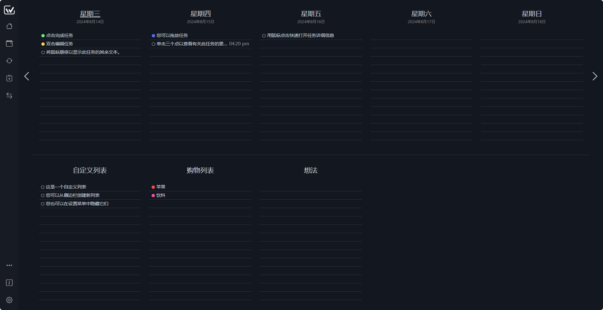
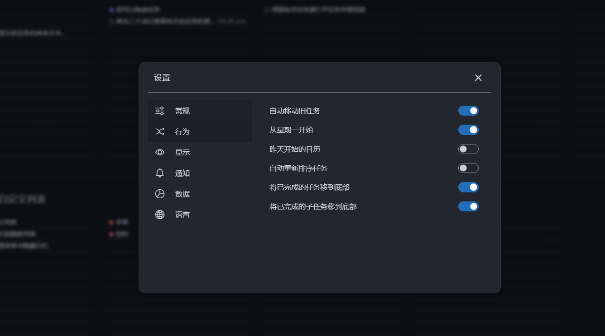

推荐一款炸裂的效率神器,方便、快捷！

在日常工作中，你每周的工作计划，或者是一些生活上的安排，都是放在哪里的？

脑子里？备忘录？或者是没有，完全是瞎忙

今天推荐一个简单的效率工具，可以将你整周的计划放在一个页面。

效果如下：

>项目地址：https://github.com/manuelernestog/weektodo

## weektodo项目简介

WeekToDo 是一款免费的极简主义每周计划应用程序，专注于隐私。

使用待办事项列表和日历安排日常的任务和项目。

跨平台支持，适用于 Windows、Mac、Linux 或web在线使用。

## weektodo如何安装

 

目前该工具下载量还是蛮多的，达到了73k。

具体安装包下载可以到github的releases中去获取。

## weektodo功能特点

- 跨平台支持
- 支持暗黑与浅色模式
- 支持自定义待办事项
- 可以将未完成的事项直接拖放到任意位置
- 支持多语言，包括简体中文
- 内容均为本地存储
- 不同的任务可以根据颜色配置
- 你可以设置一些重复任务

而在后面的开发路线图中，还会提供触摸模式、支持移动端版本、跨设备同步（目前只能导出导入）、提供不同主题可选等

## weektodo的github star数

 