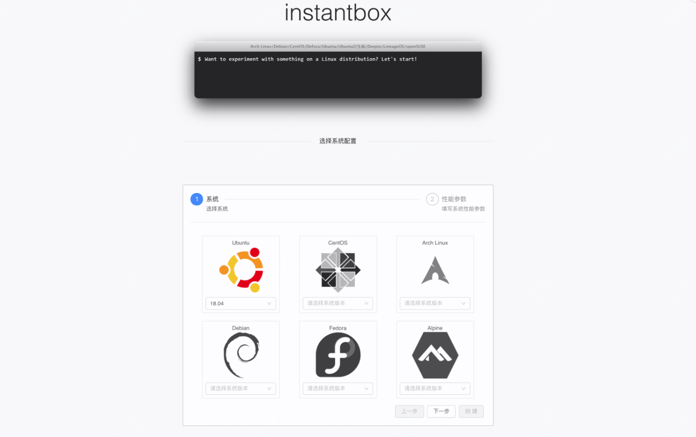
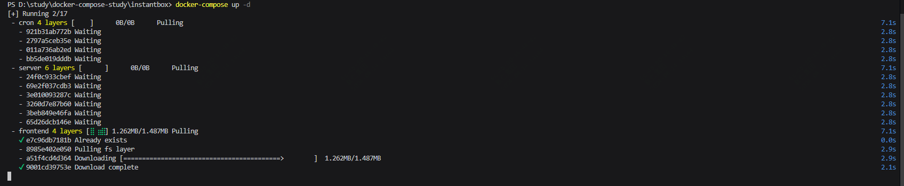
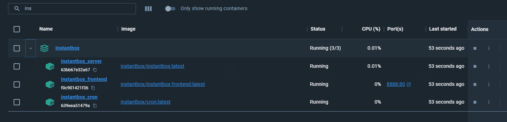
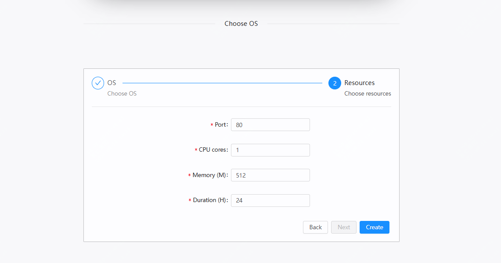

几秒钟内启动一个干净可用的linux，这个开源工具绝了！

如果你平时的工作中，临时需要一个干净的linux环境，用来跑任务或者是做个测试

那么这个开源工具，你一定要了解下

>项目地址：https://github.com/instantbox/instantbox 



## instantbox项目简介

instantbox是一个开源项目，它可以启动临时的 Linux 系统，可以从任何浏览器即时访问webshell

操作很简单，而且可以选择各种版本的 Ubuntu、CentOS、Arch Linux、Debian、Fedora 和 Alpine

## instantbox如何安装

我们来演示下该工具如何使用，需要提前准备好docker环境

然后执行如下初始化脚本

```
mkdir instantbox && cd $_
bash <(curl -sSL https://raw.githubusercontent.com/instantbox/instantbox/master/init.sh)
```

会打印如下输出，然后根据需要修改ip及端口

```
Welcome to instantbox, please wait...

docker is installed
docker-compose is installed

Enter your IP (optional): 
192.168.1.100
Choose a port (default: 8888): 
8080

You're all set! 
Run 'docker-compose up -d' then go to http://192.168.1.100:8080 on your browser.

```
我这边是在windows启动的，执行docker-compose up -d 后需要拉取镜像



启动完成后，可以去访问本地的8080端口

可以看到在docker-desktop中已经起好了



然后你就可以选择不同发行版的不同版本了，下一步需要选择端口及配置




## instantbox的功能特点

- 如果需要演示，那么它可以提供一个干净的演示环境
- 支持常用发行版
- 操作简单，启动方便
- 可以从任何设备上管理服务器

## github star数

 

 目前该项目获得了4k star