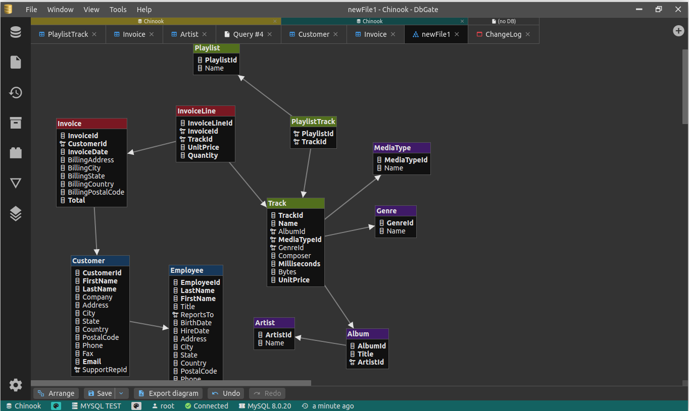
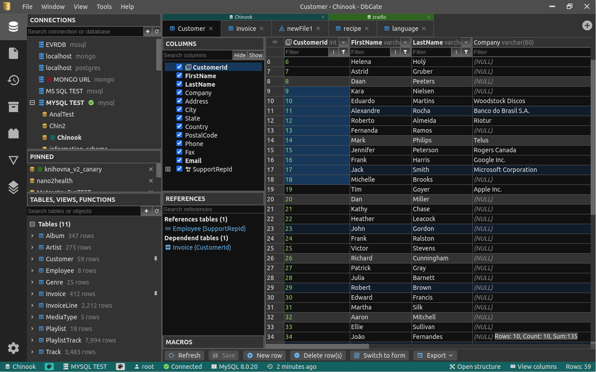
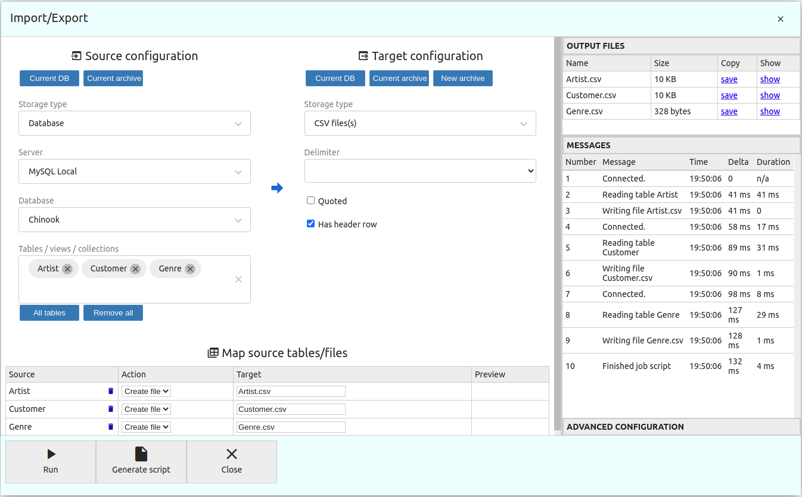
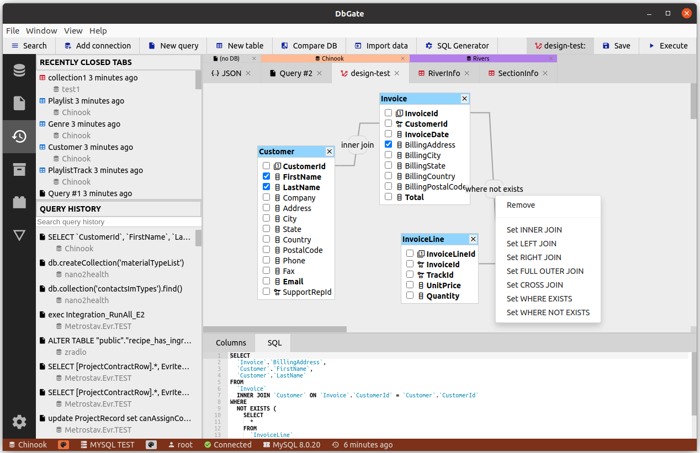
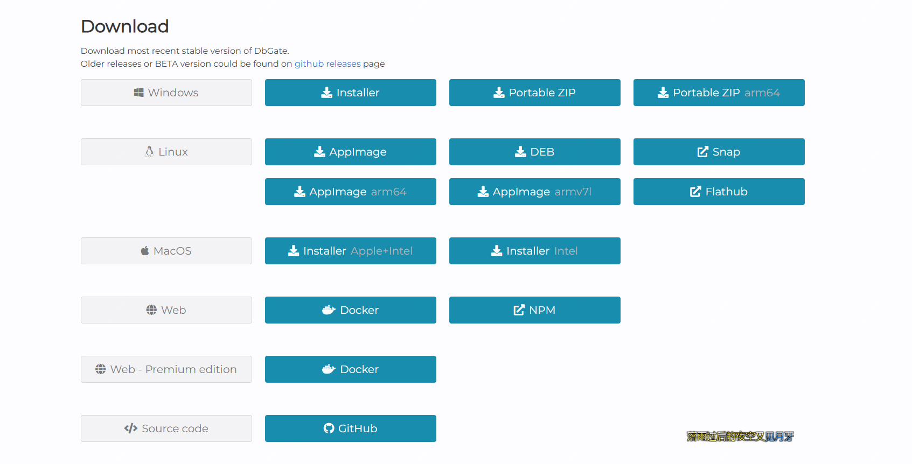

5k star,推荐一款好用的，跨平台支持的数据库管理工具

如果你使用navicat、dberver这类工具，那么今天推荐的这款开源工具一定要了解下

该工具目前只有5k star，但是下载安装量确已经到百万级别了。

今天推荐的这款工具叫dbgate，它除了常规功能之外，还有一些高级功能如架构比较、可视化查询设计器、图表可视化导出与导入

>项目地址：https://github.com/dbgate/dbgate

部分使用截图如下：






## dbgate项目简介

dbgate是一款支持MySQL、PostgreSQL、SQL Server、MongoDB、SQLite等数据库连接，而且跨平台可用的工具（linux、mac、windows），而且可以直接在web端打开。

该工具一个特点在于保持应用程序的简单性，融合了蛮多类似工具的成功经验。

基本支持任何的平台或者工具，后面还有计划会出移动端。

## dbgate如何安装

 

可以直接去官网下载安装，地址如下:

>下载地址：dbgate.org/download/

 

如果想要docker快速部署体验，可以执行如下：

```
docker run -it --name dbgate-instance --restart always -p <port on host>:3000 dbgate/dbgate
```

## dbgate功能特点

- 基础功能支持表i数据便捷，可以带sql变更脚本预览
- 可以编辑表架构、索引、主键和外键
- 同时支持同步数据库结构
- 支持将图标导出为html页面
- 可以在docker中部署运行
- 支持从各类格式文件导入(从 CSV、Excel、JSON、NDJSON、XML 导入、导出)
- 对于redis这类，支持redis树状视图，可以从键生成脚本
- 支持扩展，如果你有开发能力，可以发布自己需要的npm包作为插件

## dbgate的github star数

 

 目前该项目获得了5k star，感兴趣的快去了解下吧