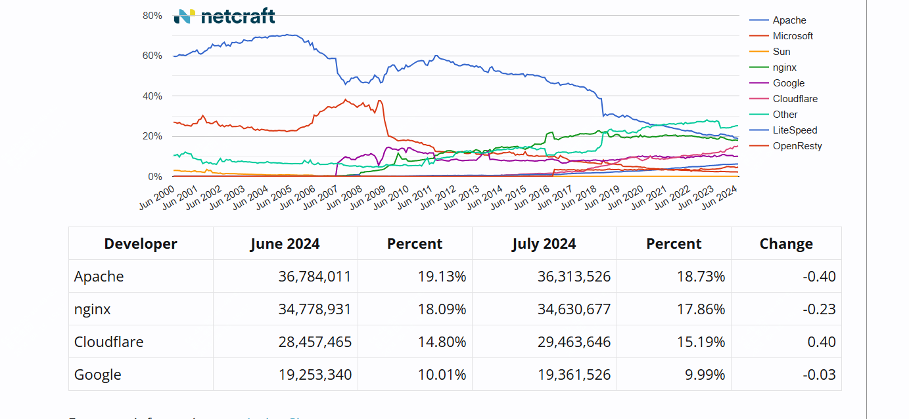
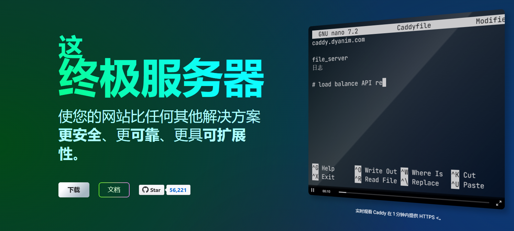

超过Nginx，号称下一代 Web 服务器，用起来够简单！

nginx在github上的star为21k，caddy的star数56.2k star，从这点看确实超过了nginx

但nginx作为老牌的web服务器，使用最广的web服务器之一，在最新的Netcraft排名中，全球仍旧有20%的站点在使用nginx。

caddy在某些方面确实有着自己的优势，尤其是对https的自动支持，今天我们就具体聊下caddy这款web服务器。



>项目地址：https://github.com/caddyserver/caddy

## caddy项目简介

caddy是一个go语言写的功能强大的可拓展的平台，可以用于为网站、服务、应用提供服务。

虽然说很多人的认知中caddy就是一个web服务器，但其实官方给它的定义是一个服务器的服务器，简单讲，它可以承担的更多。

caddy最大的特点在于它的配置文件是json格式，而且是可以热更新，是动态的，可以通过api的形式变更。



## caddy如何快速开始

 

下载量还是很高的，今天这篇文章简单介绍下，如何快速开始使用。

### 安装caddy

可以直接yum安装，或者其他发行版的包管理器安装

```
yum install yum-plugin-copr
yum copr enable @caddy/caddy
yum install caddy
```

### 启动

```
caddy run
```

准备一个json配置文件 caddy.json

```
{
	"apps": {
		"http": {
			"servers": {
				"example": {
					"listen": [":2015"],
					"routes": [
						{
							"handle": [{
								"handler": "static_response",
								"body": "Hello, world!"
							}]
						}
					]
				}
			}
		}
	}
}
```

然后通过如下命令可以上传

```
curl localhost:2019/load \
	-H "Content-Type: application/json" \
	-d @caddy.json
```

通过curl可以获得结果

```
curl localhost:2015
Hello, world!
```
也可以通过简单的caddyfile来配置

### 重点讲下caddy的自动https

自动 HTTPS 为您的所有站点预置 TLS 证书，并保持其续订状态。它还会为您将HTTP重定向到HTTPS！Caddy 使用安全和现代的默认值 - 无需停机时间、额外配置或单独的工具。

Caddy使用Let's Encrypt  或ZeroSSL证书通过HTTPS提供公共DNS名称。

Caddy 会更新所有托管证书，并自动将 HTTP（默认端口 80）重定向到 HTTPS（默认端口 443）。


## caddy的功能特点

- 可以使用caddyfile来轻松配置，可以使用json配置文件
- 支持通过json api方式更新配置
- 默认情况下自动https
- 可扩展到数十万个站点，这在生产中得到验证，处理数万亿个请求并管理数百万个 TLS 证书的经验

## caddy的github star数

 