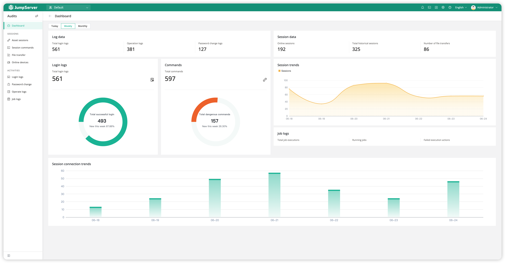
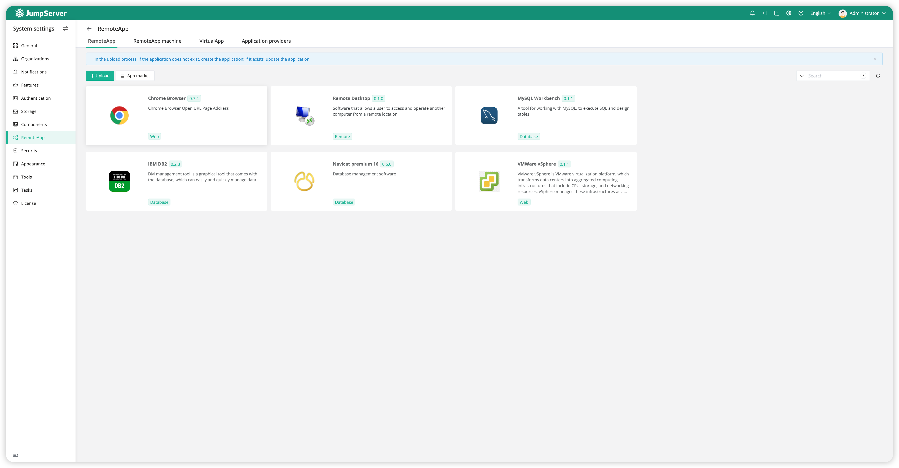
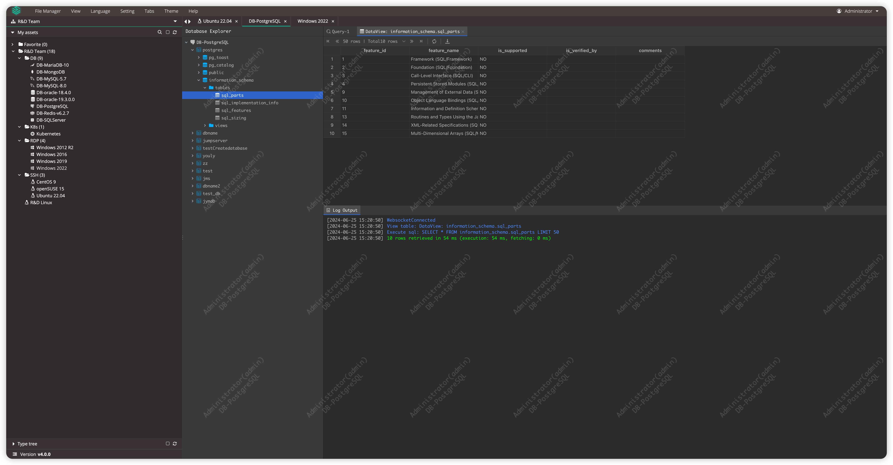

这是最好用的堡垒机了吧，推荐！

不知道大家现在用的堡垒机是哪款？

今天推荐的这款堡垒机其实在好多年前最初的版本就已经使用过了

前几天看到竟然已经推出了V4版本，今天这篇文章就简单聊下

jumpserver背后开源的公司叫飞致云，或许你不是特别了解，但如今看来，它已经很强了。

前几天有个供应商来部署项目，用的是1panle，他们家开源的；同样是最近有个开发同事让帮忙部署一套dataease，是一套BI工具，同样是他们家开源；测试同学用的metersphere，也是，他们开源的工具还有建站工具halo、知识问答系统maxKB等等。

但作为最早开源的jumpserver真的是功能强大

>项目地址：https://github.com/jumpserver/jumpserver 

## jumpserver项目简介

jumpserver用到最多的应该是运维，它真的可以成为是运维神器了！

权限管控、日志审计、支持连接主机、k8s、数据库、应用，目前最新款还有了GPT功能。

## 如何安装

 

从下载量和docker 的拉取量也可以看出该工具的火爆程度。

具体安装步骤可以到官网去查看，提供了在线和离线的方式。

建议直接安装最新的v4版本，相较于之前版本，有了蛮多功能的升级。

## 功能特点

- 支持资产类型丰富（ssh、rdp、mysql、pg、ck、oracle、redis、mongo等）
- 可以直接连k8s的pod
- 目前新版本有gpt支持
- 可以连接各类系统的web管理后台，方便管理
- 支持分布式部署，支持大规模的并发访问
- 如果是付费用户，还有更多的权限管控和资产管理功能
- 目前的批量脚本支持ansible的playbook，可以说很强了
- 如果说公司在做4A，那么这款工具是符合要求的。

## star数

 

 目前star数25k，感兴趣可以去看下。