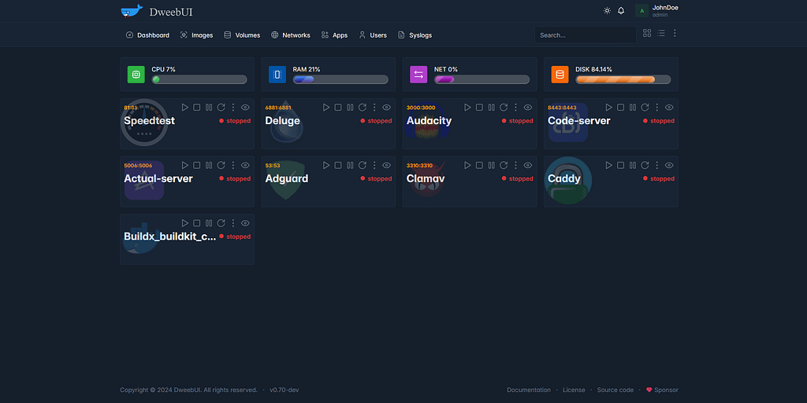
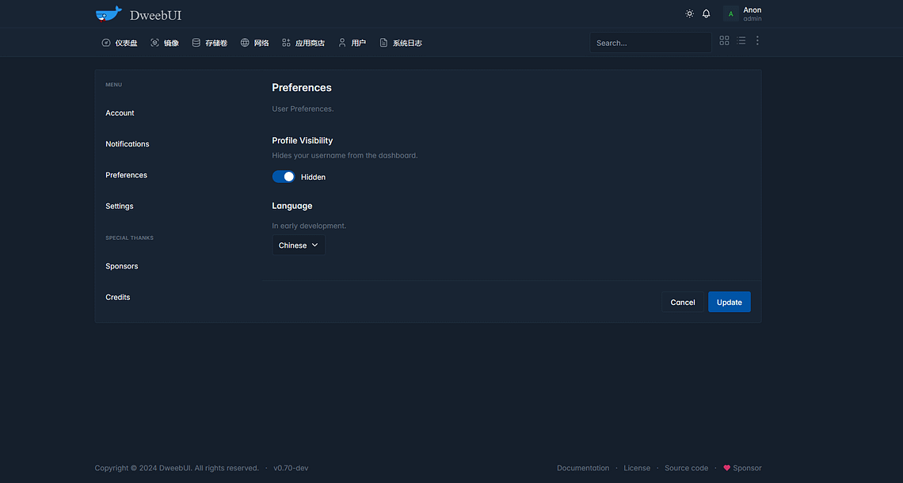

界面酷炫，内置上百个容器，开源的docker管理面板推荐

如果你nas玩家，那么这款管理工具一定要了解下

如果你日常部署服务或者开发应用用到了docker，那么今天推荐的这款工具你或许会用到

界面酷炫，功能强大，截图了解一波





>项目地址：https://github.com/lllllllillllllillll/DweebUI

## DweebUI项目简介

DweebUI是一个用于管理容器的webui，支持中文，内置大量的常用容器，并且可以一键部署。

通过简单的设置就可以开始实用，并且有仪表盘会实时更新容器的状态及服务器的资源情况，如果是多人使用还可以通过用户权限管控

## DweebUI如何安装

通过docker可以部署安装，可以看到该项目的镜像已经被拉取过36k次。


具体方式如下，采用docker compose方式去部署，如果你是nas环境，一般都会提供对应的页面

```
version: "3.9"
services:
  dweebui:
    container_name: dweebui
    image: lllllllillllllillll/dweebui
    environment:
      PORT: 8000
      SECRET: MrWiskers
    restart: unless-stopped
    ports:
      - 8000:8000
    volumes:
      - dweebui:/app/config
      # Docker socket
      - /var/run/docker.sock:/var/run/docker.sock
      # Podman socket
      #- /run/podman/podman.sock:/var/run/docker.sock

    networks:
      - dweebui_net

volumes:
  dweebui:

networks:
  dweebui_net:
    driver: bridge
```

关于部分配置的调整，建议直接去项目地址去查看！

## DweebUI的功能特点

- 开源免费，即插即用，不会收集用户数据及分析
- 实时更新的仪表盘
- 支持对容器的常规操作，如（启动、停止、暂停、重启、查看详细信息、查看日志）
- 支持浅色或深色模式
- 可以管理容器的网络、镜像及卷存储
- 支持对于不同用户的权限管控


## github-star数

 

 目前该项目时间比较短，仅有600+star，但项目还是不错的，值得学习，也值得一试!