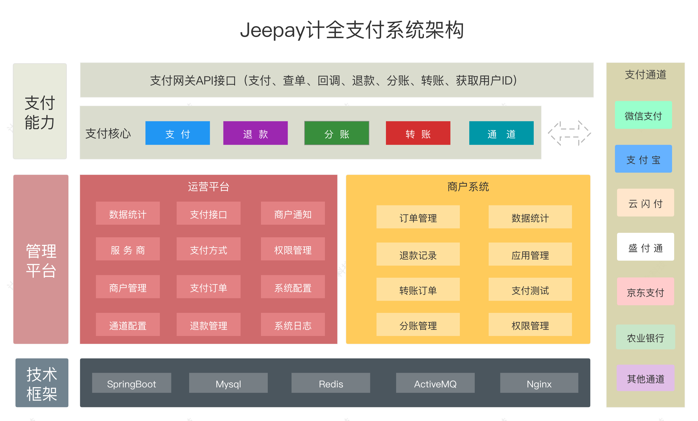

4.9k star,超强开源支付系统！支持市面大部分支付渠道，很强！

如果说你是java初学者，那么支付相关的模块一般都是比较重要的，那么不妨从这个开源项目学起

如果是企业系统需要新增支付需求，但人力又不足，那么可以参考下这个开源的支付系统

系统大致界面如下：


>项目地址：https://github.com/jeequan/jeepay

## Jeepay项目简介

Jeepay是一整套的互联网公司可以直接实用的开源支付系统。

它支持大部分付款渠道，如果是非企业用户，就是个人用户也可以拿去使用。

目前支持对接微信支付、支付宝支付、云闪付的接口，而且可以实现多渠道聚合支付。

简单来讲是一款可以拿来即用，满足大部分场景的系统。

技术框架就是常规的Spring Boot和Ant Design Vue，另外有完整的权限管理功能，公司有技术团队的话，更容易上手。


## 如何部署或安装

如果是要快速部署安装体验的，官方提供一键安装脚本如下：

centos环境
```
yum install -y wget && wget -O install.sh https://gitee.com/jeequan/jeepay/raw/master/docs/install/install.sh && sh install.sh
```
ubuntu环境
```
apt update && apt-get -y install docker.io && apt-get -y install git && wget -O install.sh https://gitee.com/jeequan/jeepay/raw/master/docs/install/install.sh && sh install.sh
```


## 功能特点

- 支持多渠道对接，微信接口支持服务商及个人支持v2或v3接口，支付宝接口支持服务商及个人
- 接口丰富，支持http以及各类语言sdk实现，对接简单
- 支持分布式部署，支持大规模并发
- 提供了后台管理界面，方便操作
- 为避免大流量下的并发处理，在支付平台到订单通知采用了mq
- 支持权限管理，采用了spring security

## star数

 

 目前该项目4.9k star，是一个不错的值得学习借鉴的项目

 如上，希望有所帮助！