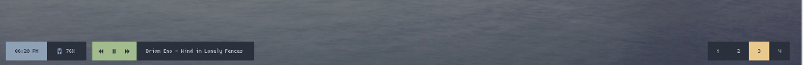
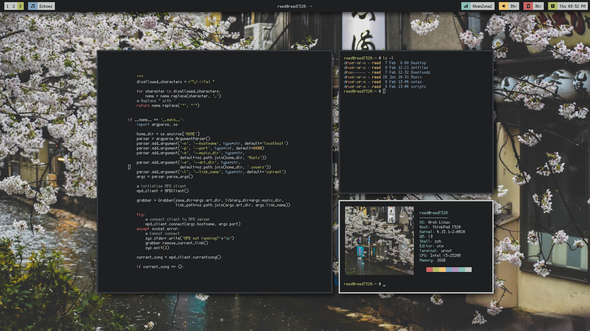

13.9k star好用！酷炫！这个桌面状态栏项目太牛了

这是一个开源的桌面自定义状态栏项目，看下面几个效果图：






>项目地址：https://github.com/polybar/polybar

## 项目简介

polybar是一个C++语言编写的桌面状态栏工具，它可以自定义设置，是专为linux系统设计的。

polybar可以用来显示常用监控信息，如主机状态等，具体可以展示内容可以到下文查看。

## 如何安装

目前该工具的下载量来到了417k，可见在开源社区的热度。

 

针对于不同的发行版，有不同的安装方式，具体如下：

debian

```
sudo apt install polybar
```
ubuntu
```
#需要20.10版本以上
apt install polybar
```
Arch Linux
```
pacman -S polybar
```
Fedora 
```
dnf install polybar
```
其它可到官网查看，如下

> polybar.github.io

## polybar支持展示的内容


- 可以展示时间及日期按照你想要的方式及位置
- 可以展示键盘布局以及各类指示灯的状态
- 可以展示背光情况
- 可以展示网络连接的情况
- 可以显示主机的负载情况如cpu或者内存
- 可以展示音量情况
- 可以展示基于时间的shell执行以及命令输出情况
- 可以展示进程间的消息传递情况
- 等等

## polybar目前star数

 

 目前polybar在开源社区获得了14k star